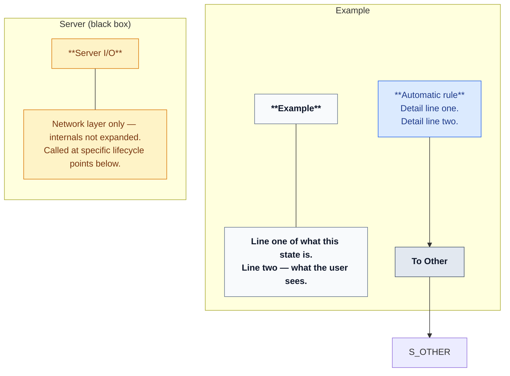

# State Diagram

Produce **Mermaid `flowchart`** diagrams (not `stateDiagram`) that show client-visible or subsystem states as **side-by-side columns**, with **colour-coded transition boxes** and a **markdown legend**.

## When to use

- User invokes `/state-diagram`
- User asks for a state/flow diagram and wants the column + colour style from prior ITS work
- Documenting a state machine from a **client or actor perspective**

## Output structure

Every diagram response must include, in order:

1. **Brief intro** (1–2 sentences: what perspective, what is black-boxed)
2. **Mermaid diagram**
3. **Legend table** (colour meanings — always include, even if repeated)

Do **not** wrap all state columns in an outer “overview” subgraph. Each state gets its own column only.

## Layout

```
direction LR

| Inactive | Playing | Paused | Done |   ← one subgraph per state, arranged left-to-right
─────────────────────────────────────
| Server (black box)                 |   ← external / I/O row below state columns
```

- **State columns**: `subgraph COL_<NAME>["StateName"]` with `direction TB` inside.
- **Black-box row** (server, network, persistence): separate subgraph **below** state columns — internals not expanded; only name **when** calls fire and **what** they are called.
- **Entry node** (optional): e.g. `START` → first state, placed outside columns.

## Inside each state column (top → bottom)

1. **State header** — bold name (`**Playing**`)
2. **State description** — exactly **two lines** (`<br/>`): what this state *is* / what the user sees
3. **Outgoing transitions** — one box per exit; each transition that **changes state** is followed immediately by a **To \<StateName\>** box in the same column

Connect with `---` between header and description only; wire transitions with `-->`.

### Transition box content (two lines)

Line 1: **trigger name** (user action, automatic rule, or external event)  
Line 2: **mechanism or pipeline** (e.g. `refresh → rewind → restore mark`)

Example:

```text
**Click Replay**
refresh → rewind → restore mark.
Re-queue with targets prefilled.
```

### To-state boxes

- Place **directly under** the triggering box in the **same column**
- Label: `To Playing`, `To Paused`, `To Inactive`, `To Server`, etc.
- Wire: `trigger --> TO_*` then cross-column `TO_* --> S_<DEST>` (destination state header in target column)
- **Omit** To-box when the transition does **not** change state (e.g. right-click move while staying Paused)

## Colour classes

Define these `classDef`s at the top of every diagram and apply with `:::className`:

| Class | Fill / stroke | Use for |
|-------|----------------|---------|
| `auto` | `#dbeafe` / `#2563eb` | Automatic — no deliberate user action (polls, lookahead, predicates, auto-commit) |
| `user` | `#dcfce7` / `#16a34a` | User interaction (clicks, buttons, drags) |
| `trigger` | `#f3e8ff` / `#9333ea` | Triggered by outside the local system (resync, remote refresh, stale batch, peer signals) |
| `state` | `#f8fafc` / `#64748b` | State header + two-line description only |
| `server` | `#fef3c7` / `#d97706` | Black-box I/O row headers and server-step descriptions |
| `goto` | `#e2e8f0` / `#475569` | **To \<StateName\>** boxes only |

### Legend (required in prose after diagram)

```markdown
| Color | Meaning | Examples |
|-------|---------|----------|
| **Blue** | Automatic | Lookahead pause, completion predicate, auto-commit |
| **Green** | User | Click target, Reset, Replay, Continue |
| **Purple** | Triggered / external | Resync abort, refreshRemoteOrders, stale batch |
| **Grey header** | State (what it is) | Top box in each column |
| **Grey To-box** | Destination label | Adjacent to triggering transition |
| **Amber** | Black-box I/O | Server / network calls |
```

## Mermaid skeleton



## Side paths

Use **dotted arrows** (`-.->`) when a user/auto action **also** hits the black box first (e.g. Reset → `refreshRemoteOrders` → then state change). Solid arrows for the primary visible state transition via To-box.

## Black-box rules

- Name the call (`refreshRemoteOrders`, `submitOrder`, etc.) and **when** it fires
- Do **not** expand HTTP handlers, queue logic, or retry/deferral details unless the user explicitly asks
- Server row may branch (e.g. in-place vs rollback) but outcomes should still exit to a **To Inactive** (or appropriate) box

## Workflow

1. **Identify states** from the requested perspective (usually client UI or session layer).
2. **List transitions** per state; classify each as `auto`, `user`, or `trigger`.
3. **Draft columns** — one subgraph per state; two-line descriptions everywhere.
4. **Add To-boxes** for every state change; skip for no-op transitions.
5. **Place black-box row** below; link commit/reset/replay paths that touch I/O.
6. **Emit legend** after the diagram.
7. **Notes** (optional): edge cases, feature flags, or “stays in state” behaviours in prose below the legend — keep the diagram itself stable.

## Reference

The ITS client main state diagram in chat (Inactive / Playing / Paused / Done + Server row) is the canonical example of this style. Re-read that diagram when matching layout; do not duplicate it inside this skill — regenerate from the live system when documenting ITS.
