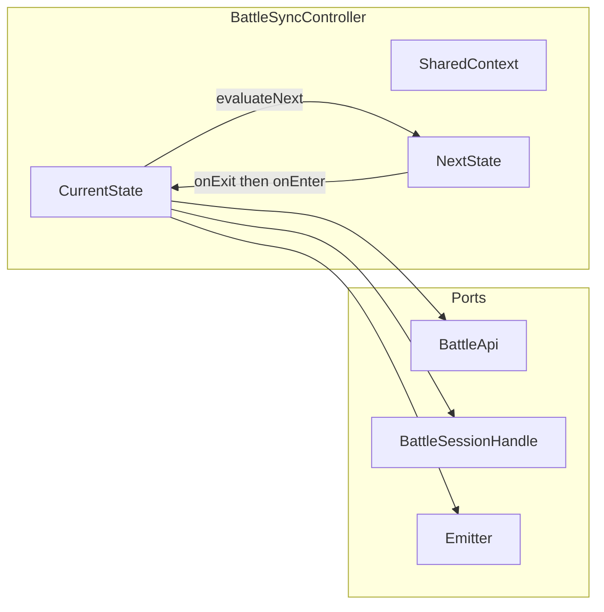

# State-based battle sync architecture (plan)

Revision: folder layout per role (`sync/host/`, `sync/client/`) + sample state template.

## Goals

- **One state module per sync phase** — each implements: throttled/non-stacking poll scheduling, data flow into the system (via a narrow port), **legal outgoing edges**, **transition predicates**, and **enter/exit** lifecycle.
- A **controller** holds **current state**, **shared context**, asks the state for **next transition**, performs **atomic** exit → enter.
- **Graph is data-first**: states declare **`id`**, **`role`**, **`edges`** so tests can validate adjacency and reachability.
- **Two graphs**: host states live under [`app/js/games/minion_battles/game/sync/host/`](../app/js/games/minion_battles/game/sync/host/); client states under [`app/js/games/minion_battles/game/sync/client/`](../app/js/games/minion_battles/game/sync/client/). Shared types, controller, scheduler, and graph validation stay at [`app/js/games/minion_battles/game/sync/`](../app/js/games/minion_battles/game/sync/) (no host/client-specific state files at the root of `sync/` except index/registry glue if needed).

Normative behaviour: [game-sync-plan.md](game-sync-plan.md) and [`.cursor/skills/game-sync-data-flow/SKILL.md`](../.cursor/skills/game-sync-data-flow/SKILL.md).

---

## Components

Ownership is split so **battle simulation state** (units, ticks, `SerializedGameState`) stays in **`GameEngine` / `BattleSession`**, while **sync orchestration** (polling, HTTP, FSM position, last heartbeat snapshot, transition flags) lives under **`sync/`**. The controller does **not** own the authoritative in-memory game graph; it owns **where the sync machine is** and **the scratchpad used to decide the next node**.

### `BattleSyncController` (`controller.ts`)

- **Owns:** the **current sync state instance** (`BattleSyncState<'host' | 'client'>`), a single **`SharedContext`** object (mutated across the tick of a poll / event), the **non-stacking poll schedule** (delegated to the scheduler), and subscriptions/wiring for **visibility** and **debug pause** gates.
- **Does not own:** full **runtime game state** — that remains on the session/engine. The controller may read it **only through `BattleSyncPort`** (or callbacks registered at construction) when building context or invoking resume/block helpers.
- **Transitions:** the controller **does not embed domain rules** for “should we resync?” It **asks the active state** for `pickNextState(ctx)` (or evaluates that state’s exported edge list with the same predicates). It performs **atomic** `onExit` → swap instance → `onEnter` when the returned id differs from the current id, with an optional **max step cap** per event to avoid infinite churn in tests.
- **When it re-evaluates transitions** (always after context has been brought up to date for that moment):
  - After a **completed heartbeat** HTTP round-trip (success path: port/reconcile has written into `SharedContext`, then `pickNextState`).
  - After **order append** / **merge-applied** / other sync **HTTP results** the port surfaces to the controller (same pattern: update context → `pickNextState`).
  - After **engine/session signals** the controller is subscribed to (e.g. entered or left parallel order pause, deferred queue depth changed, recovery finished) — wherever today `BattleNet` reacts to `BattleSession` / engine callbacks.
  - After **user-driven sync gates** (e.g. “Continue” after `synced_pending_ack`).
  - Optionally on **tab visibility** change (immediate one-shot poll or reschedule only; transition rules still run after any poll completes).

### `BattleSyncState` (`SyncState` — per-node implementation in `host/` / `client/`)

- **Owns:** **behaviour for one FSM node**: `onEnter` / `onExit`, **whether** this node wants periodic minimal-fetch polling (`getPollIntervalMs` → `null` or ms), **what to do with a heartbeat result** once the controller has merged the DTO into context (`onHeartbeatResult` — often thin), and **which state id comes next** via `pickNextState(ctx)` **from this node’s perspective** (only **outgoing edges that start here**).
- **Does not own:** global **reconcile math** shared by many nodes (e.g. pause-plane composite key, material `(hostTick, hostFingerprint)` change). That lives in **`BattleSyncPort.reconcile…` / `sync/reconcileHeartbeat.ts` / `predicates.ts`** so every state reads the same `ctx.flags.*` and does not duplicate `BattleNet`-style conditionals.
- **Does not own:** raw **`LobbyClient`** usage directly — states call **`BattleSyncPort`** methods so tests can fake I/O and so HTTP stays in one façade.

### `BattleSyncPort` (interface in `types.ts`, implementation colocated with today’s `BattleNet` or a slim adapter)

- **Owns:** all **HTTP and legacy event emission** (`sync-status`, `sync-details`, `host-anchor-wait`, etc.), **retries** where the doc requires them (e.g. merge-applied), and **mapping** wire DTOs → **`SharedContext`** fields and **derived flags** (or calling pure helpers that do so).
- **Owns:** “**last good**” server snapshots if the doc requires them (e.g. last known valid remote state for optimistic playahead rollback) — today scattered on `BattleNet`; the port is the natural home when the controller is introduced.

### `SharedContext` (`types.ts`)

- **Owns:** **sync-layer facts only**: last heartbeat fields, local tick mirrors, pause/deferred/debug/visibility flags, counters for stall UX, merge-retry state, **references/constants** needed for predicates. It is **not** a second copy of the whole `GameEngine` state tree.
- **Mutation:** updated by the **port/reconcile step** and sometimes by the **controller** (e.g. increment poll streak); states should treat it as the **single read model** for `pickNextState`.

### `SyncPollScheduler` (`scheduler.ts`)

The scheduler is **timer glue only**. It does **not** call `LobbyClient` or know about URLs. It owns **when** to ask the **`BattleSyncController`** to run **one** “periodic minimal-fetch” tick (which in practice delegates to **`BattleSyncPort.getBattleHeartbeat`**). All other HTTP stays outside the scheduler.

#### What API calls it is responsible for

- **None directly.** The scheduler only schedules **`setTimeout`** / **`requestAnimationFrame`**-style wakeups (implementation detail). The **controller** performs the actual **`GET …/heartbeat`** (via the port) when that wakeup runs.

#### When does a heartbeat API call go out?

- **Only** when a scheduled wakeup fires **and** the controller decides to run a heartbeat for that tick (e.g. not already busy with a previous in-flight heartbeat — **non-stacking** rule: the scheduler must not arm the next timer until the controller reports the previous poll **settled**).
- **Immediately** when the tab becomes **visible** again, the doc calls for an **immediate** poll; that is a **controller** “one-shot” path (may bypass or reset the next delayed fire), not a second parallel periodic loop.

#### When does it start a poll loop?

- When **`BattleSyncController.start()`** (or equivalent) runs **and** the active state’s **`getPollIntervalMs(ctx)`** returns a **positive** interval — the controller tells the scheduler to **arm** the first delay.
- After every **completed** heartbeat (success or handled failure path where another poll is still desired), the controller reads **`getPollIntervalMs`** again and asks the scheduler to **schedule the next** delay. If the state returns **`null`**, the scheduler has **no** armed periodic wakeups (idle).

#### When does it pause or stop polling loops?

- **`getPollIntervalMs` returns `null`** — e.g. `Host_Simulating` while the doc says no periodic minimal poll; `Client_Resyncing` during a deterministic chain; **debug pause** (controller applies global gate: do not arm periodic minimal-fetch; see [game-sync-plan.md](game-sync-plan.md)). The scheduler should **cancel** any pending periodic timer so nothing fires until re-armed.
- **`BattleSyncController.stop()`** / battle teardown — cancel pending timers; no further wakeups until `start()` again.
- **State transition** — after `onExit` / `onEnter`, the controller **re-queries** `getPollIntervalMs` on the **new** state and either arms or cancels; the scheduler does not need to know state ids, only “arm ms” vs “cancel”.

#### What the scheduler is not responsible for

- **`POST`** append order, **`POST`** merge-applied, **`POST`** save snapshot / initial state, **`GET`** snapshot for full resync, **`GET`** orders range — these are **`BattleSyncPort`** + **state** `onEnter` / event paths, **not** the periodic scheduler.
- **Retry backoff** for merge-applied or resync — **port** (or dedicated helpers), not the scheduler.
- **Transition rules** — controller + `pickNextState`.
- **Choosing foreground vs hidden interval** — policy can live on **`SharedContext`** / constants; the scheduler receives the **resolved delay ms** from the controller each time it arms (so visibility changes do not require the scheduler to import browser APIs if the controller already tracks `documentHidden`).

**Summary:** the scheduler = **non-stacking delayed wakeups** + **cancel**; the controller = **“on wakeup, run one heartbeat via port, then reconcile + `pickNextState`”** and **re-arm** from the active state’s `getPollIntervalMs`.

### `graph.ts` + `host/index.ts` + `client/index.ts`

- **Owns:** **static graph metadata**: every state id, factory registry, **declarative edge lists** for validation (no dangling `to`, role separation, optional reachability from bootstrap). Optionally exports data for **Mermaid / tooling**.
- **Does not own:** runtime behaviour beyond building the initial state map used by the controller.

### `BattleNet` (existing module — target end state)

- **Owns:** **construction** of port + controller for a lobby/game/player id, and **backward-compatible** public API used by `BattlePhase` until the UI is rewired.
- **Shrinks to:** a thin façade once logic moves into `sync/` (same file or imports from `sync/`).

### Outside `sync/` (clear boundaries)

- **`BattleSession` / `GameEngine`:** authoritative **simulation** state, tick loop, checkpoints from host, applying remote orders. The sync layer **observes and commands** them through narrow methods, never replaces them.

### Per-state I/O patterns

Different `BattleSyncState` implementations need different **HTTP shapes** (heartbeat-only vs one-shot chains vs retries) and different **local bookkeeping** (poll streaks, internal step enums). The **controller stays generic**: it always runs the same skeleton — bring `SharedContext` up to date (usually via the port after I/O), let the active state react, then `pickNextState(ctx)` (optionally in a loop with a max step cap). **Per-state differences** are expressed only through the state interface + port methods, not `switch (stateId)` in the controller.

**Controller skeleton (every “sync tick”):**

1. Run I/O as driven by the current state / scheduler (e.g. one heartbeat, or completion of a port-started resync chain).
2. Port (or pure reconcile helpers) updates **`SharedContext`** and derived flags.
3. **`onHeartbeatResult` / `onOrderSubmitResult`** on the active state (often thin).
4. **`pickNextState(ctx)`** — state returns the next id or `null` to stay.

**Examples:**

| Pattern | Polling (`getPollIntervalMs`) | Extra behaviour | Where retries / branching live |
|--------|-------------------------------|-----------------|--------------------------------|
| **`Client_Synced`** | Returns foreground/hidden interval when the doc says the client should observe the server tail; **`null`** when debug pause blocks the periodic loop (global gate still applied by the controller). | **`onHeartbeatResult`** usually minimal after port merge. | N/A |
| **`Client_WaitingForHost`** | Same heartbeat cadence as other polling client states. | Track **consecutive polls** (e.g. stall thresholds): either **mutate `SharedContext`** (if UI or other readers need the streak) or use **private fields** on the state instance reset in `onEnter`/`onExit`. | Stall → `pickNextState` returns `Client_Resyncing` when thresholds met. |
| **`Client_Resyncing`** | Often **`null`** while a **deterministic resync chain** runs so the 500 ms loop does not overlap heavy fetches. | **`onEnter`** (or first post-enter hook) kicks off work via **`BattleSyncPort`** (snapshot, orders range, replay, optional follow-up heartbeat). | **Port** implements retry policy and maps responses onto `ctx`; on completion it notifies the controller to run **one** reconcile + `pickNextState` pass (same hook as after heartbeat). Optional: private **step enum** on the state (`fetchSnapshot` → `replay` → …) if the chain is easier to read than one mega-promise. |

**Responsibility split (avoid duplicating `BattleNet` conditionals in the controller):**

| Concern | Owner |
|--------|--------|
| Which endpoints, bodies, and **retry** semantics | **`BattleSyncPort`** |
| Whether periodic heartbeat is scheduled | **`getPollIntervalMs`** on the **active state** + **scheduler** |
| Streaks, resync sub-steps, state-only counters | **That state’s** `onEnter` / `onHeartbeatResult` / **private fields** |
| After **any** async sync I/O completes | **Port** (or completion callback) updates **`SharedContext`**, then controller runs **`pickNextState`** |

---

## Folder layout

```
app/js/games/minion_battles/game/sync/
  types.ts              # SharedContext, BattleSyncPort, edge types
  controller.ts         # BattleSyncController
  scheduler.ts          # non-stacking poll timer
  graph.ts              # registries, validateSyncGraphs(), re-exports state ids
  host/
    index.ts            # register all host states + HOST_SYNC_GRAPH edges (or one file per state)
    ...                 # one module per state (e.g. HostSimulating.ts)
  client/
    index.ts
    ...                 # e.g. ClientWaitingForHost.ts
```

Convention: **host-only** implementations only import from `sync/types`, `sync/scheduler`, and `game/` — never from `sync/client/`. Same for client-only code and `sync/host/`. Shared predicates (e.g. “material heartbeat pair changed”) live in `sync/predicates.ts` or next to `types.ts` if tiny.

---

## Conceptual model



---

## Battle sync state inventory (FSM node IDs)

These are **sync machine** state ids (under `sync/host/` and `sync/client/`), not necessarily one-to-one with today’s `BattleNetSyncTerminalStatus` strings (`synced`, `waiting_for_host`, `resyncing`, etc.). States **emit** terminal UX statuses via the port as needed. **Edges are declared per state** and aggregated in `graph.ts` for validation.

### Host states (`sync/host/`)

| State ID | Doc / code source | Periodic minimal-fetch poll? | Typical outgoing edges (indicative) |
|----------|-------------------|------------------------------|-------------------------------------|
| `Host_BootstrapFullResync` | [game-sync-plan.md](game-sync-plan.md) §GET — on load, full resync for all players | One-shot / short sequence (not the 500 ms loop) | → `Host_PostBootstrap` |
| `Host_PostBootstrap` | After load: resume if all units have orders, else stay paused | Usually none until engine / merge signals | → `Host_Simulating` or `Host_PollingParallelPause` |
| `Host_Simulating` | Heartbeat rules: host **does not** run periodic minimal poll while sim runs freely and not paused for parallel orders, no deferred POSTs, not in recovery | **No** | On pause for parallel orders → `Host_PollingParallelPause`; deferred queue → `Host_PollingDeferredFlush`; recovery → `Host_Resyncing` |
| `Host_PollingParallelPause` | Paused for parallel player orders (`waitingForOrders`); keep pending / merge outcomes visible | **Yes** (foreground / hidden intervals; never stack requests) | Batch / merge path → `Host_MergeAppliedBlocking` or back toward `Host_Simulating` |
| `Host_PollingDeferredFlush` | Outbound deferred order POSTs not yet flushed | **Yes** | Queue drained → `Host_Simulating` or `Host_PollingParallelPause` as appropriate |
| `Host_MergeAppliedBlocking` | SAVE path: merge pending → applied with retries; **block** order submit and resume until success (exhaustion → full resync) | Retries + tight / event-driven follow-up | Success → resume / checkpoint path; failure cap → `Host_Resyncing` |
| `Host_Resyncing` | Full (or tick-scoped) resync / recovery after merge failure or other host-side recovery | Bursts + validation polls | → `Host_PostBootstrap` or `Host_Failed` |
| `Host_Failed` | Irrecoverable host sync failure | **Off** (manual / reload only) | Terminal |
| `Host_DebugGate` | Debug pause: **no** periodic minimal-fetch loop until debug pause ends (normative doc) | **Off** for periodic loop | Debug ends → re-evaluate from `Host_Simulating` rules |

**Note:** Doc says hosts do not “desync” in the client sense; hash / pause-plane **resync triggers** that apply to non-hosts are **no-op or host-specific** on the host graph (implemented as separate edge sets or role-gated predicates).

### Client states (`sync/client/`)

| State ID | Doc / code source | Periodic minimal-fetch poll? | Typical outgoing edges (indicative) |
|----------|-------------------|------------------------------|-------------------------------------|
| `Client_BootstrapFullResync` | §GET — initial load full resync | One-shot chain | → `Client_PostBootstrap` |
| `Client_PostBootstrap` | After load: resume if ready, else paused | Usually handoff | → `Client_Synced`, `Client_SimulatingWithPoll`, or `Client_PollingParallelPause` |
| `Client_Synced` | Golden path: local pause plane / fingerprint aligned with heartbeat; UX `synced` | Per normative “when to poll” (may still poll when rules require observation) | Material tail / behind → `Client_Resyncing`; ahead + host paused → `Client_WaitingForHost`; parallel pause / deferred flush → dedicated poll states |
| `Client_SimulatingWithPoll` | Client heartbeat branch: sim **would** advance if not blocked — keep polling for catch-up / merge visibility | **Yes** | Behind + material change → `Client_Resyncing`; optimistic / host pause plane → `Client_WaitingForHost` or `Client_BlockingHostPausePlane` |
| `Client_PollingParallelPause` | Paused for parallel orders | **Yes** | Orders / merge visibility → `Client_Synced` or `Client_WaitingForHost` / `Client_Resyncing` per reconcile |
| `Client_PollingDeferredFlush` | Deferring order POSTs | **Yes** | Flush complete → prior operational state |
| `Client_WaitingForHost` | Optimistic playahead success path; “waiting for host”; **hold** orders locally while in this plane | **Yes** (stall thresholds → forced resync) | Pause-plane aligned → `Client_Synced`; hash mismatch / stall → `Client_Resyncing` |
| `Client_BlockingHostPausePlane` | `blocking-host-pause-plane` / clamped host pause vs local ahead (see game-sync-plan) | **Yes** (often same cadence as wait-host) | Merge with `Client_WaitingForHost` **if** enter/exit and edges are identical in implementation |
| `Client_Resyncing` | Full or tick-scoped resync, recovery pipeline | Controlled bursts + heartbeat checks | → `Client_SyncedPendingAck` or `Client_Synced` (see `BATTLE_RESYNC_AUTO_RESUME_AFTER_DESYNC`) |
| `Client_SyncedPendingAck` | Recovery complete but UX requires Continue | Mostly **no** periodic poll (explicit one-shots still allowed by doc) | User ack → `Client_Synced` |
| `Client_Failed` | Irrecoverable / exhausted | **Off** or manual retry | Terminal |

**Note:** Mid-battle **host migration** remains a documented TODO (critical log); when handled, add an explicit edge (e.g. into `Client_Resyncing`) rather than ad hoc branches in UI.

---

## Template: defining a battle sync state (sample only)

Below is the **pattern** for one client state (`Client_WaitingForHost`). Other states follow the same shape: export **`STATE_DEF`** (for the graph builder) + **`createClientWaitingForHostState()`** (behavior). Host states mirror this under `sync/host/` with `role: 'host'`.

### 1) Declarative edges (graph metadata)

Edges are **data** consumed by `validateSyncGraphs()`; `when` stays a thin predicate (tested separately if non-trivial).

```typescript
// sync/client/ClientWaitingForHost.ts (fragment — illustrative types from sync/types)

import type { ClientStateId, SharedContext, SyncEdge } from '../types';

export const CLIENT_WAITING_FOR_HOST_ID = 'Client_WaitingForHost' as const satisfies ClientStateId;

/** Declarative outgoing edges for graph export / validation only. */
export const clientWaitingForHostEdges: ReadonlyArray<
  SyncEdge<ClientStateId, 'client'>
> = [
  {
    to: 'Client_Resyncing',
    label: 'pause-plane-hash-mismatch',
    when: (ctx) => ctx.flags.pausePlaneTransitionMismatch === true,
  },
  {
    to: 'Client_Synced',
    label: 'pause-plane-aligned',
    when: (ctx) => ctx.flags.pausePlaneAlignedAfterPoll === true,
  },
  {
    to: 'Client_Resyncing',
    label: 'waiting-for-host-stall',
    when: (ctx) => ctx.flags.waitingForHostStallResync === true,
  },
  // …other doc-driven exits
];
```

### 2) Runtime object: lifecycle + I/O + polling

The controller holds an instance implementing **`BattleSyncState`** (define in `types.ts`):

```typescript
// sync/types.ts (interface sketch)

export interface BattleSyncState<Role extends 'host' | 'client'> {
  readonly id: StateIdFor<Role>;
  readonly role: Role;

  /** Called once when this state becomes active. Start timers, subscribe engine hooks. */
  onEnter(ctx: SharedContext, port: BattleSyncPort): void | Promise<void>;

  /** Called once when leaving. Always runs before the next state's onEnter. */
  onExit(ctx: SharedContext, port: BattleSyncPort): void | Promise<void>;

  /** If null, controller does not schedule periodic minimal-fetch polls. */
  getPollIntervalMs(ctx: SharedContext): number | null;

  /** Single heartbeat tick; non-overlapping scheduling is controller's job. */
  onHeartbeatResult(ctx: SharedContext, port: BattleSyncPort, hb: HeartbeatDto): void;

  /** After events + heartbeat handling, return next state id or null to stay. */
  pickNextState(ctx: SharedContext): StateIdFor<Role> | null;

  /** Optional: controller calls after order submit / merge callbacks. */
  onOrderSubmitResult?(ctx: SharedContext, port: BattleSyncPort, res: OrderSubmitResult): void;
}
```

### 3) Sample implementation skeleton (same file, co-located)

```typescript
// sync/client/ClientWaitingForHost.ts (continued)

import type { BattleSyncPort, BattleSyncState, SharedContext } from '../types';
import type { HeartbeatDto } from '../types';

export function createClientWaitingForHostState(): BattleSyncState<'client'> {
  return {
    id: CLIENT_WAITING_FOR_HOST_ID,
    role: 'client',

    onEnter(ctx, port) {
      port.emitSyncStatus('waiting_for_host', ctx.syncDetails ?? null);
      // reset stall counters on ctx if owned by controller
    },

    onExit(_ctx, port) {
      // clear UI-only timers; unsubscribe if any
    },

    getPollIntervalMs(ctx) {
      if (ctx.debugPause) return null;
      return ctx.documentHidden ? ctx.constants.heartbeatHiddenMs : ctx.constants.heartbeatForegroundMs;
    },

    onHeartbeatResult(ctx, port, hb) {
      port.mergeHeartbeatIntoContext(ctx, hb); // mutates ctx snapshot fields
      // set ctx.flags.* for reconcile (pause plane, material change, etc.)
    },

    pickNextState(ctx) {
      for (const edge of clientWaitingForHostEdges) {
        if (edge.when(ctx)) return edge.to;
      }
      return null;
    },
  };
}
```

### 4) Registration

`sync/client/index.ts` builds **`CLIENT_STATE_FACTORIES: Record<ClientStateId, () => BattleSyncState<'client'>>`** and **`CLIENT_SYNC_EDGES: Record<ClientStateId, ReadonlyArray<SyncEdge<...>>>`** from each module. `sync/graph.ts` validates **every `edge.to` exists** in the record and that **no edge targets a host-only id** on the client graph.

---

## Controller responsibilities

Unchanged from prior plan: start/stop, visibility, debug gate, non-stacking polls, transition loop with max steps, emit legacy `BattleNet` events for `BattlePhase` / `BattleSyncStatus`.

---

## Migration strategy (unchanged intent)

1. Scaffold `sync/` + `host/` + `client/` + types + controller + scheduler + graph validation.
2. Migrate one vertical slice (e.g. `Client_WaitingForHost`) with parity tests from `BattleNet.test.ts`.
3. Peel `BattleNet` polling into controller; then port reconcile/resync/merge paths state-by-state.
4. Thin `BattleNet` facade.
5. Add a short section to [game-sync-plan.md](game-sync-plan.md) pointing at this file + `graph.ts`.

---

## Implementation todos

1. Scaffold `sync/types.ts`, `controller.ts`, `scheduler.ts`, `graph.ts`, empty `host/index.ts`, `client/index.ts`.
2. Add `validateSyncGraphs()` + tests (reachability, role separation, no dangling `edge.to`).
3. Implement controller + legacy event emission.
4. First full state: **`sync/client/ClientWaitingForHost.ts`** using the template above + tests.
5. Map normative poll rules into further host/client modules under their folders.
6. Port material-change / pause-plane / resync / host merge-applied blocking.
7. Shrink `BattleNet.ts` to facade.
8. Doc cross-links in `game-sync-plan.md`.
