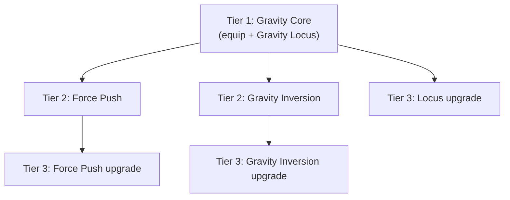

# Gravity Research Tree — Brainstorm

Status: **converging** — resource mechanic, toggle input, and mechanic scope are decided (§5.5, §6). Push/Pull semantics per-ability and the modifier's name are proposed, pending confirmation. See `.claude/skills/brainstorming` for the process this doc is following.

## 1. Objective

A new research tree, **Gravity**, focused on repositioning enemies, applying CC, and punishing CC'd/displaced enemies with damage. Thematically paired with the **Shield** weapon, but must work with any primary weapon (Rock, Shield, Stick) — no hard equip lock to one weapon.

**Locked constraints:**
- New resource: `gravity` (0–100, purple `#a855f7`, icon `Atom` — already stubbed in `resources/Gravity.ts`, gain logic explicitly marked TBD).
- New **Core** item (equipment slot that grants the resource + starter card), following the `017_core_light.ts` pattern — this is what "new core assigned to them" means in this codebase: Core items determine `resourcesToAdd` + `cardsToAdd` + weapon/utility slot layout.
- New `AbilityGroupId` (next free slot after `Light = 8`) and a `09_gravity_core/` card folder with a `GravityCore.md` doc (template: `05_earth_core/EarthCore.md`).
- **Ability Mode**: a per-cast toggle (Push ↔ Pull) settable only while the player is in ability-selection/targeting input. Since it can be changed mid-input, an ability's cast can start as Push and resolve as Pull if the player flips it before confirming.
- Three named abilities: **Gravity Locus**, **Force Push**, **Gravity Inversion** (specs below).
- Subtle, non-interrupting repositioning as a *distinct* effect from big launches — both need to read clearly on screen as different things.

## 2. Intended player experience

Gravity is a **battlefield choreographer** kit, not a damage kit — its damage exists to punish positioning mistakes it creates. The good feeling is: "I moved that enemy exactly where I wanted, and now it's paying for it" — either by colliding with something, or by eating a follow-up hit while CC'd.

- Should read as **spatial power**, not a stat stick: value scales with the terrain and other units on the field, not just numbers on the ability.
- **Subtle vs. forceful must look and feel obviously different** — a small nudge shouldn't flash like a launch, or players won't be able to read whether an enemy's attack got interrupted.
- Flexible across weapons: Shield players lean into tanky control (hold ground, push things off you); Rock players can set up ranged combos (push enemies into throw range, or line them up); Stick players get melee pull-ins (yank stragglers into swing range) or peel (push melee attackers off you).

## 3. What already exists to build on

| Piece | File | Notes |
|---|---|---|
| Gravity resource stub | `resources/Gravity.ts` | Max 100, purple, `Atom` icon. `subscribe()` is empty — gain mechanics explicitly TBD. |
| Core item pattern | `character_defs/items/core/017_core_light.ts` | `resourcesToAdd: ['light']`, `cardsToAdd`, `slotLayout`. Directly reusable shape for a Gravity Core. |
| Tree pattern | `researchTrees/trees/light.ts`, `earth.ts` | Core trees gate on `characterHasEquippedItem` (the Core item) rather than a specific weapon, so "works with any weapon" is already the norm, not an exception. |
| Knockback system | `crowdControl/knockbackKeywords.ts`, `game/units/unitKnockback.ts` | Tiered launch (air time / slide time / magnitude), gated by CC-armour threshold (bosses absorb N hits first), terrain-aware (`computeForcedDisplacement` stops a unit at a wall). |
| CC armour / hard-CC threshold | `crowdControl/tryApplyHardCcStun.ts`, `ccArmourState.ts` | See `[[boss-cc-armour]]` memory — bosses need N absorbed hits before a stun/launch actually lands. Gravity Inversion's 1.5s hard CC will run through this same gate for boss-tier enemies. |
| `AbilityGroupId` + folder convention | `card_defs/AbilityGroupId.ts`, `card_defs/05_earth_core/EarthCore.md` | Earth Core's doc is the template for a new skill-tree line. |

## 4. What's genuinely new engine work

None of these exist today — flagging so scope is clear before we commit to the three abilities as pitched:

- **Pull** (force a unit *toward* a point). Only "away from source" knockback exists (`_launchKnockback`, `applyDirectionalKnockback`). Pull needs new displacement math, not just a negated vector — it also raises the question of *what happens when the pulled unit reaches the locus* (stop? pass through? stack at center?).
- **Unit-to-unit collision during forced movement.** `computeForcedDisplacement` only checks terrain passability along the path — it has no concept of another unit occupying a cell. Force Push's "hits an enemy → both take damage" and "hits an ally → only flung unit takes damage" requires a new collision sweep against other units, distinct from terrain.
- **Wall bounce-back with damage to both sides.** Today a wall just halts movement (`distance` clamps to the point before the wall; no rebound, no damage hook). Force Push wants a rebound vector plus a damage event fired at the terrain tile — terrain doesn't currently take "impact" damage from a unit collision (Earth Core's stone damage is dealt by abilities directly, not by units slamming into it).
- **Non-interrupting "nudge."** Every existing forced-movement path (`applyKnockback`) clears the unit's path and is treated as CC. A subtle reposition that *doesn't* cancel the enemy's current attack windup is a new movement category alongside knockback — not a smaller tier of it.
- **Long-hold airborne CC (Gravity Inversion's 1.5s float).** Existing knockback air time tops out at tier 3 = 0.5s and is a movement arc, not a suspended state. A 1.5s "hanging in the air, fully CC'd" is closer to a new stun-variant buff (like `ExposedBuff`/`StunnedBuff`) with a distinct visual, not a bigger knockback tier.
- **Live per-cast Ability Mode (Push/Pull toggle).** Nothing like this exists. Named "Ability Mode" specifically to avoid clashing with `AbilityModifier` in `researchTrees/types.ts`, which is a *static, research-granted, per-unit* tweak (flat damage, tag additions) applied before battle — unrelated to this live in-battle player toggle.
- **Per-tick resource accrual.** Every existing `Resource` subclass (`Mana`, `Rage`, `Resonance`, …) gains value from discrete events (`turn_end`, `onRoundStart`, a landed hit) — there is no "recompute every fixed-update tick" hook on the `Resource` base class. The grazing mechanic (§5.5) needs continuous nearest-enemy/nearest-projectile distance checks every tick, so this needs a new `onTick?(unit, engine, dt)` hook added to `Resource` and called from `GameEngine.fixedUpdate` for every unit's attached resources.

## 5. The three abilities, as pitched (with decisions folded in)

| Ability | Effect | New mechanics it leans on |
|---|---|---|
| **Gravity Locus** | Small black hole at a point; Push/Pull toggle decides whether it pulls enemies in or pushes them away. Carries the **non-interrupting nudge** pillar (§5.5b). | Pull (new), push (existing knockback, redirected toward/away from a point instead of away from caster), Push/Pull toggle (new), non-interrupting nudge (new) |
| **Force Push** | Flings a unit in a direction. Hits enemy → both take damage. Hits wall → bounces off, unit + wall both take damage. Hits ally → only flung unit takes damage. **Only this ability deals collision damage**, authored as an ability-specific event (not a generic engine-wide rule other knockbacks pick up automatically). | Unit-unit collision (new), wall bounce + terrain damage (new), directional knockback (existing), collision-damage event hook (new, scoped to this ability) |
| **Gravity Inversion** | Lifts enemies airborne, hard-CC 1.5s, then slams down for ~6 damage. Smaller knockback than Force Push — no collision damage. | Long-hold airborne CC (new buff), hard-CC-armour interaction (existing), slam damage on landing |

**Decided:** all three abilities share the same Push/Pull toggle (§6B), but only Force Push triggers the unit/wall collision-damage rule — Gravity Locus and Gravity Inversion use smaller, non-damaging-on-collision knockbacks.

### 5.5 Gravity resource — grazing mechanic (decided)

A Touhou-style "graze" system: standing near danger (without necessarily engaging it) fills the meter, and grazing a projectile pays out more than grazing a unit.

**Constants** (names indicative, would live in a `gravityConstants.ts` alongside the tree, mirroring `earthCoreConstants.ts`):
- `GRAVITY_MIN_PER_ROUND` — floor rate, always granted regardless of proximity.
- `GRAVITY_MAX_PER_ROUND_UNITS` — cap rate from grazing an enemy unit.
- `GRAVITY_MAX_PER_ROUND_PROJECTILES` — cap rate from grazing an enemy projectile; **higher than the unit cap** (projectiles pay out more).
- `GRAVITY_GRAZE_MIN_DISTANCE` — edge-to-edge distance at/under which the *max* rate applies.
- `GRAVITY_GRAZE_MAX_DISTANCE` — edge-to-edge distance at/over which only the *min* (floor) rate applies.

**Per tick, for a unit carrying the Gravity resource:**
1. Find the nearest enemy unit. `grazeDistUnits = distance(centers) - (enemyRadius + casterRadius)`, clamped to ≥ 0.
2. `rateUnits = lerp(GRAVITY_MAX_PER_ROUND_UNITS, GRAVITY_MIN_PER_ROUND, clamp01((grazeDistUnits - MIN_DIST) / (MAX_DIST - MIN_DIST)))` — closer grazes pay closer to the max.
3. Repeat 1–2 against the nearest enemy projectile, using `GRAVITY_MAX_PER_ROUND_PROJECTILES` as the cap → `rateProjectiles`.
4. `ratePerRound = max(rateUnits, rateProjectiles, GRAVITY_MIN_PER_ROUND)`.
5. Apply continuously: `resource.add(ratePerRound * (dt / ROUND_DURATION))` every `fixedUpdate` tick (`ROUND_DURATION = 10s`, from `gameConstants.ts`) — expressed as "per round" for tuning/display, applied as a smooth per-tick trickle rather than a lump sum at round boundaries.

This requires the new `Resource.onTick` hook noted in §4, plus a nearest-enemy/nearest-projectile lookup (reuse whatever `findEnemies`/targeting helpers already do this, rather than reimplementing distance search).

**Open implementation questions** (not blocking the brainstorm, flagging for the plan phase):
- Does "nearest enemy" reuse an existing visibility/darkness filter (so units hidden in darkness don't passively feed Gravity), or is it raw distance?
- Confirm the floor (`GRAVITY_MIN_PER_ROUND`) is what you get *at or beyond* `GRAVITY_GRAZE_MAX_DISTANCE`, not a separate additive trickle on top of the lerped value — the spec above treats it as the lerp's lower bound, not a bonus.

## 6. Decisions so far

### A. `gravity` resource generation — **decided: grazing** (§5.5)

Touhou-style graze: proximity to enemy units and enemy projectiles both feed the resource continuously, projectiles paying out more than units, with a guaranteed floor trickle. Full spec in §5.5. The other options considered (movement-based, impact-based, mass-proximity, shield-synergy-burst) are dropped in favor of this — noted here only so we don't re-litigate them later.

### B. Push/Pull toggle — **decided: click-toggle icon, named "Ability Mode"**

A button on the ability slot flips Push↔Pull; state persists until changed. Applies uniformly to all three gravity abilities (§5). "Modifier key on confirm" and "twin cards instead" are dropped. The live per-cast toggle is called **Ability Mode** in code/UI — kept distinct from the existing `AbilityModifier` type in `researchTrees/types.ts`, which is a static, research-granted, per-unit tweak applied before battle and is unrelated to this.

**Push vs Pull semantics per ability — decided.** Convention: **Push = away from the reference point, Pull = toward the reference point**, where the reference point is whatever the ability treats as its origin:
- **Gravity Locus**: reference point is the locus itself (as originally pitched — no change).
- **Force Push**: reference point is the caster. Push = fling away from caster (as pitched); Pull = fling *toward* the caster instead ("Force Pull") — same collision engine, just the vector points inward, so it can slam the target into terrain/units behind the caster or short of it.
- **Gravity Inversion**: the lift/hard-CC/slam timing stays identical either way; the toggle only changes the *horizontal* component of the slam — Push drops them straight down in place (or outward), Pull drags them down at the caster's feet (setting up a melee follow-up). Damage and the 1.5s hard-CC window are unaffected by the toggle.

### C. Juice / visual clarity ideas

- **Color language**: keep all gravity VFX in the resource's violet (`#a855f7`) family so players learn "purple on an enemy = gravity is affecting them," the same way stun/exposed already have their own read.
- **Distinct nudge vs. launch language**: nudges get a faint directional ghost-step/arrow with no camera reaction; launches get a motion streak. **Decided: no camera shake, no bespoke audio for now** — both dropped from scope; the streak alone (present on launches, absent on nudges) carries the "was this a real CC?" read.
- **Locus visuals**: swirling inward violet particle streams for Pull, outward-radiating cracks/rings for Push — legible at a glance which mode is active, reinforcing the Ability Mode toggle.
- **Collision feedback split by target**: unit-vs-unit = a "clash" spark burst + short hitstop; unit-vs-wall = a dust/debris burst + a visible crack decal on the wall tile, so players can tell which collision type just happened without reading combat text.
- **Gravity Inversion telegraph**: a rising dust/debris column under the lifted enemy for the full 1.5s window, clearly communicating "this is your window to capitalize," then a hard downward streak + small shockwave ring on the slam.

**Decided: systematize these through parameterized effect defs, not one-off ability code.** This project already has exactly the right infrastructure for this in `game/effect_defs/`:
- `IEffectDef` (`effect_defs/types.ts`) is a `createVisual`/`updateVisual` pair driven by `effect.effectData` — the same def can serve many callers by varying data fields (color, radius, direction), which is how e.g. `afterimageEffectDef`/`stackGhostEffectDef` already serve multiple abilities via `bodyColor`/`direction` params (`effect_defs/movementEffects.ts`).
- Effects are registered once in the central `effectDefRegistry` (`effect_defs/index.ts`) and organized into category files by *what they visually are* (`impactEffects.ts`, `trailEffects.ts`, `aoeEffects.ts`, `movementEffects.ts`, …), not one file per ability or per tree.
- Declarative spawning already exists via `AbilityTimingEmitterDef` on an ability's timing interval (`abilities/abilityTimings.ts` + `abilities/createEmitterFromDef.ts`) — continuous effects (like Locus's field) should be wired as a `ContinuousEmitter` tied to the active-timing window, not manually spawned/torn down in `doCardEffect`.

Concrete def plan (one parameterized def per *visual shape*, shared across all three abilities and reusable by future kits):
| Def (proposed name) | Category file | Parameterized by | Used by |
|---|---|---|---|
| `GravityFieldEffectDef` | new, or `aoeEffects.ts` | `direction: 'in' \| 'out'`, `color`, `radius` | Gravity Locus (Push/Pull), and the outer non-interrupting-nudge ring |
| `NudgeArrowEffectDef` | `movementEffects.ts` | `direction`, `color` | Gravity Locus's nudge ring today; any future non-interrupting displacement later |
| `CollisionClashEffectDef` | `impactEffects.ts` | impact point, `color` | Force Push unit-vs-unit collisions only (per §5 scope) |
| `TerrainImpactEffectDef` (spark/dust + crack decal) | new (or extend `impactEffects.ts`) | impact point, tile ref | Force Push unit-vs-wall collisions only |
| Slam shockwave | **reuse `howlShockwaveEffectDef`** (`aoeEffects.ts`), pass violet `effectData.colors` | already data-driven, no code change needed | Gravity Inversion's landing |

Verified in `aoeEffects.ts`: `howlShockwaveEffectDef` and `pulseEffectDef` already read `effectData.colors` for their ring palette — Gravity Inversion's slam can reuse `howlShockwaveEffectDef` as-is by passing violet colors, no new def required. (`critShockwaveEffectDef`/`enrageBurstEffectDef` hardcode red and would need the same data-driven treatment before reuse — not needed here since `howlShockwaveEffectDef` already fits.)

## 7. Progression structure — decided: simple spine

Three abilities is a small tree compared to Earth Core's two-lane, 15+ node spread, so we're not forcing a lane split prematurely — can revisit as a two-lane (Control vs Impact) split once more abilities exist.

**Tier 1 — Gravity Core** (equip node, like `LIGHT_NODE_CORE`)
- Effect: `replaceEquippedItem` (current Core → Gravity Core, `resourcesToAdd: ['gravity']`), `addCard` Gravity Locus.
- `tier: 10`, matching the display-tier convention already used by `EARTH_NODE_EARTH_CORE` and the `command_core` nodes.
- **Access requirement — decided:** no equip/weapon gate (keeps "works with any weapon" unambiguous). Instead, gated behind story progress: a **new `accountKnowledge` key** (e.g. `'AlphaWolfDefeated'`) added to the alpha-wolf boss mission's `completionRewards.knowledgeKeys` (`storylines/WorldOfDarkness/missions/005_monster.ts`, the mission whose win condition is `unitDead: 'alpha_wolf'` — it doesn't currently grant any knowledge key, so this is new). The Gravity tree's `accessRequirements` then checks `{ type: 'accountKnowledge', key: 'AlphaWolfDefeated' }`, the same way `training`/`stick_sword`/`command_core` already gate on the `'Research'` key. This makes Gravity the first tree gated on a boss-defeat milestone rather than an item/prior-research gate.

**Tier 2 — parallel, both available once Core is taken** (like Light's Imbuement/Gather Light siblings)
- **Force Push** — `addCard`, prereq: Gravity Core only.
- **Gravity Inversion** — `addCard`, prereq: Gravity Core only.
- Not exclusive with each other — both are meant to be taken; Gravity is a 3-ability kit, not a pick-one branch, unless you want it to be.

**Tier 3 — per-ability upgrade nodes** (numbers TBD in the mechanics-spec pass)
- Locus upgrade(s): bigger field radius, or a second simultaneous locus.
- Force Push upgrade(s): extra collision damage, or chain to a second collision.
- Gravity Inversion upgrade(s): shorter cooldown, or extra slam damage.

## Open questions to resolve before converging

- [x] Resource generation — grazing mechanic, spec'd in §5.5.
- [x] Push/Pull interaction model — click-toggle icon, named **Ability Mode** (§6B).
- [x] Mechanic scope — build all 4 new mechanics; collision damage is Force-Push-only, authored as an ability-specific event rather than a generic knockback feature; the non-interrupting nudge lives on Gravity Locus.
- [x] Push=away/Pull=toward convention for Force Push and Gravity Inversion — confirmed (§6B).
- [x] Gravity Core's weapon/utility slot layout — 1 weapon / 1 utility, same as Light Core.
- [x] Progression shape — simple spine, not two lanes (§7); revisit as a lane split only if the tree grows beyond these 3 abilities.
- [x] Gravity Core's access requirement — no weapon/item gate; new `accountKnowledge: 'AlphaWolfDefeated'` key granted by the alpha-wolf boss mission, checked by the tree's `accessRequirements` (§7).
- [ ] Nearest-enemy/nearest-projectile lookup for grazing (§5.5) — reuse an existing visibility/darkness-aware helper, or raw distance to any enemy regardless of vision? (Implementation-level, doesn't change player-facing design — fine to resolve at the planning stage.)
