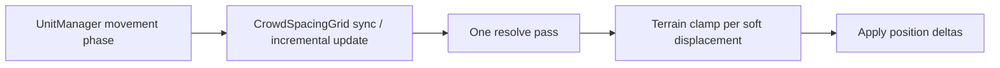

# Plan: CrowdSpacing MVP

> **Completed 2026-08-10.** Steps 1–6 delivered: `UnitTag.CrowdSpacingAnchor`, ephemeral `CrowdSpacingGrid` + one-pass `resolveCrowdSpacingPass` (radius weight, terrain clamp), `CrowdSpacingManager` after UnitManager movement, boss spawn tag, AbilityTest `crowd_spacing_pack_and_anchors`, living follow-on doc `docs/plans/crowd-spacing.md`. Verify: lint clean; AbilityTest green; `--changed` **799** passed (1 skipped). Plan-caused fix: Double Punch dummies tagged as CrowdSpacing anchors. Pre-existing: quest `mapPosition` tsc errors unchanged. **Follow-ups:** Phase 1–3 in `crowd-spacing.md`; open decisions (pets as anchors, forced-mover flag, cell-size policy).

Brainstorm locked in chat (2026-08-10): continuous radius soft push for unit packs (not rigid physics); name **CrowdSpacing**; uniform spatial grid + **one pass per tick**; asymmetric soft vs anchor; airborne exempt; forced-movers temporary anchors; players + dedicated tag as anchors; radius-weighted push with mass hook; **instant position correction with terrain clamp**; ephemeral grid (rebuild on resync, incremental while playing, **not** checkpointed).

| Topic | Decision |
|---|---|
| Name | **CrowdSpacing** (avoid “collision” and do not overload ability **`nudge`**) |
| Spatial | Uniform grid; **one** separation pass per tick (leftover overlap OK next tick) |
| Application | Instant position correction, **terrain-clamped** (MVP) |
| Weight | `weight = radius` now; API allows future mass / override |
| Soft | Grounded non-anchor participants |
| Anchor | `isPlayerControlled()`, `UnitTag.CrowdSpacingAnchor`, or temporary forced-move |
| Exempt | Airborne (`isUnitAirborne`) — not in the grid at all |
| Forced move | Temporary **anchor** (not pushed; still occupies space) — MVP: `knockback != null` (slide) and `controlled` |
| Grid sync | Derived only; rebuild on load/resync; incremental cell updates in play; **do not** serialize |
| Not this system | `CellOccupancyManager` (tile capacity / shove for `maxPerTile`) stays separate |

### Vocabulary (locked)

| Term | Meaning |
|---|---|
| **CrowdSpacing** | Soft radius packing: nudge overlapping grounded units apart |
| **Soft** | Participates and **can** be displaced by CrowdSpacing |
| **Anchor** | Participates (occupies space) but is **never** displaced by CrowdSpacing |
| **Exempt** | Not in the grid (e.g. airborne); neither soft nor anchor |
| **CrowdSpacingAnchor** | `UnitTag` for heavies/bosses/large enemies (independent of `Boss`) |
| **Spacing weight** | How hard a unit resists being moved; MVP = `radius` |

---

## Agent Instructions

This plan is executed by `/jp-implement-plan` (see `.claude/skills/jp-implement-plan/SKILL.md` — do not restate its workflow here). The **invoking agent is the sole orchestrator**: it spawns one worker per step **synchronously** (never in the background), waits for each worker to finish, then moves to the next step, and finally reports plan completion to the user. Each worker implements **exactly one step**, checks off that step's checklist items with a one-line summary under each, and **stops without spawning the next agent**.

Project skills relevant to this plan:

- `working-on-minion-battles` — game wiring under `app/js/games/minion_battles/`.
- `game-engine` — tick loop / manager placement; CrowdSpacing runs after unit movement.
- `game-object-def-pattern` — if weight/mass hooks land on defs later (MVP may keep helpers only).
- `scoped-testing` — per-step Vitest selection.
- `ability-tests` — general scenario in Step 5; expensive runner pass only in the final step.
- `jp-plan` / `working-with-skills` — only if AGENTS/skills need a one-line pointer after the system lands.

**Verification cadence:** per step, at most `npm run lint:changed`, `npx tsc --noEmit` when the step crosses an interface boundary, and **only** the specific test files the step touches or creates. No full-suite or AbilityTest/E2E in regular steps — the **final step** runs expensive checks once and writes the follow-on design doc.

**Content note:** Do **not** implement size-tier hierarchy, custom mass, multi-pass-per-tick, per-tick max-displacement caps (beyond terrain clamp), or syncing the grid. Leave extension hooks only where the step asks for them.

---

## Architecture

**Tick placement:** After Phase 2b movement in `UnitManager.gameTick` (positions settled for the tick), as a new **CrowdSpacing** phase. Do **not** merge into `CellOccupancyManager` / Phase 2a.

**Determinism:**

- Process overlapping pairs in stable order (`unitId` ascending; pair key `minId|maxId`).
- No `Math.random`; fixed one pass; pure functions of positions, radii, roles, terrain.
- Grid is acceleration only — same positions ⇒ same corrections even if grid was rebuilt.

**Baseline constants (MVP — tune later in follow-on doc):**

| Constant | Starter | Notes |
|---|---|---|
| Grid cell size | `2 * maxParticipatingRadius` (recomputed on full rebuild) or fallback `CELL_SIZE * 2` | Large enough that a unit spans ≤ ~2×2 cells |
| Overlap epsilon | `0.5` px | Ignore tiny overlaps |
| Weight | `radius` | Soft–soft inverse-weight split; soft–anchor = 100% on soft |
| Passes per tick | `1` | Residual OK |

**Participation (MVP):**

1. Not alive / inactive / spawning → skip  
2. `isUnitAirborne(unit)` → **exempt**  
3. Else if `isPlayerControlled()` **or** `hasUnitTag(CrowdSpacingAnchor)` **or** forced-mover → **anchor**  
4. Else → **soft**

Forced-mover MVP helper: `unit.knockback != null || unit.controlled` (knockback **air** already exempt via step 2; slide remains anchor). Ability `nudge` alone does **not** count as forced move.

**Players:** always anchors via `isPlayerControlled()` (no tag required). Note: player-owned pets currently count; refine in Phase 1 doc if needed.

**Bosses / heavies:** add `UnitTag.CrowdSpacingAnchor` wherever bosses already get `UnitTag.Boss` in shared spawn constants (additive; do **not** derive CrowdSpacing from Boss in solver code).

---

## Ability Test Coverage

| Scenario | What it covers |
|---|---|
| `crowd_spacing_pack_and_anchors` (general / Movement) | Soft enemies overlapping at start separate over ticks; player standing in the pack is not displaced; a `CrowdSpacingAnchor` enemy is not displaced; soft units move away from anchors |

Keep assertions high-level (ordering / inequality of positions, not exact pixel tables). Create in Step 5; run headlessly in the **final** step.

---

## Steps

### Step 1 — Tag, roles, weight, constants

**Touches:**
- `app/js/games/minion_battles/game/units/unitTag.ts`
- `app/js/games/minion_battles/game/crowdSpacing/` (new folder: `crowdSpacingConstants.ts`, `crowdSpacingRoles.ts`, co-located `crowdSpacingRoles.test.ts`)

- [x] Add `UnitTag.CrowdSpacingAnchor` and ensure parse/serialize via existing tag helpers still works.
  - Added enum value `crowdSpacingAnchor` with comment that it is independent of `Boss`; covered by `isUnitTag` / `parseUnitTagsFromJSON` test.
  - Comment: independent of `Boss`; used for heavies that must stand their ground.
- [x] Export MVP constants (`CROWD_SPACING_OVERLAP_EPSILON`, fallback cell size, etc.) from `crowdSpacingConstants.ts` — no magic numbers at call sites.
  - New `crowdSpacingConstants.ts`: overlap epsilon 0.5, fallback `CELL_SIZE * 2`, one pass/tick, `crowdSpacingCellSizeFromMaxRadius`.
- [x] Implement `getCrowdSpacingWeight(unit): number` returning `unit.radius` for MVP, with a short comment that mass/override may replace this later.
  - Implemented in `crowdSpacingRoles.ts` with mass/override note in JSDoc.
- [x] Implement `getCrowdSpacingRole(unit): 'exempt' | 'soft' | 'anchor'` using the participation rules above (import `isUnitAirborne` from terrain tile transitions).
  - Role helper + `isCrowdSpacingForcedMover` (`knockback != null || controlled`); dead/spawning/airborne exempt; players/tag/forced movers anchor; else soft.
- [x] Co-located unit tests for roles (airborne exempt, player anchor, tag anchor, knockback air vs slide, soft default) and weight.
  - `crowdSpacingRoles.test.ts` covers tag parse, constants, weight, and role matrix including nudge-not-forced.
- [x] Verify: `npm run lint:changed`, then `npx vitest run` on the new roles test file only.
  - `lint:changed` clean; `crowdSpacingRoles.test.ts` — 11 passed.

---

### Step 2 — Ephemeral CrowdSpacingGrid

**Touches:**
- `app/js/games/minion_battles/game/crowdSpacing/CrowdSpacingGrid.ts`
- `app/js/games/minion_battles/game/crowdSpacing/CrowdSpacingGrid.test.ts`

- [x] Implement a uniform-grid spatial index keyed by cell coords; store unit ids (or refs) per cell.
  - New `CrowdSpacingGrid.ts`: `clear` / `rebuild` / `updateUnit` / `removeUnit` / `queryNeighbors`; multi-cell insert; runtime-only (no serialize).
  - API sketch: `clear()`, `rebuild(participants, cellSize)`, `updateUnit(unitId, x, y, radius)`, `removeUnit(unitId)`, `queryNeighbors(x, y, radius): unitId[]`.
  - A unit may occupy multiple cells if radius spans them; insert into all overlapped cells.
  - **Not** serialized; no checkpoint fields.
- [x] `rebuild` chooses cell size from constants / max radius policy in Step 1.
  - Defaults to `crowdSpacingCellSizeFromMaxRadius(max radius)`; optional `cellSize` override; empty → fallback.
- [x] Unit tests: insert/query finds overlaps; move updates cells; remove clears; rebuild from list matches incremental end state for the same positions.
  - `CrowdSpacingGrid.test.ts` — 7 cases covering query, cell-size policy, update, remove, rebuild↔incremental, multi-cell span.
- [x] Verify: `npm run lint:changed`, then `npx vitest run` on `CrowdSpacingGrid.test.ts` only.
  - `lint:changed` clean; `CrowdSpacingGrid.test.ts` — 7 passed.

---

### Step 3 — One-pass resolve + terrain clamp

**Touches:**
- `app/js/games/minion_battles/game/crowdSpacing/resolveCrowdSpacing.ts`
- `app/js/games/minion_battles/game/crowdSpacing/resolveCrowdSpacing.test.ts`
- Reuse: `clampNudgeVectorToTerrain` / `computeForcedDisplacement` (do not duplicate terrain math)

- [x] Implement `resolveCrowdSpacingPass({ units, grid, terrainManager | grid terrain })`:
  1. Consider only soft + anchor already in the grid (exempt never inserted).
  2. Enumerate unique overlapping pairs in deterministic order.
  3. Soft–soft: separation along axis by overlap depth; split by inverse weights (`w = getCrowdSpacingWeight`).
  4. Soft–anchor: full correction on soft only.
  5. Anchor–anchor: no-op.
  6. Terrain-clamp each soft delta before applying; never leave soft in impassable terrain.
  7. Apply instant `unit.x/y` updates; refresh grid cells for moved units.
  - New `resolveCrowdSpacing.ts`: accumulate pair deltas (id-sorted), clamp via `clampNudgeVectorToTerrain`, apply + `grid.updateUnit`.
- [x] Co-located tests: two softs push apart; larger radius moves less; soft yields fully to anchor; anchor unmoved; clamp blocks push into walls (use small grass+impassable fixture like other force-move tests); one pass only (no internal iteration loop beyond a single sweep).
  - `resolveCrowdSpacing.test.ts` covers soft–soft, weight split, soft–anchor, rock clamp, triple residual + second external pass, epsilon, anchor–anchor.
- [x] Verify: `npm run lint:changed`, `npx tsc --noEmit` if signatures cross modules, then `npx vitest run` on `resolveCrowdSpacing.test.ts` only.
  - `lint:changed` clean; `tsc` has unrelated pre-existing quest mission errors; `resolveCrowdSpacing.test.ts` — 7 passed.

---

### Step 4 — Engine wiring + boss tag content

**Touches:**
- `app/js/games/minion_battles/game/managers/UnitManager.ts`
- `app/js/games/minion_battles/game/GameEngine.ts` and/or `EngineContext.ts` / `GameState.ts` as needed for owning the grid
- `app/js/games/minion_battles/constants/enemyConstants.ts` (boss `unitTags`)
- Optional thin `CrowdSpacingManager.ts` if that keeps UnitManager readable

- [x] Own an ephemeral `CrowdSpacingGrid` on the engine/context (like `cellOccupancyManager` — runtime only).
  - Added `CrowdSpacingManager` (owns grid) on `GameEngine` + `EngineContext`; never serialized.
- [x] After movement Phase 2b, run CrowdSpacing: sync participants into the grid (incremental updates preferred; full `rebuild` on empty/missing state), then one `resolveCrowdSpacingPass`.
  - UnitManager Phase 2c calls `crowdSpacingManager.tick` (rebuild when empty/flagged/cell-size change; else incremental; then one resolve).
- [x] On snapshot load / `fromJSON` / prepare-for-new-game: **full rebuild** (or clear and rebuild on first tick) — never read grid from JSON.
  - `crowdSpacingManager.clear()` in `prepareForNewGame` and `fromJSON`; first tick rebuilds.
- [x] Add `UnitTag.CrowdSpacingAnchor` alongside existing `UnitTag.Boss` in shared boss spawn tags (`enemyConstants`), without changing solver to special-case Boss.
  - `ENEMY_ALPHA_WOLF.unitTags` is now `[Boss, CrowdSpacingAnchor]`.
- [x] Verify: `npm run lint:changed`, `npx tsc --noEmit`, then `npx vitest run` on crowdSpacing tests + any UnitManager test touched (if none, crowdSpacing tests only).
  - `lint:changed` clean; `tsc` only pre-existing quest `mapPosition` errors; crowdSpacing suite 25 passed (no UnitManager tests).

---

### Step 5 — AbilityTest scenario (create only; light unit verify)

**Touches:**
- `app/js/games/minion_battles/testing/scenarios/general/` (new or existing movement-adjacent file, e.g. `crowdSpacing.ts`)
- `app/js/games/minion_battles/testing/scenarios/registry.ts`

- [x] Add `crowd_spacing_pack_and_anchors` scenario per Ability Test Coverage table (`generalSection: 'Movement'` if that group exists / fits).
  - New `testing/scenarios/general/crowdSpacing.ts`: overlapping soft trio + player + `CrowdSpacingAnchor`; wait lockout; high-level spread/stay assertions.
  - Keep map small; player `wait` or short move so the runner does not idle-exit early.
  - Assert soft pack spreads; player and tagged anchor positions stay put (within epsilon).
- [x] Register in `ALL_ABILITY_TEST_SCENARIOS`.
  - Imported and appended next to other Movement scenarios in `registry.ts`.
- [x] Verify: `npm run lint:changed`, then `npx vitest run` on any **unit** tests edited this step only — **do not** run the full AbilityTest SimulationRunner suite here (final step does that).
  - No unit tests edited this step; verify via `lint:changed` only.

---

### Step 6 — Follow-on design doc + final verification

**Touches:**
- `docs/plans/crowd-spacing.md` (**create** — single living doc for MVP summary + Phase 1 / 2 / 3)
- This plan file (completion note only if orchestrator asks; workers check items)

- [x] Create `docs/plans/crowd-spacing.md` with:
  1. **MVP (done)** — short summary of what shipped (grid, one pass, roles, terrain clamp, sync rules, tag).
  2. **Phase 1 — Safety & feel** — high-level instructions only: per-tick max displacement; soft squeezed between anchors/walls; whether player-owned pets should be soft vs anchor; any feel tuning.
  3. **Phase 2 — Size / tier hierarchy** — high-level instructions: optional spacing tier so larger tiers act as anchors vs smaller (example only; no numbers required).
  4. **Phase 3 — Explicit mass** — high-level instructions: mass/weight override separate from radius; how it plugs into `getCrowdSpacingWeight`.
  - One document for all phases; keep instructions actionable for a future `/jp-plan`, not full step checklists.
  - Created `docs/plans/crowd-spacing.md`: MVP summary + Phase 1/2/3 high-level instructions in one living doc.
- [x] Final verification (once): `npm run lint:changed` (or `npm run lint` if changed lint is empty), then run the new AbilityTest via the project’s headless scenario path (e.g. SimulationRunner test filtered to `crowd_spacing_pack_and_anchors` **or** the smallest command that executes that scenario), then `npx vitest run --changed`.
  - `lint:changed` clean; headless via `crowdSpacing.scenarios.test.ts` (1 passed); `vitest run --changed` 799 passed / 1 skipped. `tsc --noEmit` still has unrelated quest `mapPosition` errors only.
- [x] Fix only failures caused by this plan (≤2 attempts); leave pre-existing failures noted.
  - Fixed plan-caused `double_punch_death_fallback` break: tagged co-located dummies `CrowdSpacingAnchor` so soft packing no longer separates them before punch2.

---

## Open decisions (non-blocking for MVP)

- [ ] Should player-owned **pets** remain anchors via `isPlayerControlled()`, or become soft in Phase 1?
- [ ] Should future dashes that are neither `knockback` nor `controlled` register via a shared `isForcedMover` flag?
- [ ] Exact max-radius / cell-size policy if battles mix tiny and huge radii — revisit if query sets get large.

---

## Out of scope (this plan)

- Size-tier ladder, custom mass, multi-pass per tick, syncing grid over the network
- Replacing or merging `CellOccupancyManager`
- Changing ability `nudge` semantics
- Deriving CrowdSpacing from `UnitTag.Boss` in code
