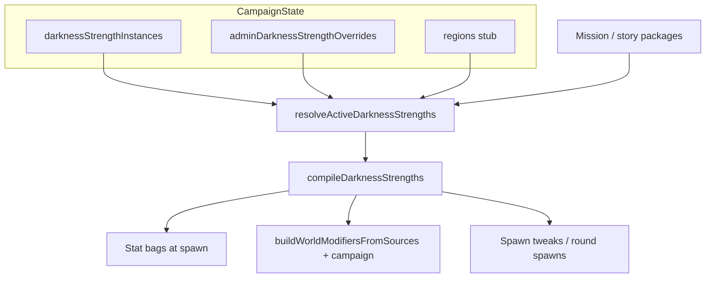

# DarknessStrength — Implementation Plan

> **Completed 2026-07-23.** Steps 1–9 delivered: `app/js/darknessStrength/` (types, registry, three starters, resolve/compile/progression), campaign JSON + API fields, battle bake + campaign WM lane + `spawnUnits` round spawns, mission-end progression hooks, admin **Campaign data** UI on Players → selected player (DarknessStrength sub-tab), and headless scenarios for hardened HP / swarm reinforcements. Automated verify green for DS scope; full suite **1390 passed / 2 failed** (`meleeStrikeTooltip` unrelated). **Human follow-up:** browser checklist on Campaign data force-enable/disable. **Follow-ups** (not this plan): lord domains, curses/research grants, mission packages, schedule/ability fire, bestiary modified stats, player-facing browse.

Meta-progression packages that raise enemy difficulty over time. Sources (darkness growth, region domains, curses, mission one-offs) resolve into an **Active DarknessStrengths** set, then **compile** into stat bags, world modifiers, and spawn tweaks. Defs are typed JSON-like objects that compose existing effect / ability / world-modifier primitives.

Brainstorm decisions locked in chat (2026-07-22/23):

| Topic | Decision |
|---|---|
| Umbrella name | **DarknessStrength** (all packages) |
| Authoring unit | Package defs; compile → stat bags / world modifiers / spawn tweaks / schedules |
| WM merge order | `builtins < campaign < mission < story` (same `id` → one instance; later wins) |
| Filters (v1) | `characterId` \| `creatureType` \| `tags` |
| `battlesRemaining` | Decrement on **victory only** |
| Campaign counters | Update at **mission end only** (mission unresolved until victory or defeat) |
| Admin overrides | Force **enable and disable** (+ optional test `data`) |
| Lord domains | Campaign **region** state (stub region map in storage; full lord content later) |
| First content | Two **stat** packages + one **spawn extra units every round** package |
| Admin UI | Players → selected player home: left pane **Campaign data** above character list; center sub-tabs; first tab = DarknessStrength |

## Agent Instructions

This plan is executed by `/jp-implement-plan` (see `.claude/skills/jp-implement-plan/SKILL.md` — do not restate its workflow here). The **invoking agent is the sole orchestrator**: it spawns one worker per step **synchronously** (never in the background), waits for each worker to finish, then moves to the next step, and finally reports plan completion to the user. Each worker implements **exactly one step**, checks off that step's checklist items with a one-line summary under each, and **stops without spawning the next agent**.

Project skills relevant to this plan (workers should invoke the ones matching their step):

- `working-on-minion-battles` — always for battle wiring.
- `game-engine` — tick/spawn/stat application, serialization boundaries.
- `research-trees` — mirror `passiveBonuses` merge math for enemy/player stat bags.
- `modifying-spawn-definitions` — spawn-tweak / round spawn behaviour.
- `missions` — battle bootstrap / mission-end campaign patches.
- `editing-and-creating-components` — admin Campaign data UI.
- `campaign-home-tabs` / `campaign-characters` — players → character home routing.
- `ability-tests` — final-step scenarios only.
- `scoped-testing` — per-step Vitest selection.
- `working-with-skills` — only if a short AGENTS note is added under the new folder.

**Verification cadence:** per step, at most `npm run lint`, `npx tsc --noEmit` when the step crosses an interface boundary, and only the specific test files the step touches or creates. No full-suite, whole-directory, or AbilityTest/E2E runs in regular steps — the final step runs the expensive things exactly once.

## Architecture



### Instance crumb (persist minimal)

```ts
{ packageId: string; data?: Record<string, unknown> }
// Campaign: e.g. { battlesRemaining: 10 }
 // Mission/battle: e.g. { killCount: 13 } — not copied to campaign until mission end
```

### Admin override map

```ts
adminDarknessStrengthOverrides?: Record<string, { enabled: boolean; data?: Record<string, unknown> }>
```

### World-modifier merge

Extend `buildWorldModifiersFromSources` with `campaign?: WorldModifierDef[]`:

```text
builtins < campaign < mission < story
```

Duplicate `id` → keep later source only.

### v1 compile effect kinds (typed)

- `statBag` — `target: 'enemy' | 'player'`, optional filter (`characterId` / `creatureType` / `tags`), `bonuses` shaped like `PassiveBonusMap` (reuse merge: add sum, mult `1+Σ(mult−1)`).
- `spawnTweak` — at least `{ everyRound: true; characterId: string; count: number; spawnBehaviour?: ... }` for the first content pack.
- `worldModifier` — preset id or inline `WorldModifierDef` (for later packages; not required for the three starters if spawn/stat cover them).
- Defer full `schedule` + ability-def firing to a follow-up unless a starter needs it.

### Starter registry packages

| `packageId` | Lane | Compile |
|---|---|---|
| `ds_enemy_hardened` | Darkness | Enemy `maxHealth` mult **1.30** (Medium) — all enemies (no filter) |
| `ds_enemy_fierce` | Darkness | Enemy `all_damage` mult **1.20** (Small) — all enemies |
| `ds_swarm_reinforcements` | Darkness | Each round start: spawn **1** `swarmling` (edgeOfMap or darkness — pick one and document in def) |

Defs live in a static registry (code). Campaign saves only instances + overrides.

### Admin UI placement

In admin `CharactersPanel` (Players → selected player):

1. Left pane: **Campaign data** selectable row **above** the character list (mutually exclusive with character selection).
2. Selecting it shows center content with **sub-tabs**; first sub-tab = **DarknessStrength** (list registry + active instances, force enable/disable, optional edit `data`).
3. Resolve which `campaignId` to edit from the player’s characters / account `campaignIds` (if multiple, simple selector in the Campaign data header).

### Key existing code index

| Concern | Location |
|---|---|
| Campaign persistence | `backend/Campaign.php`, `backend/CampaignManager.php`, `GetCampaignHandler` / update handlers |
| `CampaignState` type | `app/js/types.ts` |
| Lobby campaign API | `app/js/LobbyClient.ts` (`getCampaign`, `updateCampaign`, admin resources) |
| Passive merge math | `app/js/researchTrees/passiveBonuses.ts`, `types.ts` (`PassiveBonusMap`) |
| Descriptive magnitudes | `app/js/researchTrees/descriptiveValue.ts` |
| Player unit bake at mission start | `app/js/games/minion_battles/storylines/BaseMissionDef.ts` |
| Enemy spawn factory | `game/units/index.ts`, spawn configs / `unit_defs/unitDef.ts` (`creatureType`, `tags`) |
| WM merge | `worldModifiers/buildWorldModifiers.ts`, `BattleSession.finalizeEngine` |
| Round events | `WorldEventType` `on_round_start` / EventBus |
| Admin player home | `ui/components/characters/CharactersPanel.tsx` |
| Routes | `app/js/components/ability-tests/campaignTabPaths.ts` |

### Out of scope (document only; extension points)

- Full lord-domain content packs; ambient rain; terrain enter/leave; ability-schedule meteor; bestiary modified-stat display; player-facing non-admin browse UI polish beyond what’s needed for admin.

---

### Step 1 — DarknessStrength types, registry, starter defs

New folder `app/js/darknessStrength/` (parallel to `researchTrees/`): core types, registry, three starter defs, unit filter helper.

Touches: new `app/js/darknessStrength/types.ts`, `registry.ts`, `packages/starters.ts` (or per-file), `unitFilter.ts`, `unitFilter.test.ts`, `registry.test.ts`; optional short `AGENTS.md`.

- [x] Add typed `DarknessStrengthDef`, `DarknessStrengthInstance`, `DarknessStrengthAdminOverride`, `DarknessStrengthCompileEffect` (`statBag` \| `spawnTweak` \| stub `worldModifier`), and `UnitFilter` (`characterId?` / `creatureType?` / `tags?`, AND semantics).
  - Added `app/js/darknessStrength/types.ts` with all shapes; compile effects reuse `PassiveBonusMap` / `WorldModifierDef` / `SpawnBehaviour`.
- [x] Implement `matchesUnitFilter(unitOrDef, filter)` against `characterId`, `creatureType`, and def/runtime `tags`; cover with `unitFilter.test.ts`.
  - `unitFilter.ts` ANDs fields; resolves creatureType/tags from subject or UNIT_DEFS; covered by `unitFilter.test.ts`.
- [x] Register starters `ds_enemy_hardened`, `ds_enemy_fierce`, `ds_swarm_reinforcements` with names/descriptions/icons/lane=`darkness` and the compile payloads from the Architecture table; `getDarknessStrength(id)` + `listDarknessStrengths()`.
  - Starters in `packages/starters.ts` (HP 1.3 / damage 1.2 / edgeOfMap swarmling); registry + `registry.test.ts`; short `AGENTS.md`.

Verify: `npm run lint:changed`, `npx vitest run app/js/darknessStrength/unitFilter.test.ts app/js/darknessStrength/registry.test.ts`.

---

### Step 2 — Campaign persistence + API surface

Persist instances, admin overrides, and a minimal `regions` stub on campaign JSON.

Touches: `backend/Campaign.php`, campaign update/get handlers as needed, `app/js/types.ts` (`CampaignState`), `app/js/LobbyClient.ts` (and/or `minionBattlesApi.ts`) for read/write of the new fields.

- [x] Extend `Campaign` / `CampaignState` with `darknessStrengthInstances: DarknessStrengthInstance[]`, `adminDarknessStrengthOverrides?: Record<string, { enabled: boolean; data?: Record<string, unknown> }>`, and `regions?: Record<string, { activeDomainPackageIds?: string[] }>` (empty-ok stub).
  - PHP `Campaign` stores the three fields; `CampaignState` + `CampaignRegionState` in `types.ts`; `UpdateCampaignHandler` accepts PATCH for them.
- [x] Ensure `toArray` / `fromArray` / `updateCampaign` round-trip the new fields without dropping unknown-safe defaults (`[]` / `{}`).
  - `toArray` always emits instances `[]` and empty maps as `{}`; `fromArray` defaults missing keys; LobbyClient `Partial<CampaignState>` PATCH documents the keys.
- [x] Add a focused PHP or TS test if one already exists for campaign round-trip; otherwise a small Vitest that documents the client payload shape expected by the API (mock or type-level) — prefer extending an existing campaign test file if present.
  - Added `campaignFields.ts` + `campaignFields.test.ts` documenting defaults and sample PATCH shape (no prior campaign test file).

Verify: `npx tsc --noEmit`, `npm run lint:changed`, plus any new/touched campaign test file only.

---

### Step 3 — Resolve Active DarknessStrengths (+ admin overrides)

Pure resolve: natural instances + region stubs + admin force on/off → active list for a battle context.

Touches: `app/js/darknessStrength/resolve.ts`, `resolve.test.ts`.

- [x] Implement `resolveActiveDarknessStrengths({ instances, overrides, regionId?, missionPackageIds? })`: start from campaign instances (and optional mission package ids); apply overrides (`enabled: false` drops, `enabled: true` inserts with optional `data`); return active `{ packageId, data, def }[]`.
  - Added `resolve.ts`: natural instances + optional `regions`/`regionId` domain ids + `missionPackageIds`, then admin overrides; skips unknown defs; returns `{ packageId, data, def }[]`.
- [x] Gate on def thresholds only when `data` supplies required counters (none of the three starters need thresholds yet — keep the hook).
  - `passesDarknessStrengthThresholds` drops when `data.battlesRemaining` is a number ≤ 0; starters unchanged (no counters required).
- [x] Tests: force-enable missing package; force-disable active package; override `data` wins for that resolve.
  - `resolve.test.ts` covers force-enable/disable, override data precedence, region+mission sources, and the threshold hook.


Verify: `npm run lint:changed`, `npx vitest run app/js/darknessStrength/resolve.test.ts`.

---

### Step 4 — Compile + apply `statBag` at unit spawn

Merge enemy (and player if targeted) bonuses like research passives; bake at spawn / mission unit creation.

Touches: `app/js/darknessStrength/compile.ts`, `compile.test.ts`, `storylines/BaseMissionDef.ts` and/or enemy spawn path in `game/units/index.ts` / mission bootstrap used by `BattleSession`; wire campaign resolve input from battle init where campaign state is already available.

- [x] `compileStatBags(active)` → merged enemy/player bags; filter-aware contributions; reuse passive merge rules.
  - Added `compile.ts`: `compileStatBags` (subject-aware filters; unfiltered-only when no subject), `mergePassiveBonuses`, `applyDarknessStrengthStatBuffs`; covered by `compile.test.ts`.
- [x] Apply enemy bag when creating/spawning enemy units (maxHealth / damage mult paths that already exist or minimal hooks next to research passives). Player bag only if a def targets `player` (starters do not).
  - `spawnUnit` bakes from `engine.activeDarknessStrengths`; `GameEngine`/`GameState` store + checkpoint crumbs; `BattleSession.load` accepts optional `darknessStrength` resolve input; `BaseMissionDef` merges player bags into research passives before bake.
- [x] Vitest: hardened + fierce stack on a synthetic unit; filter excludes non-matching `characterId` when filter set.
  - `compile.test.ts` covers stack + filter; `spawnUnit.test.ts` covers engine spawn bake for hardened.

Verify: `npx tsc --noEmit`, `npm run lint:changed`, `npx vitest run app/js/darknessStrength/compile.test.ts` (and any single spawn/bootstrap test file touched).

---

### Step 5 — Campaign WM lane + `spawnTweak` every round

Install campaign-compiled world modifiers; implement swarm reinforcements as round-start spawns.

Touches: `worldModifiers/buildWorldModifiers.ts`, `BattleSession.ts` (or finalize path), `app/js/darknessStrength/compile.ts` (spawn → WM or dedicated round hook), possibly `WorldEffect.ts` / runtime if a new `spawnUnits` effect is the cleanest path; `compile.spawn.test.ts` or extend `compile.test.ts`.

- [x] Add `campaign` source to `buildWorldModifiersFromSources` with order `builtins < campaign < mission < story`; test duplicate-id precedence (mission wins over campaign).
  - Extended `WorldModifierSources` + merge; `buildWorldModifiers.test.ts` covers mission-over-campaign and full lane order.
- [x] Compile `ds_swarm_reinforcements` into a mechanism that spawns `count` of `characterId` on each `on_round_start` (prefer declarative WM effect; add `spawnUnits` WorldEffect if no existing primitive fits — `custom` only with required comment).
  - Added `spawnUnits` WorldEffect + runtime via `spawnUnit`; `compileWorldModifiers` maps `spawnTweak` → package-id WM with `on_round_start`; covered by `compile.spawn.test.ts`.
- [x] Battle finalize: resolve campaign DarknessStrengths → pass compiled WM defs as `campaign` source; ensure spawn tweak runs in headless-friendly way.
  - `BattleSession.finalizeEngine` passes `compileWorldModifiers(engine.activeDarknessStrengths)` as `campaign`; headless `round_start` emit in `compile.spawn.test.ts` confirms spawns.

Verify: `npx tsc --noEmit`, `npm run lint:changed`, `npx vitest run` on the new/touched WM merge test + spawn/compile test files only.

---

### Step 6 — Mission-end campaign progression hooks

Victory-only duration decrement; end-of-mission promotion of battle tallies into campaign instance `data`.

Touches: mission-result / campaign update path (client `updateCampaign` / backend `addMissionResult` or adjacent), small helper in `app/js/darknessStrength/progression.ts` + `progression.test.ts`.

- [x] On mission **victory**: for each campaign instance whose def uses `battlesRemaining`, decrement by 1 and remove or disable at 0 per def policy (document: remove instance when `battlesRemaining` hits 0).
  - `decrementBattlesRemainingOnVictory` in `progression.ts`; host victory PATCH via `applyDarknessStrengthProgression` on `recordMissionResult`.
- [x] On mission **end** (victory or defeat): merge promoted counters from a mission summary payload into matching campaign instances (API shape can be `{ packageId, dataDelta }` listed by the battle host); do not write mid-battle.
  - `mergeDarknessStrengthPromotions` + `applyMissionEndDarknessStrengthProgression`; host defeat uses `onDarknessStrengthMissionEnd('defeat')`.
- [x] Pure tests for decrement/remove and merge-at-end; no AbilityTest here.
  - `progression.test.ts` covers decrement/remove, promotion merge, victory vs defeat pipeline.

Verify: `npm run lint:changed`, `npx vitest run app/js/darknessStrength/progression.test.ts`.

---

### Step 7 — Admin Campaign data UI (DarknessStrength sub-tab)

Players → selected player: left **Campaign data** above characters; center sub-tabs; first = DarknessStrength admin.

Touches: `CharactersPanel.tsx`, new small components under `ui/components/characters/` (e.g. `CampaignDataPanel.tsx`, `DarknessStrengthAdminTab.tsx`), `campaignTabPaths.ts` if a dedicated URL segment is needed, `LobbyClient` admin/campaign update calls already from Step 2.

- [x] Left pane: selectable **Campaign data** row above the character list (admin URL view); selecting it clears character selection and shows Campaign data center.
  - Added selectable Campaign data row (URL + lobby when `lobbyClient` present); URL uses `/players/:id/campaign-data` and skips character auto-nav.
- [x] Center: sub-tab bar; first tab **DarknessStrength** lists registry packages with active/override state; toggles force enable/disable; persists via campaign update API; show `data` JSON or simple fields when present.
  - `CampaignDataPanel` + `DarknessStrengthAdminTab`: force enable/disable/clear, JSON data editor, PATCH `adminDarknessStrengthOverrides`.
- [x] Campaign id selector when the player has multiple campaigns; default to first character’s `campaignId`.
  - `collectPlayerCampaignIds` prefers character order then account ids; select shown when >1 campaign.
- [x] Match existing admin panel Tailwind / `PanelLayout` patterns (`editing-and-creating-components`).
  - CharacterEditor-style sub-tabs, CharacterCard-like selection borders, shared dark theme tokens + test ids.

Verify: `npm run lint:changed` (no Vitest unless a tiny pure helper was extracted — then run only that file).

---

### Step 8 — AbilityTest scenarios (high level)

Deterministic scenarios proving the system end-to-end for the three starters.

Touches: new scenario file(s) under `testing/scenarios/general/` (or similar), `testing/scenarios/registry.ts`, harness helpers to install campaign DarknessStrengths / finalize like `installWorldModifiers`.

- [x] Scenario: with `ds_enemy_hardened` force-active, a spawned enemy’s max HP is higher than the same spawn without it (assert ratio/direction, not brittle absolute literals beyond importing package constants).
  - `dsEnemyHardenedRaisesEnemyHpScenario`: control spawn then force-enable override; asserts `hardened.maxHp === floor(control * DS_ENEMY_HARDENED_MAX_HEALTH_MULT)`.
- [x] Scenario: with `ds_swarm_reinforcements` active, after several rounds the living swarmling count has increased vs a control run (or vs round-0 baseline) in a tiny map.
  - `dsSwarmReinforcementsOverRoundsScenario`: campaign WM install via harness; asserts living swarmlings ≥ 2 after round starts.
- [x] Register scenarios; keep them fast and headless.
  - Registered in `registry.ts` + `GENERAL_GROUP_ORDER` (`Darkness Strength`); harness `installDarknessStrengthsForTest`; thin Vitest `darknessStrength.scenarios.test.ts`.

Verify (this step only): `npm run lint:changed`, `npx vitest run` on the new scenario test wiring file if scenarios are also covered by a thin Vitest wrapper — **do not** run the full AbilityTest UI suite here; full scenario headless run is Step 9.

---

### Step 9 — Final verification

Expensive checks once.

Touches: none expected beyond fixes if verification fails.

- [x] Run `npm run lint`, then `npx tsc --noEmit`, then `npx vitest run --changed` (or the plan’s DarknessStrength + WM test files if tree is dirty), then headless AbilityTest/scenario runs for the new DarknessStrength scenarios (same runner pattern as other general scenarios in `SimulationRunner` / ability-test skill).
  - lint: only pre-existing `tmp/analyze-perf-*.mjs` no-undef errors + unrelated app warnings; `tsc --noEmit` clean; DS/WM/spawn/CampaignData/scenario Vitest **63/63** passed; headless DS scenarios via `darknessStrength.scenarios.test.ts` **2/2** passed; `--changed` **680 passed / 2 failed** (`meleeStrikeTooltip` — unrelated to DS, mock missing `abilityModifiers`).
- [x] Manual browser checklist (human): Players → pick player → **Campaign data** → DarknessStrength tab → force-enable `ds_enemy_hardened` and `ds_swarm_reinforcements` → start a mission → confirm tougher HP / extra round spawns; force-disable and confirm they stop.
  - Deferred to human — agent did not run browser playtest.
- [x] Write a short completion note at the top of this plan when the orchestrator finishes.
  - Orchestrator completion note added 2026-07-23; full `npm run test` 1390 passed / 2 failed (`meleeStrikeTooltip`, unrelated).

Verify: as above; report pre-existing failures separately.

---

## AbilityTest coverage (summary)

| Scenario | Asserts |
|---|---|
| Hardened enemies | Active `ds_enemy_hardened` → enemy max HP increased vs control |
| Swarm reinforcements | Active `ds_swarm_reinforcements` → more swarmlings over rounds |

Low-level merge/filter/override math stays in Vitest unit tests (Steps 1–6).

## Follow-ups (not this plan)

- Region lord domain content; curse lane + research grant path; mission-authored packages in mission defs; schedule/ability-def firing; ambient/numeric WM `sum`; bestiary modified stats; player-facing (non-admin) Active DarknessStrengths browse.
