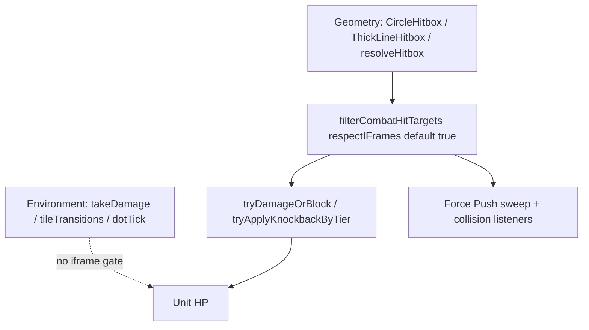

# Plan: Combat iFrame filtering via hitboxes

**Completed 2026-08-12.** Combat hits now funnel through `filterCombatHitTargets` (hitboxes + `resolveHitbox`) and apply-layer gates (`tryDamageOrBlock`, knockback/CC, Force Push pass-through / slam skip); env damage stays ungated; `damageEnemiesInCircle` collects via `CircleHitbox`; skills document the hitbox-first rule; AbilityTests cover Dodge vs wolf/slime and vs Thornbinder. Follow-ups unchanged: historic `takeDamage` audit, true-strike content, cone geometry migration. Note: `vitest --changed` still shows two pre-existing failures (Double Punch two-targets, Gravity Locus) unrelated to this plan.

Brainstorm locked in chat (2026-08-12): Dodge/`iframe` windows must block **combat** damage and knockback/CC; **environment** damage (thorn enter/land/DoT, day-light, etc.) ignores iframes; Force Push unit collision / slam is **combat** and must **pass through** iframe units (no damage, no collision stop); no current ability true-strikes through iframes, but APIs expose `respectIFrames: false` for later; Thornbinder and other circle AoEs migrate onto **`CircleHitbox`** instead of hand-rolled radius loops; skills must tell authors to resolve combat hits through hitboxes.

| Topic | Decision |
|---|---|
| Combat hits | Skip iframe units by default |
| Combat knockback / hard CC | Resisted during iframes (same class as juggernaut for launch) |
| Environment HP loss | Direct `takeDamage` / terrain / DoT — **no** iframe gate |
| Force Push collision / slam | Combat; **pass through** iframes |
| True strike | Opt-out `respectIFrames: false` only; unused by current cards |
| Hit discovery | Prefer `CircleHitbox` / `ThickLineHitbox` / `resolveHitbox`; do not invent parallel geometry loops for combat |
| Thornbinder / Stomp / BramblePatch / LightBlast / ShakingGround / ally splash | Collect hits via `CircleHitbox.getUnitsInHitbox` (via shared helpers) |

### Vocabulary (locked)

| Term | Meaning |
|---|---|
| **Combat hit** | Ability/projectile/melee/AoE/collision damage or CC applied to a unit as an attack |
| **Environment damage** | Terrain effects, standing DoT, day-light, wall-unstick, etc. — not combat hits |
| **iFrame window** | Active ability state/`iframe` timing tag (`unit.hasIFrames(gameTime)`) |
| **`filterCombatHitTargets`** | Shared post-geometry filter: alive / not spawning / optional iframe skip |
| **`respectIFrames`** | Default `true`; `false` = true-strike (future) |
| **Pass through** | Forced-movement unit sweep ignores iframe bodies; no collision event / damage |

---

## Agent Instructions

This plan is executed by `/jp-implement-plan` (see `.claude/skills/jp-implement-plan/SKILL.md` — do not restate its workflow here). The **invoking agent is the sole orchestrator**: it spawns one worker per step **synchronously** (never in the background), waits for each worker to finish, then moves to the next step, and finally reports plan completion to the user. Each worker implements **exactly one step**, checks off that step's checklist items with a one-line summary under each, and **stops without spawning the next agent**.

Project skills relevant to this plan:

- `working-on-minion-battles` — game code under `app/js/games/minion_battles/`.
- `working-with-hitboxes` / `app/js/games/minion_battles/hitboxes/SKILL.md` — hit discovery conventions (updated in Step 6).
- `creating-an-ability` / `card_defs/SKILL.md` — authoring checklist (updated in Step 6).
- `working-with-skills` — when editing skill files (length / location rules).
- `scoped-testing` — per-step Vitest selection (`lint:changed` before tests).
- `ability-tests` — Dodge vs Thornbinder scenario in Step 5; run headlessly only in the **final** step.

**Verification cadence:** per step, at most `npm run lint:changed`, `npx tsc --noEmit` when the step crosses an interface boundary, and **only** the specific test files the step touches or creates. No full-suite or AbilityTest/E2E in regular steps — the **final step** runs expensive checks once.

**Content note:** Do **not** gate `Unit.takeDamage` globally. Do **not** make env thorns/DoT respect iframes. Do **not** add true-strike to any live card in this plan — only the API knob.

---

## Architecture

**Two funnels, one filter:**

1. **Hitboxes** — after geometry in `CircleHitbox` / `ThickLineHitbox` / `resolveHitbox`, run `filterCombatHitTargets`.
2. **Apply choke points** — `tryDamageOrBlock` and combat knockback/CC refuse iframe targets unless `respectIFrames: false` (belt-and-suspenders for custom `onHit` / raw lists).

**AoE migration:** `damageEnemiesInCircle` stops hand-rolling radius math; it queries `CircleHitbox.getUnitsInHitbox`, then applies damage/CC. Call sites (Thornbinder, Thorn Stomp, Bramble Patch, Light Blast, Shaking Ground, blood-mage ally splash) keep working without per-card geometry rewrites; clean up redundant empty `resolveHits` / comments where useful.

---

## Ability Test Coverage

| Scenario | What it covers |
|---|---|
| Existing `dodge_iframe_protection` | Unchanged: wolf charge + slime projectile still blocked |
| New `dodge_iframe_vs_thornbinder` (general / Movement) | Player Dodges during Thornbinder Bramble impact: no HP loss, Dodge not interrupted, no lasting knockback from the slam |

Keep assertions high-level (HP unchanged, ability still completes / no knockback residue). Create in Step 5; run headlessly in the **final** step.

---

## Steps

### Step 1 — Shared combat target filter + hitbox wiring

**Touches:**
- `app/js/games/minion_battles/abilities/combatTargetFilter.ts` (new) + co-located `combatTargetFilter.test.ts`
- `app/js/games/minion_battles/hitboxes/CircleHitbox.ts`
- `app/js/games/minion_battles/hitboxes/ThickLineHitbox.ts`
- `app/js/games/minion_battles/abilities/hitboxDef.ts`
- Optional thin re-export from `hitboxes/index.ts` if that keeps imports clean

- [x] Add `filterCombatHitTargets(units, gameTime, opts?: { respectIFrames?: boolean }): Unit[]` (default `respectIFrames: true`).
  - Drop units that are inactive / dead / spawning.
  - When `respectIFrames`, drop `unit.hasIFrames(gameTime)`.
  - Document true-strike opt-out in JSDoc; do not use opt-out from live cards in this plan.
  - Added `abilities/combatTargetFilter.ts` with JSDoc true-strike note; default `respectIFrames: true`.
- [x] Unit-test filter: iframe unit excluded by default, included when `respectIFrames: false`; dead/spawning always dropped.
  - Co-located `combatTargetFilter.test.ts` covers iframe default/opt-out plus dead/spawning/inactive.
- [x] Call the filter at the end of `CircleHitbox.getUnitsInHitbox` and `ThickLineHitbox.getUnitsInHitbox` (need `gameTime` from `HitboxEngineContext` — extend the context type if missing).
  - `HitboxEngineContext.gameTime` added; both getters end with `filterCombatHitTargets(result, engine.gameTime)`.
- [x] Ensure `resolveHitbox` results are filtered (either via hitbox getters alone, or an explicit filter pass for `custom` shapes).
  - Circle/meleeLine via getters; `custom` explicitly filtered in `resolveHitbox` before priority ordering.
- [x] Verify: `npm run lint:changed`, then `npx vitest run` on `combatTargetFilter.test.ts` and any existing hitbox tests touched.
  - lint:changed clean; 5/5 combatTargetFilter tests passed; tsc clean for Step 1 files (pre-existing quest mapPosition errors unrelated).

### Step 2 — Apply-layer gates (`tryDamageOrBlock` + combat knockback/CC)

**Touches:**
- `app/js/games/minion_battles/abilities/blockingHelpers.ts` (+ existing shield/block tests if needed)
- `app/js/games/minion_battles/crowdControl/knockbackKeywords.ts` (+ `knockbackKeywords.test.ts`)
- `app/js/games/minion_battles/crowdControl/tryApplyHardCcStun.ts` and/or `tryApplyLift.ts` if they interrupt without going through knockback
- Co-located tests as needed

- [x] In `tryDamageOrBlock`, if defender has iframes and `respectIFrames !== false`, return miss (`hit: false`) without damage or block side-effects.
  - Add optional `respectIFrames?: boolean` on `TryDamageOrBlockParams` (default true).
  - Early miss before block/damage; `respectIFrames` defaults true on `TryDamageOrBlockParams`.
- [x] In `tryApplyKnockbackByTier` / shared tier forced-movement helper, treat iframes like juggernaut: `fully_resisted`, no launch, no interrupt (unless a future true-strike path passes an explicit opt-out — wire the same flag or document knockback always respects iframes for now; prefer a `respectIFrames` on the knockback ctx/options mirroring damage).
  - `_tryApplyTierForcedMovement` returns `fully_resisted` on iframes; `KnockbackEngineCtx.respectIFrames` opt-out (default true).
- [x] Ensure hard-CC stun/lift entry points that interrupt casts also no-op on iframe targets (same policy).
  - `tryApplyHardCcStun` / `tryApplyLift` absorb on iframes (no armour, no interrupt); stun takes `respectIFrames`, lift uses ctx flag.
- [x] Unit tests: iframe defender → no damage from `tryDamageOrBlock`; iframe target → knockback `fully_resisted`.
  - `blockingHelpers.iframe.test.ts` + knockback iframe cases in `knockbackKeywords.test.ts` (incl. true-strike opt-out).
- [x] Verify: `npm run lint:changed`, then only the co-located tests edited/created this step.
  - lint:changed clean; 6/6 tests passed (`blockingHelpers.iframe` + `knockbackKeywords`); tsc only shows pre-existing quest mapPosition errors.

### Step 3 — Migrate circle AoE helpers onto `CircleHitbox`

**Touches:**
- `app/js/games/minion_battles/abilities/targetHelpers.ts`
- `app/js/games/minion_battles/abilities/targetHelpers.test.ts`
- Call sites that only need import/comment cleanup if the helper change is sufficient:
  - `card_defs/0008_ThornbinderBramble/0008Ability.ts`
  - `card_defs/0016_ThornStomp/0016Ability.ts`
  - `card_defs/07_command_core/0706_BramblePatch/0706Ability.ts`
  - `card_defs/08_light_core/0801_LightBlast/0801Ability.ts`
  - `card_defs/05_earth_core/0525_ShakingGround/0525Ability.ts`
  - `abilities/bloodMageAllySplash.ts`

- [x] Refactor `damageEnemiesInCircle` to collect candidates via `CircleHitbox.getUnitsInHitbox(engine, caster, center.x, center.y, radius)` (then existing `maxTargets` closest-N), instead of a hand-rolled distance loop.
  - Preserve `onHit` override behavior; hits already exclude iframes via Step 1 hitbox filter + Step 2 apply gates.
  - Keep team/enemy semantics identical to `CircleHitbox` (hostile to caster).
  - `damageEnemiesInCircle` now uses `CircleHitbox.getUnitsInHitbox` via `toHitboxEngine`; `onHit` and maxTargets closest-N preserved.
- [x] Apply the same pattern to `damageEnemiesInTruncatedCone` if it still hand-rolls geometry: either keep shape math but run `filterCombatHitTargets`, or document why cone stays custom — **must** still exclude iframes before `tryDamageOrBlock`.
  - Cone geometry stays custom (no truncated-cone hitbox); `filterCombatHitTargets` runs after shape collect, documented in JSDoc.
- [x] Update `targetHelpers.test.ts` for iframe exclusion / CircleHitbox path (mock or tiny units with `hasIFrames`).
  - Added circle iframe exclusion + truncated-cone iframe exclusion tests; mocks include `active` / `isSpawning`.
- [x] Light touch on Thornbinder/Stomp: comments noting impact uses circle hit discovery; leave targeting `HitboxSpec` as-is unless empty `resolveHits` needs a clarifying comment (no behavior change required beyond helper).
  - Comments on both impact call sites; Thornbinder `resolveHits` notes targeting-only vs CircleHitbox impact.
- [x] Verify: `npm run lint:changed`, then `npx vitest run` on `targetHelpers.test.ts` and co-located `0008Ability.test.ts` / `0016Ability.test.ts` if edited.
  - lint:changed clean; 12/12 passed (targetHelpers 4 + 0008 6 + 0016 2).

### Step 4 — Force Push pass-through on iframe units

**Touches:**
- `app/js/games/minion_battles/game/units/unitKnockback.ts` (`findFirstUnitCollisionAlongSegment`)
- `app/js/games/minion_battles/game/units/forcedMovementCollision.test.ts`
- `app/js/games/minion_battles/card_defs/09_gravity_core/0902_ForcePush/0902Ability.ts` (+ `0902Ability.test.ts` if present)
- Gravity Inversion slam path if it deals “slam” damage on landing via combat-style apply — gate the same way (skip iframe / no interrupt)

- [x] Unit–unit forced-movement sweep skips units with `hasIFrames(gameTime)` so the mover passes through (no collision event).
  - Requires `gameTime` available on the knockback update context; thread it if missing.
  - `KnockbackUpdateContext.gameTime` threaded from `unitMovementTick`; `findFirstUnitCollisionAlongSegment` skips iframe units.
- [x] Force Push collision damage listeners no-op when flung or struck unit has iframes (defense in depth if an event still fires).
  - Unit-collision listener early-returns; Gravity Inversion `LiftedBuff` slam also skips damage on iframes (still emits slam VFX).
- [x] Tests: mover with `collideWithUnits` does not stop on / damage an iframe blocker; non-iframe blocker still collides.
  - Added pass-through + non-iframe collision cases in `forcedMovementCollision.test.ts`; Force Push + LiftedBuff iframe cases.
- [x] Verify: `npm run lint:changed`, then `forcedMovementCollision.test.ts` and `0902Ability.test.ts` if touched.
  - lint:changed clean; 21/21 passed (`forcedMovementCollision` 8 + `0902Ability` 7 + `LiftedBuff` 6).

### Step 5 — AbilityTest: Dodge vs Thornbinder Bramble

**Touches:**
- `app/js/games/minion_battles/testing/scenarios/general/` (new or extend pathfinding/movement scenario file)
- `app/js/games/minion_battles/testing/scenarios/registry.ts`
- Co-located scenario test file if the project uses one (follow `crowdSpacing` / `pathfinding` patterns)
- `ability-tests` skill conventions

- [x] Add high-level scenario `dodge_iframe_vs_thornbinder`: player casts Dodge so iframes overlap Thornbinder Bramble impact; assert player HP unchanged and Dodge is not cancelled mid-window (no lasting knockback / active cast completes or equivalent high-level signal).
  - Deterministic tiny-battle harness; no pixel-perfect tables.
  - Added `dodgeIFrameVsThornbinderScenario` in `general/pathfinding.ts`: short same-cell Dodge overlapping Bramble impact; asserts full HP, no knockback, movement spent, Dodge finished.
- [x] Register in scenario registry under general / Movement (or Combat — prefer Movement next to existing dodge iframe scenario).
  - Exported + appended next to `dodgeIFrameProtectionScenario` in `registry.ts`; thin `pathfinding.scenarios.test.ts` for final-step headless.
- [x] Verify: `npm run lint:changed` only this step — **do not** run the AbilityTest headlessly here (final step).
  - `npm run lint:changed` clean (includes pathfinding scenario + registry + scenarios test).

### Step 6 — Skills: prefer hitboxes for combat hit discovery

**Touches:**
- `app/js/games/minion_battles/hitboxes/SKILL.md`
- `.claude/skills/working-with-hitboxes/SKILL.md` (keep in sync / point at the full guide)
- `app/js/games/minion_battles/card_defs/SKILL.md`
- `.claude/skills/creating-an-ability/SKILL.md` (short pointer if needed; stay under length limits per `working-with-skills`)

- [x] Update hitbox skill: combat hit lists must come from hitbox `getUnitsInHitbox` / `resolveHitbox`; iframes are filtered inside that pipeline by default; do **not** list iframe checks as “caller must handle” anymore for standard combat.
  - Note env damage is outside this pipeline.
  - Note `respectIFrames: false` for rare true-strike.
  - Rewrote `hitboxes/SKILL.md` combat path + CircleHitbox/`resolveHitbox`; iframes in pipeline; env outside; true-strike opt-out. `.claude` pointer stays in sync.
- [x] Update `card_defs/SKILL.md` (and creating-an-ability pointer): when an ability damages or CCs units in a shape, use a hitbox (or a helper that wraps one, e.g. `damageEnemiesInCircle`); do not hand-roll enemy radius loops for combat.
  - Expanded **Hitboxes (combat)** under literate programming + checklist item; creating-an-ability adds a short combat-hit pointer.
- [x] Verify: no Vitest; `npm run lint:changed` only if any lintable files changed (skills/markdown may be empty).
  - Skills/markdown only — skipped Vitest and lint:changed (no lintable app code changed).

### Step 7 — Final verification

**Touches:** none for feature work (verification only)

- [x] Run `npm run lint:changed`.
  - Clean: linted 27 changed files, exit 0.
- [x] Run co-located unit tests from Steps 1–4 in one command (filter, hitbox/targetHelpers, knockback/block, forced movement / Force Push).
  - 36/36 passed: combatTargetFilter, targetHelpers, blockingHelpers.iframe, knockbackKeywords, forcedMovementCollision, 0902Ability, LiftedBuff.
- [x] Run AbilityTest headless for `dodge_iframe_protection` and `dodge_iframe_vs_thornbinder` (via existing scenario test runner / `SimulationRunner` pattern — follow `ability-tests` skill).
  - `pathfinding.scenarios.test.ts`: both scenarios passed via `runScenarioHeadless` (2/2).
- [x] Run `npx vitest run --changed` once as a broad regression net for this branch.
  - 780 passed, 1 skipped; 2 failed in `SimulationRunner.test.ts` (Double Punch two-targets, Gravity Locus). Same failures reproduce on clean stashed tree — pre-existing, not introduced by this plan.
- [x] Spot-check: no new `damageEnemiesInCircle` call site reintroduces a hand-rolled hostile loop; CircleHitbox remains the collector.
  - Helper uses `CircleHitbox.getUnitsInHitbox`; call sites (0008/0016/0706/0801/0525/bloodMageAllySplash) only invoke the helper. LightBlast’s unit loop is ally heal, not combat hostile collect.
- [x] Write a one-paragraph completion note at the top of this plan when green (orchestrator).
  - Added 2026-08-12 completion paragraph (shipped filter/gates/CircleHitbox/Force Push/skills/AbilityTests; noted pre-existing --changed failures).

---

## Out of scope / follow-ups

- Migrating every historic `unit.takeDamage` in `card_defs/` onto `tryDamageOrBlock` (audit later).
- Making dark thorns / env DoT respect iframes.
- True-strike content cards.
- New hitbox shapes beyond fixing cone helper filtering.
- Changing Dodge duration, stamina, or Thornbinder numbers.
