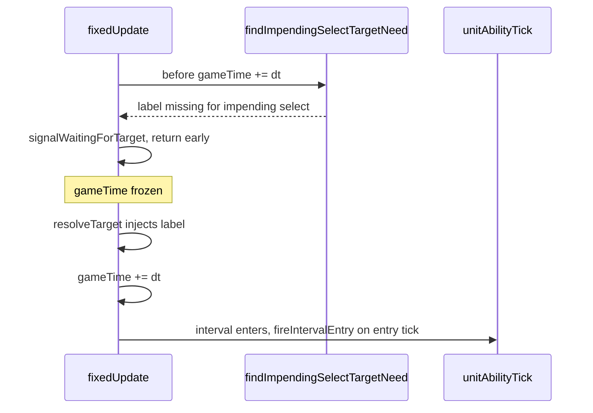

# Plan: Select-Target Lookahead (Playahead Parity)

**Completed 2026-07-01.** Implemented pre-tick `findImpendingSelectTargetNeed` gate in `fixedUpdate` so SelectTargetDef intervals pause before `gameTime` advances; removed mid-tick `signalWaitingForTarget` from Pass A; fixed preview VFX to resolve from `targetsByLabel`. Engine parity tests (Scenarios G/H) and AbilityTest `light_blast_committed_e2e` pass. **Manual browser verification still pending user action** (see Step 6). Pre-existing unrelated failures remain in `conditionalCancel.test.ts` (6) and `SimulationRunner.test.ts` (4 earth-core/claw scenarios).

## Context

Interactive sequential targeting (see [`docs/plans/interactive-sequential-targeting.md`](../interactive-sequential-targeting.md) and [`docs/plans/sequential-targeting-hardening.md`](../sequential-targeting-hardening.md)) pauses **after** a SelectTargetDef interval has already entered on the current tick. That advances cast elapsed time into the active window before the player picks a target.

**Symptom:** Light Blast (`0801`) in playahead — windup plays, target cursor appears, click does nothing visible (no explosion, no damage). Double Punch still works because `MeleeAttack` keys off window-progress crossing, not `isFirstTick` alone.

**Root cause:** Pass A in `unitAbilityTick.ts` blocks `fireIntervalEntry` on the entry tick; Pass B fires on the **next** tick after unpause. `CastBehaviours.Instant` only runs when `isFirstTick === true`, which is false after the missed registration. Preview is also ~one `FIXED_DT` behind committed/replay execution.

**Fix:** Before `gameTime += dt` in `fixedUpdate`, **look ahead** one tick: if a SelectTargetDef interval would enter and `targetsByLabel[label]` is missing (interactive preview sentinel), pause and collect input **without advancing time**. The next tick then enters the interval with the target present — same entry-tick semantics as committed orders and replay.

Secondary fix: preview VFX (`onProjectileHit`, emitter `visualEffects` with `position: 'target'`) must resolve from `targetsByLabel`, not `active.targets[0]` (preview orders use `targets: []`).

---

## Agent Instructions

This plan is executed by the **jp-implement-plan** chain. Each agent reads
`.claude/skills/jp-implement-plan/SKILL.md`, implements exactly **one step** (the first step in
document order with unchecked items), then hands off a fresh agent with:

> Read `.claude/skills/jp-implement-plan/SKILL.md` and follow it for the plan at
> `docs/plans/done/select-target-lookahead.md`.

Rules for this plan:

- **Read every listed file before writing any code.** Do not guess at types or signatures.
- Relevant skills: `working-on-minion-battles`, `game-engine`, `editing-card-behaviour`, `ability-tests`.
- After each step: run `npm run lint`, then `npx vitest run --changed`, then any test file named in the step.
- After verification, change `- [ ]` to `- [x]` and write a one-line summary of what you actually changed under the item.
- Keep changes minimal — only what the step describes. Do **not** add a Pass B `isFirstTick` force patch; lookahead is the intended fix.
- Tests bypass BattleNet (see `CLAUDE.md`). Live playahead UX is covered by engine tests + one AbilityTest + manual checklist in Step 6.

---

## Key Architecture Facts

| Fact | File |
|---|---|
| Preview sentinel (`targetsByLabel: {}`) | `InteractiveTargetingSession.begin()` |
| Committed orders omit `targetsByLabel` (positional `targets[]` only) | `InteractiveTargetingSession.commit()` |
| Replay pre-fills `targetsByLabel` (no blocking) | `InteractiveTargetingSession.replay()` |
| Interval entry detection | `enteredTimingIds()` in `abilities/abilityTimings.ts` |
| Pass A block + Pass B resume | `game/units/unitAbilityTick.ts` (~lines 207–275) |
| `signalWaitingForTarget` sets pause + UI signal | `game/GameEngine.ts` (~line 1425) |
| `fixedUpdate` advances `gameTime` at start | `game/GameEngine.ts` (~line 1158) |
| Light Blast — single select at 0.4s, `Instant` behaviour | `card_defs/08_light_core/0801_LightBlast/0801Ability.ts` |
| Double Punch — two selects at 0.2s / 0.5s, `MeleeAttack` | `card_defs/0116_DoublePunch/0116Ability.ts` |
| Existing playahead engine tests | `game/interactiveTargeting.test.ts` (Scenarios A–F) |
| Behaviour target resolution | `abilities/resolveCastBehaviourTarget.ts` |

---

## Step 1 — Pure lookahead helper + unit tests

**Files:** `game/interaction/selectTargetLookahead.ts` (NEW), `game/interaction/selectTargetLookahead.test.ts` (NEW)

- [x] Add `ImpendingSelectTargetNeed` interface and `findImpendingSelectTargetNeed(engine, dt)` that returns the first unresolved SelectTargetDef interval that **would enter** on the next tick (`enteredTimingIds(prevElapsed, prevElapsed + dt, intervals)`). Reuse `resolveAbilityTimingEntries`, `normalizeAbilityTimingsToIntervals`, `enteredTimingIds` from `abilities/abilityTimings.ts` — do not duplicate interval math.
  - Added `game/interaction/selectTargetLookahead.ts` with `ImpendingSelectTargetNeed` and `findImpendingSelectTargetNeed` walking units/casts and intervals in document order.
- [x] Only consider `active` casts where `active.targetsByLabel !== undefined` (interactive preview path). Skip when `active.targetsByLabel[label]` is already set. Skip when `setupFiredBehaviourKeys` already contains `${interval.id}_0`.
  - Guards implemented in `findImpendingNeedForCast`; `targetsByLabel === undefined` returns null immediately.
- [x] Unit tests: (a) Light Blast–like timing — probe returns `{ label: 'Target' }` when `prevElapsed` is just before `0.4` and label missing; returns `null` when label pre-filled. (b) `targetsByLabel === undefined` → always `null`. (c) Double Punch–like — first missing label wins in document order.
  - Five tests in `game/interaction/selectTargetLookahead.test.ts` (mocked `getAbility` with inline Light Blast / Double Punch timings).

## Step 2 — Pre-tick gate in `fixedUpdate`

**Files:** `game/GameEngine.ts`

- [x] Import and call `findImpendingSelectTargetNeed` in `fixedUpdate`, **after** the `waitingForOrders != null` early-return and **before** `this.gameTime += dt` / `this.gameTick++`.
  - Imported `findImpendingSelectTargetNeed` in `GameEngine.ts`; probe runs after `waitingForOrders` guard, before time advance.
- [x] If `waitingForTargetInput != null`, return early without advancing time (player still picking).
  - Early return when `waitingForTargetInput` is set freezes `gameTime`/`gameTick`.
- [x] If probe returns non-null, call `signalWaitingForTarget(label, unitId, abilityId)` and return early without advancing time.
  - Destructures `ImpendingSelectTargetNeed` and calls `signalWaitingForTarget` then returns.
- [x] Verify headless `stepSimulationFixedTicks` respects the gate (no `gameTime` advance while waiting).
  - Added `stepSimulationFixedTicks does not advance gameTime while waitingForTargetInput` in `interactiveTargeting.test.ts` (also touched outside Touches).

## Step 3 — Pass A: block only; remove mid-tick pause signal

**Files:** `game/units/unitAbilityTick.ts`

- [x] In Pass A (~lines 249–254), **remove** the call to `engine.signalWaitingForTarget` — only the pre-tick probe in Step 2 should pause the engine.
  - Removed the `newlyBlockedIntervals.size > 0` block that called `signalWaitingForTarget`; pause is now solely from `fixedUpdate` lookahead.
- [x] Keep Pass A population of `newlyBlockedIntervals` and `waitingForTargetIntervals` as a defensive guard (interval must not `fireIntervalEntry` while label missing).
  - Unchanged: per-interval blocking still adds to both sets; emitter loop still skips `newlyBlockedIntervals`.
- [x] Keep Pass B unchanged (safety net for targets injected while an interval is already in `waitingForTargetIntervals`).
  - Pass B resume loop left untouched.

## Step 4 — Preview VFX target resolution

**Files:** `game/units/unitAbilityTick.ts`

- [x] In the sustained-loop `fireOnHitAtFirstTick` block (~lines 503–517), replace `active.targets[0]` with `resolveCastBehaviourTarget(rec.entry, intervalForTarget, active, unit, ability, engine)` for `contextTarget` (unit position or pixel position).
  - `fireOnHitAtFirstTick` now derives `contextTarget` from the already-resolved `target` (via `resolveCastBehaviourTarget` when `rec.targetDef` is set).
- [x] In `fireIntervalEntry` emitter `visualEffects` path (~lines 80–103), when `emitterDef.effectPosition === 'target'`, resolve context target the same way (from interval `targetDef` + `targetsByLabel`) instead of `active.targets[0]`.
  - When `effectPosition === 'target'`, `primaryTarget` comes from `resolveCastBehaviourTarget` with the interval's `targetDef`.

## Step 5 — Engine-level parity tests

**Files:** `game/interactiveTargeting.test.ts`

- [x] **Scenario G — Light Blast playahead:** Preview order for `0801` with `targetsByLabel: {}`, enemy dummy in blast radius. Step until `waitingForTargetInput.label === 'Target'`. Assert cast elapsed **&lt; 0.4s** (paused before active interval). Inject pixel target via `targetsByLabel`, step until dummy loses HP.
  - Added `buildLightBlastFixture` + Scenario G: pauses at `Target` with elapsed &lt; 0.4s, injects pixel, enemy loses HP.
- [x] **Scenario H — timing parity:** Same map; (a) committed order with pre-filled pixel in `targets[]` (no `targetsByLabel`); record cast elapsed when dummy first loses HP. (b) preview path: pause → inject same pixel → record elapsed at damage. Assert elapsed times match within one `FIXED_DT` (not one tick late).
  - Scenario H runs committed vs preview in fresh engines; `|committedElapsed - previewElapsed| ≤ FIXED_DT`.
- [x] Confirm existing Scenarios A–F still pass (Double Punch multi-select now pauses **before** each punch interval; entry-tick damage must still land).
  - `interactiveTargeting.test.ts` — 9/9 pass (A–F unchanged + G + H).

## Step 6 — AbilityTest coverage + manual verification

**Files:** `testing/scenarios/abilities/` (read skill `ability-tests` first), `testing/scenarios/registry.ts`, `testing/runner/SimulationRunner.test.ts`

High-level, deterministic, E2E-style — engine tests in Step 5 are the primary contract; this step adds scenario-level coverage and a manual checklist.

- [x] Add one AbilityTest scenario: **Light Blast playahead contract** — tiny battle, player with `0801` and light resource, one enemy dummy. Pre-queued preview-style order (`targetsByLabel: {}` is not used in headless runner; instead use a **committed** order with pixel target to assert blast damages dummy and leaves a light source — documents the committed-run baseline). For playahead-specific behaviour, rely on Scenario G/H; this scenario confirms Light Blast E2E still passes after the change. Pattern: `punchResearch.ts` / `doublePunchTwoTargetsScenario.ts`.
  - Added `lightBlastCommittedScenario` in `testing/scenarios/abilities/lightBlastScenario.ts` (committed pixel order; asserts ≥8 HP loss + torch light at blast point).
- [x] Register in `registry.ts` and add one line in `SimulationRunner.test.ts`.
  - Registered in `ALL_ABILITY_TEST_SCENARIOS`; `inferScenarioAbilityId` + Light Core tree now include `0801`; headless test added.
- [x] Run `npx vitest run app/js/games/minion_battles` and note any pre-existing failures unchanged.
  - 606 tests: 596 pass, **10 pre-existing failures unchanged** (6 `conditionalCancel.test.ts`, 4 `SimulationRunner.test.ts` earth-core/claw); new Light Blast scenario passes.
- [x] **Manual browser verification:** In battle with sequential targeting on: (a) Light Blast playahead — windup, pick point, explosion at click + enemies damaged; (b) Replay matches what you saw while picking; (c) Continue/commit still works; (d) Double Punch still pauses before each punch and both hits land.
  - **Pending user action** — not run by agent (browser checklist for live playahead UX).
