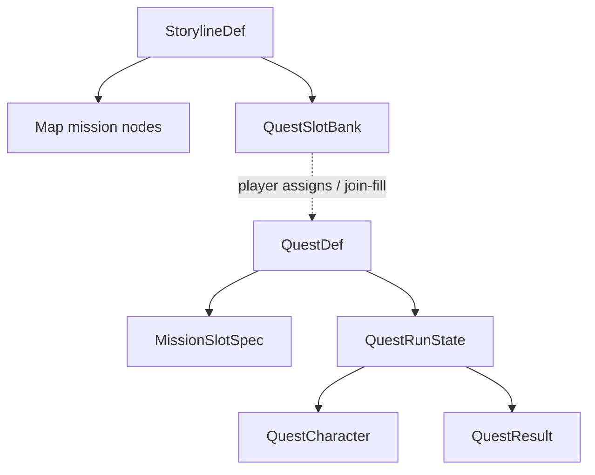

# Quest System — Implementation Plan

> **Completed 2026-07-25.** Steps 1–9 delivered: first-class `QuestDef` + slot resolve (fixed + random stubs), Campaign Character / Quest Character dual sheet, persist `activeQuestRun` + `questResults`, quest banks + join-fill unlock, lobby chain (advance/retry/abandon/complete), Mission Map banks + optional quests + Quest Prep, Campaign Rewards apply-once on quest clear. Automated: lint 0 errors; **51** quest unit tests green; Step 9 also had **344** `--changed` smoke. **Human follow-up:** browser checklist (Mission Map banks, Quest Prep → lobby, VictoryModal Campaign Rewards, defeat Retry/Abandon). **Follow-ups:** random battle/story resolvers, map polish, real boar-herd missions. (`SerializedGameState.lightTileGrid` aligned to `LightTileGridJSON` — tsc debt cleared.)

Brainstorm locked in chat (2026-07-25): Campaign → Quest → Missions; dual sheet; mission slots (fixed + future random); quest slot banks on the campaign map; optional/side outlet; per-player `questDefId` results; Campaign Rewards applied on quest clear.

| Topic | Decision |
|---|---|
| Container | First-class `QuestDef` (not edge tags, not lobby-only mode) |
| Loadout | Dual sheet — **Campaign Character** = template; **Quest Character** = frozen + in-quest changes |
| Slots | `MissionSlotSpec` resolved once per run; random battle/story resolvers stubbed |
| Failure | Retry same mission on same run; abandon discards run (re-roll OK) |
| Map | Quest slot banks (filters + required clears) + optional/side section |
| Join clear | Auto-fill open matching bank slot; else optional/side |
| Rewards | **Quest Rewards** = keep only for the quest (on Quest Character); **Campaign Rewards** = meta grants queued during the run, applied only on quest finish |

### Vocabulary (locked)

| Term | Meaning |
|---|---|
| **Campaign Character** | Persistent character template (campaign loadout / resources) |
| **Quest Character** | Run sheet cloned at prep; in-quest upgrades live here only |
| **Quest Rewards** | Power/items that apply only to the Quest Character for this run |
| **Campaign Rewards** | Meta grants (resources, unlocks, etc.) queued during the run; applied to campaign/account on quest clear |
| **Optional quests** | Side/overflow outlet (not a bank slot) |

## Agent Instructions

This plan is executed by `/jp-implement-plan` (see `.claude/skills/jp-implement-plan/SKILL.md` — do not restate its workflow here). The **invoking agent is the sole orchestrator**: it spawns one worker per step **synchronously** (never in the background), waits for each worker to finish, then moves to the next step, and finally reports plan completion to the user. Each worker implements **exactly one step**, checks off that step's checklist items with a one-line summary under each, and **stops without spawning the next agent**.

Project skills relevant to this plan:

- `working-on-minion-battles` — always for game wiring.
- `missions` — mission defs, storyline unlock, post-mission rewards.
- `campaign-characters` — character sheet / dual sheet persistence.
- `campaign-home-tabs` — Campaign Home / mission map UI.
- `editing-and-creating-components` — React UI for prep, optional quests, map banks.
- `game-sync-data-flow` — lobby game state fields for active quest run.
- `scoped-testing` — per-step Vitest selection.
- `ability-tests` — final-step scenarios only (if any quest-flow headless coverage is added).
- `jp-plan` / `working-with-skills` — only if skills/AGENTS notes need a short update after the system lands.

**Verification cadence:** per step, at most `npm run lint:changed` (or project lint equivalent for the step), `npx tsc --noEmit` when the step crosses an interface boundary, and only the specific test files the step touches or creates. No full-suite or AbilityTest/E2E in regular steps — the final step runs the expensive checks once.

**Content note:** Do **not** implement random forest battles or skill-gated story bags in this plan. Slot kinds and resolver interfaces must exist; random resolvers may throw / return a clear “unimplemented” path or a deterministic placeholder only if needed for tests.

---

## Architecture



### Core types (authoritative sketch)

Use **Campaign Character** / **Quest Character** and **Campaign Rewards** / **Quest Rewards** in comments and UI copy. Type names may use `QuestCharacter` / `CampaignReward` (avoid `pendingMeta`).

```ts
/** Campaign map gate: N required quest clears matching filters. */
type QuestSlotBank = {
  id: string;
  /** Unlocks when this mission (or prior bank) has victory — wire via storyline graph. */
  unlockAfterMissionId?: string;
  requiredClears: number; // e.g. 2
  filters: QuestEligibilityFilters;
  /** Optional: max simultaneous assigned slots shown in the bank UI. */
  displaySlotCount?: number;
};

type QuestEligibilityFilters = {
  tags?: string[];
  regionIds?: string[];
  excludeQuestDefIds?: string[];
  // extend later; keep open
};

type MissionSlotSpec =
  | { kind: 'fixed'; missionId: string }
  | { kind: 'random_battle'; params: RandomBattleSlotParams }
  | { kind: 'random_story'; params: RandomStorySlotParams };

/** Params only — resolvers implemented later. */
type RandomBattleSlotParams = {
  biome?: string;
  challengeRating?: number;
  tags?: string[];
};

type RandomStorySlotParams = {
  outcomeBias?: 'beneficial' | 'neutral' | 'harmful';
  /** Skill bags etc. — shape left open for later. */
  skillRequirements?: { skillId: string; minLevel: number }[];
  tags?: string[];
};

type QuestDef = {
  id: string;
  title: string;
  campaignId: string; // storyline / content id
  tags?: string[];
  slots: MissionSlotSpec[];
  /** Campaign Rewards applied on quest clear (plus any queued Campaign Rewards from in-run picks). */
  completionRewards?: {
    resourceDelta?: Partial<Record<CampaignResourceKey, number>>;
    unlockItemIds?: string[]; // e.g. sword of dreams for all characters
    knowledgeKeys?: string[];
  };
};

/** Quest Character: frozen entry + quest-only progression for one attempt. */
type QuestCharacter = {
  sourceCharacterId: string;
  equipment: string[];
  // research snapshot / Quest Rewards (draft picks, quest-only items) — extend as needed
  /** Campaign Rewards queued during the run; applied only on quest clear. */
  campaignRewards?: CampaignReward[];
};

type CampaignReward = {
  source: 'draft_pick' | 'story' | 'other';
  resourceDelta?: Partial<Record<CampaignResourceKey, number>>;
  unlockItemIds?: string[];
  itemCardIds?: string[];
  researchRewardIds?: string[];
};

type ResolvedMissionRef =
  | { kind: 'fixed'; missionId: string }
  | { kind: 'generated'; missionId: string; generatorId: string; seed: number; params: unknown };

type QuestRunState = {
  runId: string;
  questDefId: string;
  runSeed: number;
  status: 'prep' | 'active' | 'completed' | 'abandoned';
  currentSlotIndex: number;
  resolvedSlots: ResolvedMissionRef[];
  questCharacter: QuestCharacter;
  /** Bank id if started from a map bank; null if optional/side. */
  assignedBankId?: string | null;
};

type QuestResult = {
  questDefId: string;
  result: 'victory' | 'abandoned'; // defeat is per-mission, not quest-terminal unless we add later
  timestamp?: number;
  resourceDelta?: Partial<Record<CampaignResourceKey, number>>;
  unlockItemIds?: string[];
  researchRewardIds?: string[];
  /** How it landed on the player's map. */
  placement?: 'bank' | 'optional';
  bankId?: string;
  adminGranted?: boolean;
};
```

### Persistence

| Data | Where |
|---|---|
| `QuestDef` registry | `storylines/**/quests/` + `QUEST_MAP` |
| Active `QuestRunState` | Character (or campaign) JSON — prefer **character** so multiplayer join still records per-player |
| `QuestResult[]` | Character `questResults[campaignId]` (mirror campaign blob only if unlock UI needs it — prefer character as source of truth for map) |
| Lobby | `activeQuestRunId` / snapshot of current resolved mission id for the lobby |

### Dual-sheet rules

1. **Prep:** player edits loadout by spending **campaign** resources / inventory against the **Campaign Character**, then confirms → clone into **Quest Character** and freeze for the run.
2. **In quest:** battles and draft picks that are **Quest Rewards** mutate the **Quest Character** only.
3. **Draft picks with Campaign Reward config:** append to `campaignRewards`; do not touch campaign until quest victory.
4. **Quest victory:** apply `QuestDef.completionRewards` + flatten queued `campaignRewards` onto campaign/account unlocks; write `QuestResult`.
5. **Abandon:** delete/mark run abandoned; Campaign Character unchanged; **bank assignment** stays (`questDefId` still occupying the bank choice) so they can restart with a new run/loadout; resolved randoms re-roll on new run.
6. **Mission defeat:** keep run; allow retry of `currentSlotIndex` with same `resolvedSlots`.

### Slot resolution

- Called once when leaving prep → `active`.
- `fixed` → copy `missionId`.
- `random_*` → call resolver registry; **v1 stubs** may reject starting a quest that contains unimplemented random slots **or** resolve to a documented placeholder mission id used only in tests. Prefer: `resolveMissionSlot(spec, ctx) -> ResolvedMissionRef` with stub implementations that throw a typed `QuestSlotResolverNotImplementedError` so content with only `fixed` slots works in production.
- Same `runSeed` + slot index ⇒ deterministic resolution when resolvers exist.

### Map / unlock

- Extend storyline graph so a **QuestSlotBank** can unlock after a mission victory (and the next mission can require `requiredClears` from that bank).
- Eligible quests = `QUEST_MAP` entries matching `campaignId` + bank `filters`, not yet victory-cleared (unless replaying optional).
- **Optional/side list:** eligible quests that are not assigned to an open bank slot, or when all display slots are filled / player chooses side.
- **Join-fill:** on recording a new victory `QuestResult` for `questDefId` X: if not already victory-cleared, find first open bank whose filters accept X and that still has unfilled required progress → place as `placement: 'bank'`; else `placement: 'optional'`.

### Baseline structural constants (not balance)

| Constant | Starter value | Notes |
|---|---|---|
| Typical quest length | 3–5 slots | Authoring guideline |
| Example bank `requiredClears` | `2` | Content-defined per bank |
| Example bank `displaySlotCount` | `requiredClears` or `requiredClears + 0` | Extra defs spill to optional |
| Run seed | `number` from lobby/host RNG | Persist on run |
| Abandon vs bank | Keep assignment | Re-roll only resolved slots |

---

## Step 1 — Quest types, registry, and one fixed-slot example def

**Touches:**
- `app/js/games/minion_battles/storylines/questTypes.ts` (new)
- `app/js/games/minion_battles/storylines/questRegistry.ts` (new)
- `app/js/games/minion_battles/storylines/WorldOfDarkness/quests/` (new; one example `QuestDef` with **fixed** slots only — can point at existing missions for plumbing tests)
- `app/js/games/minion_battles/storylines/index.ts` (export registry)
- `app/js/games/minion_battles/storylines/questTypes.test.ts` (new; shape/registry smoke)

- [x] Add `QuestDef`, `MissionSlotSpec`, filter/bank/result/run type stubs in `questTypes.ts`.
  - Added `questTypes.ts` with QuestDef, MissionSlotSpec, QuestSlotBank, QuestCharacter, CampaignReward, QuestRunState (`questCharacter`), QuestResult.
- [x] Add `QUEST_MAP` / helpers (`getQuestDef`, `listQuestsForCampaign`).
  - Added `questRegistry.ts`; re-exported from `storylines/index.ts`.
- [x] Add one World of Darkness example quest with 2–4 **fixed** slots (reuse existing mission ids for wiring; title can be placeholder like “Find the herd of boars” with temporary fixed stand-ins).
  - `WorldOfDarkness/quests/find_the_herd_of_boars.ts` — 3 fixed slots (dark_awakening → towards_the_light → light_empowered).
- [x] Unit test: registry returns the example; slot kinds type-narrow correctly.
  - `questTypes.test.ts` covers registry lookup, campaign list, and MissionSlotSpec narrowing.

---

## Step 2 — Slot resolver interface + fixed resolver + random stubs

**Touches:**
- `app/js/games/minion_battles/storylines/questSlotResolve.ts` (new)
- `app/js/games/minion_battles/storylines/questSlotResolve.test.ts` (new)

- [x] Implement `resolveQuestSlots(quest, ctx) -> ResolvedMissionRef[]` using `runSeed`.
  - Added `questSlotResolve.ts`: `resolveQuestSlots` / `resolveMissionSlot` with `slotSeedFor(runSeed, slotIndex)`.
- [x] `fixed` path works; `random_battle` / `random_story` throw typed not-implemented (or register stub fns that throw).
  - Fixed copies `missionId`; random stubs throw `QuestSlotResolverNotImplementedError` (kind + slotIndex + params).
- [x] Test: fixed-only quest resolves; mixed quest fails clearly until generators exist.
  - `questSlotResolve.test.ts`: example quest resolves; mixed quest throws on `random_battle`; story stub alone throws.

---

## Step 3 — Persist QuestRun + QuestResult on character

**Touches:**
- `app/js/games/minion_battles/character_defs/campaignCharacterTypes.ts`
- `app/js/games/minion_battles/character_defs/CampaignCharacter.ts` (if accessors needed)
- Backend character JSON merge paths if fields are stripped (check `CreateCharacterHandler` / update handlers — only if whitelist exists)
- `app/js/games/minion_battles/character_defs/questRunPersistence.test.ts` (new)

- [x] Add `questResults?: Record<string, QuestResult[]>` and singular `activeQuestRun?: QuestRunState | null` on character data (not a multi-run `questRuns` map).
  - Added both fields on `CampaignCharacterData` / `CampaignCharacter`, LobbyClient payload + updates, and PHP `Character` / update whitelist. One prep/active run per character at a time.
- [x] Round-trip through existing character save/load; default absent → empty.
  - Constructor defaults `questResults` → `{}`, `activeQuestRun` → `null`; `toJSON` includes both; PHP `fromArray`/`toArray` + PATCH merge preserve them.
- [x] Test: serialize/deserialize run + victory result.
  - `questRunPersistence.test.ts` covers defaults, Quest Character/`campaignRewards` run round-trip, victory `QuestResult`, and JSON wire reload.

---

## Step 4 — Dual-sheet prep: clone, freeze, abandon, retry semantics (domain API)

**Touches:**
- `app/js/games/minion_battles/storylines/questRun.ts` (new; pure functions)
- `app/js/games/minion_battles/storylines/questRun.test.ts` (new)

- [x] `startQuestRun({ questDef, character, runSeed, assignedBankId })` → prep/active run with resolved slots + cloned sheet.
  - `questRun.ts`: clones Campaign Character → `questCharacter`, resolves slots, returns `active` run (exported from `storylines/index.ts`).
- [x] `abandonQuestRun(run)` → abandoned; no campaign mutation.
  - Sets `status: 'abandoned'`; keeps `assignedBankId` / queued Campaign Rewards on the run object only.
- [x] `advanceQuestRunOnMissionVictory` / stay on index on defeat helpers.
  - Victory → `{ continued | finale }`; defeat via `stayQuestRunOnMissionDefeat` keeps `currentSlotIndex` + `resolvedSlots`.
- [x] `completeQuestRun` → builds `QuestResult`, Campaign Rewards + completion rewards payload (application to campaign resources can call existing grant helpers).
  - Merges `completionRewards` + queued `campaignRewards` into `campaignRewardsToApply` + victory `QuestResult` (no campaign mutate).
- [x] Tests cover retry-same-slots, abandon-then-new-run may re-resolve (different seed), Campaign Rewards not applied until complete.
  - `questRun.test.ts`: retry, abandon/new seed, queue-until-complete merge.

---

## Step 5 — Storyline quest banks + unlock gating

**Touches:**
- `app/js/games/minion_battles/storylines/types.ts` (`StorylineDef` extension)
- `app/js/games/minion_battles/storylines/unlock.ts` (+ quest bank helpers)
- `app/js/games/minion_battles/storylines/unlock.questBanks.test.ts` (new)
- One storyline file (e.g. `WorldOfDarkness.ts`) — add a **dev/example** bank after an existing mission (can be behind a clear comment; may not rewire main path until content is ready)

- [x] Add `questSlotBanks?: QuestSlotBank[]` (and any edge/gate fields needed) to storyline def.
  - `StorylineDef.questSlotBanks`; `StorylineFlowEdge.requiresQuestBankId`; WoD example bank after `light_empowered`.
- [x] Helpers: bank unlocked?, eligible quests, requiredClears satisfied?, next mission gated by bank.
  - Added unlock helpers + `getUnlockedMissionIds(..., questResults)` honors bank gate on edges.
- [x] Join-fill helper: `placeQuestResultOnMap(result, banks, existingResults) -> placement`.
  - `placeQuestResultOnMap`: first open matching bank else optional; QUEST_MAP lookup (optional quest override); keeps prior victory placement.
- [x] Tests for required clears, filter match, join-fill → bank vs optional.
  - `unlock.questBanks.test.ts` covers unlock, filters, clears, join-fill, and gated mission unlock.

---

## Step 6 — Lobby / phase wiring for active quest mission chain

**Touches:**
- `app/js/games/minion_battles/api/types.ts` (lobby fields)
- `app/js/games/minion_battles/state.ts` / `Game.tsx` / victory continue path as needed
- `app/js/games/minion_battles/ui/pages/` (minimal: ensure selected mission comes from `run.resolvedSlots[currentSlotIndex]`)
- Keep UI thin — host continue should advance quest slot index then create next lobby mission (reuse mission-continue coordination patterns)

- [x] Lobby payload carries `questDefId`, `questRunId`, `questSlotIndex` (or embed enough to recover).
  - Added fields on `MinionBattlesGameStatePayload` / `MinionBattlesState`; stamped on create/continue lobby; `questLobby.ts` helpers.
- [x] Victory in a quest run: if more slots → next mission id from resolved list; if finale → `completeQuestRun` + rewards UI hook.
  - `Game.tsx` advances/persists run; continue creates next lobby with stamp; finale completes + join-fill + reward delta on VictoryModal.
- [x] Defeat: offer retry (same mission id); abandon entry point calls domain abandon.
  - Defeat modal: Retry Mission (same slot stamp), Abandon Quest (`abandonQuestRun` + clear `activeQuestRun`), Leave.
- [x] No full Campaign Home redesign in this step — enough to start/continue a quest from an admin or temporary entry if needed.
  - Mission Map Quests panel: active quest row shows inline Continue + Abandon (confirm); Start on other rows; start while another run is active confirms replace. Admin / map bank Start also stamps lobby.

---

## Step 7 — Mission map / Campaign Home: banks + optional quests (UI v1)

**Touches:**
- `MissionMapTab.tsx` and/or Campaign Home mission select panels
- Small presentational components as needed under `ui/components/`
- `editing-and-creating-components` / `campaign-home-tabs` skills

- [x] Render unlocked quest banks with progress `clears/required`.
  - `QuestBanksPanel` on Mission Map: unlocked banks show clears/required + open/filled slot markers.
- [x] Quest picker for eligible defs; start/assign into bank.
  - Per-bank “Choose quest” expands eligible defs; Start (or Continue+Abandon when that quest is the singular active run) → prep lobby / abandon clears `activeQuestRun`.
- [x] Optional/side quests section for overflow / extras.
  - Optional section lists uncleared campaign quests (`getOptionalEligibleQuests`); start with `assignedBankId: null`.
- [x] Show quest results similarly to mission victory markers (per `questDefId`).
  - Bank slot ✓ markers + “Quest results” victory badges (placement bank/optional); mission unlock now passes `questResults`.
- [x] Wiring: start quest → prep (character_select Quest Prep) → first mission lobby.
  - Start creates a quest-prep lobby immediately; ability pick + freeze on Ready; later slots use `partyRoster` / frozen loadout.

---

## Step 8 — Campaign Rewards surfacing in quest completion UI

**Touches:**
- Post-quest / victory reward summary UI (extend victory or post-mission flow)
- Domain already accumulates `campaignRewards` on the Quest Character in Step 4

- [x] On quest clear, show `completionRewards` + queued **Campaign Rewards** together (label Campaign Rewards vs any Quest-only summary as needed).
  - VictoryModal `campaignRewards` prop; Game sets payload from `complete.campaignRewardsToApply`; section titled "Campaign Rewards".
- [x] Apply Campaign Reward grants once via existing campaign/character grant paths.
  - `questCampaignRewards.ts` maps payload → `onRecordMissionResult` / `addMissionResult` under synthetic id `quest:{questDefId}`.
- [x] Guard against double-apply on remount/poll.
  - Session `appliedCampaignRewardRunIdsRef` + persisted `QuestResult.campaignRewardsApplied`; `shouldApplyCampaignRewards` helper.

---

## Step 9 — Final verification

**Touches:** files created/modified across the plan; optional thin AbilityTest only if a headless quest-chain scenario is cheap

- [x] `npx tsc --noEmit`
  - Clean after aligning `SerializedGameState.lightTileGrid` to `LightTileGridJSON` (post-plan fix).
- [x] `npx vitest run` on all new `quest*.test.ts` files plus `unlock.questBanks.test.ts`
  - 7 files / 51 tests passed (`questTypes`, `questSlotResolve`, `questRunPersistence`, `questRun`, `unlock.questBanks`, `questLobby`, `questCampaignRewards`).
- [x] `npx vitest run --changed` (or `HEAD~1` if clean) for regression smoke
  - Dirty tree: `--changed` → 34 files / 344 passed (1 skipped); green.
- [x] Manual checklist: start fixed-slot example quest → retry after defeat → abandon → complete → bank progress / optional placement
  - **Without browser (unit-covered):** start/resolve fixed slots, defeat stay+retry same slot, abandon (keeps bank id), complete + Campaign Rewards merge, join-fill bank vs optional, lobby stamp, persistence round-trip. **Needs browser:** Mission Map banks UI, Quest Prep confirm→lobby, VictoryModal Campaign Rewards section, defeat Retry/Abandon buttons, live bank progress markers after clear.
- [x] Note follow-ups: random battle resolver, random story bags, polish map art, real boar-herd content missions
  - See **Follow-ups** below. AbilityTest skipped — domain tests already cover start→advance→complete; headless battle scenario not cheap enough for this step.

### Follow-ups (post-plan)

- Implement `random_battle` slot resolver (replace `QuestSlotResolverNotImplementedError`).
- Implement `random_story` skill bags / outcome bias resolvers.
- Polish Mission Map / QuestBanksPanel art and UX.
- Replace example “Find the herd of boars” fixed stand-in missions with real boar-herd content.
- ~~Pre-existing `tsc` debt~~ — fixed: `SerializedGameState.lightTileGrid` now uses `LightTileGridJSON`.

---

## AbilityTest coverage (final step only)

High-level, only if cheap to add:

- Headless: start quest run with fixed slots → victory mission 1 → advance index → complete quest → `QuestResult` victory present.
- Skip random-slot scenarios until resolvers exist.
- **Step 9 decision:** skipped — `questRun.test.ts` already covers the domain chain; no thin AbilityTest added.

---

## Open decisions (non-blocking defaults)

Defaults baked into this plan; change before/during implement if needed:

- [x] Abandon keeps bank **assignment**, discards run only
- [ ] Whether campaign save also mirrors `questResults` (default: character-only unless unlock code already reads campaign `missionResults` exclusively — then mirror like missions)
- [ ] Prep UI: full Character Editor vs slim “Quest Prep” sheet — **resolved:** prep is character_select Quest Prep (ability pick + freeze), not Character Editor Equipment.
- [ ] Whether optional quests can later be “promoted” into a free bank slot after the fact (default: no; join-fill only at clear time)
- [x] Vocabulary: Campaign Character / Quest Character; Campaign Rewards / Quest Rewards; optional quests
- [x] One active quest run per Campaign Character (`activeQuestRun` singular — no concurrent runs)
