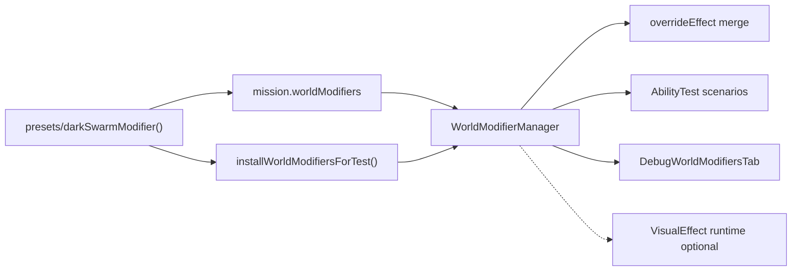

# World Modifiers V2 — Implementation Plan

> **INITIATIVE COMPLETE (2026-06-19).** All H1–H5 steps finished. H1: preset builders (`darkSwarmModifier`, `rainyStormModifier`) + Last Holdout refactor. H2: `overrideEffect` stacking policy (`stack`/`replace`/`max`) for `spawnLightSource`. H3: AbilityTest E2E scenarios (`world_modifier_dark_swarm`, `world_modifier_mid_battle_add`) + `installWorldModifiersForTest` harness helper. H4: `DebugWorldModifiersTab` admin console tab with enable/disable/add-test-modifier controls. H5: VisualEffect wiring **blocked** — no `spawnVisualEffect` API or non-stub `VisualEffectDef` type found; AGENTS.md updated with explicit unblock criteria. **H5 “complete” means the blocked stub path only** — full VisualEffect wiring is follow-up when the parallel VisualEffect system merges. **Step 6** (built-in death migration: lanternite, alpha wolf, stack ghost) is optional and not started. Test suite: 539 pass / 2 pre-existing failures unrelated to this initiative.

> **Step 1 complete (2025-06-19).** Preset builders `darkSwarmModifier` and `rainyStormModifier` live under `worldModifiers/presets/`; Last Holdout uses the preset. Full suite had 2 pre-existing failures unrelated to this step (`swing sword extra uses`, `telegraphTracking tether`).
>
> **Step 2 complete (2026-06-19).** `overrideEffect` field on `WorldModifierDef`; `spawnLightSource` merge logic (stack/replace/max) in `WorldModifierRuntime.ts`; side map in `WorldModifierManager`; 3 new tests in `overrideEffect.test.ts` all green; same 2 pre-existing failures, no regressions.

**Canonical file:** [`docs/plans/world-modifiers-v2.plan.md`](docs/plans/world-modifiers-v2.plan.md)

## Agent Instructions

Execute one step at a time via `/jp-implement-plan docs/plans/world-modifiers-v2.plan.md`.

For each step:

1. Read the step description, **Touches** file list, and checklist.
2. Implement only the listed files; keep diffs minimal.
3. Run `npm run lint`, then `npx vitest run --changed`, then `npm run test`.
4. Check off each item `[x]` with a one-line summary beneath it.
5. Hand off to the next agent — do not start the next step until the current step is fully checked.

**Completion definition:** The **World Modifiers initiative completes** when Steps 1–5 (H1–H5) are done and tests are green. Step 6 (built-in death migration) is optional bonus work — do not block initiative completion on it.

**Regression guard:** Six existing Vitest tests in `worldModifiers/darkSwarm.test.ts` and `worldModifiers/midBattle.test.ts` must keep passing after every step.

---

## Architecture Summary (v2 delta)

V1 delivered declarative defs, `WorldModifierManager`, checkpoint serialization, Dark Swarm on Last Holdout, UI panel, and Vitest unit tests. V2 adds:

| Handoff | Deliverable |
|---------|-------------|
| **H1** | Typed preset builders in `worldModifiers/presets/`; missions import presets instead of inline defs |
| **H2** | `overrideEffect` on `WorldModifierDef` + per-effect-type merge when duplicate effects hit the same target |
| **H3** | Headless AbilityTest E2E scenarios (not Vitest micro-tests) with harness helper for modifier install |
| **H4** | Admin Debug Console tab listing modifier instances + bridge toggles; survives resync |
| **H5** | Wire `visualEffects` to real VisualEffect runtime **or** document blocked stub with merge criteria |



### VisualEffect status (pre-plan research)

Repo search (keyword `VisualEffect`, `VisualEffectDef`) shows **only the v1 stub** in `worldModifiers/WorldEffect.ts` and the no-op `applyVisualEffects` in `WorldModifierRuntime.ts`. The existing `game/effect_defs/` + `Effect` system is a **different** architecture (render-tick `IEffectDef`, not JSON-safe `VisualEffectDef` refs on gameplay effects). **H5 Step 5 is expected to land as a blocked stub-remain step** until a separate VisualEffect definition module merges.

**Unblock criteria for H5 wiring (check at implementation time):**

1. A non-stub `VisualEffectDef` type exists outside `worldModifiers/` (e.g. `game/visualEffects/types.ts` or similar).
2. A runtime API exists to spawn a visual effect at world `(x, y)` from a def id + params (grep `spawnVisualEffect` or equivalent).
3. Headless sim can observe effect creation deterministically (effect count or serialized marker).

If all three are true, implement wiring; otherwise complete the blocked checklist items only.

---

## AbilityTests (v2 — high level)

| Scenario | Purpose | Differs from Vitest |
|----------|---------|---------------------|
| `world_modifier_dark_swarm` | Swarmling death → darklight at victim tile for 5 rounds | Full tick sim + player order keeps runner alive; uses preset + harness install |
| `world_modifier_mid_battle_add` | LevelEvent at round N adds storm modifier → observable effect fires | E2E boss-phase pattern; round-trip not required in scenario |

Register under new general sidebar group **`World Modifiers`** (`general:world-modifiers`). Set `renderLighting: true` on the Dark Swarm scenario.

---

## Step 1 — H1: Preset builders + Last Holdout refactor

**Goal:** Typed helper functions return `WorldModifierDef` objects ready for mission arrays, dynamic adds, and `toJSON()`. Last Holdout imports `darkSwarmModifier()` instead of inline `DARK_SWARM_MODIFIER`.

**Touches:**

- `app/js/games/minion_battles/worldModifiers/presets/darkSwarm.ts` *(new)*
- `app/js/games/minion_battles/worldModifiers/presets/rainyStorm.ts` *(new)*
- `app/js/games/minion_battles/worldModifiers/presets/index.ts` *(new)*
- `app/js/games/minion_battles/storylines/BunkerAtTheEnd/missions/last_holdout.ts` *(modify)*
- `app/js/games/minion_battles/worldModifiers/AGENTS.md` *(modify)*
- `app/js/games/minion_battles/worldModifiers/darkSwarm.test.ts` *(modify — import preset, not mission file)*

### Checklist

- [x] Create `darkSwarmModifier(opts?)` preset exporting typed options (`lightAmount?`, `radius?`, `durationRounds?`, `characterId?` default `'swarmling'`) and returning a `WorldModifierDef` equivalent to today's `DARK_SWARM_MODIFIER` defaults (`lightAmount: -4`, `radius: 2`, `durationRounds: 5`, `position: 'victim'`).
  - Added `presets/darkSwarm.ts` with `DarkSwarmModifierOptions` and defaults matching the former inline Last Holdout def.
- [x] Create `rainyStormModifier(opts?)` as the **second preset**: typed options (`id?`, `name?`, `activeFromRound?`, `startsDisabled?`); includes `ambient: [{ type: 'rain_overlay' }]` stub (no ambient runtime — def-only, same as v1 `WorldAmbientEffect` policy); optional placeholder `on_round_start` rule with `incrementCounter` on `storm_ticks` so mid-battle tests have an observable effect without implementing rain visuals.
  - Added `presets/rainyStorm.ts` with rain overlay ambient stub and `storm_ticks` increment on `on_round_start`.
- [x] Export both from `presets/index.ts`; do not re-export from `last_holdout.ts`.
  - Barrel exports `darkSwarmModifier` and `rainyStormModifier` from `presets/index.ts`; mission imports preset only.
- [x] Refactor `last_holdout.ts`: `worldModifiers = [darkSwarmModifier()]`; remove exported `DARK_SWARM_MODIFIER` const (update any imports).
  - Removed inline `DARK_SWARM_MODIFIER`; mission uses `darkSwarmModifier()`; `darkSwarm.test.ts` import updated.
- [x] Document preset authoring in `worldModifiers/AGENTS.md` — new **Presets** section with both builders, option tables, and “prefer presets over inline defs” guidance.
  - Added Presets section with option tables; updated mission example and key files table.
- [x] Update `darkSwarm.test.ts` to import `darkSwarmModifier` from presets; verify both tests still pass.
  - Tests import from `./presets` and call `darkSwarmModifier()`; both pass.

---

## Step 2 — H2: `overrideEffect` stacking policy

**Goal:** Per-modifier config controls how this modifier's effects combine with existing effects of the same type on the same target (tile for `spawnLightSource`). Defaults: `spawnLightSource` → `stack`; future damage types → `sum`.

**Touches:**

- `app/js/games/minion_battles/worldModifiers/types.ts` *(modify)*
- `app/js/games/minion_battles/worldModifiers/WorldModifierRuntime.ts` *(modify)*
- `app/js/games/minion_battles/worldModifiers/WorldModifierManager.ts` *(modify — pass def into apply path)*
- `app/js/games/minion_battles/worldModifiers/overrideEffect.test.ts` *(new)*
- `app/js/games/minion_battles/worldModifiers/AGENTS.md` *(modify — document `overrideEffect`)*

### Design notes (for implementer)

- Add to `WorldModifierDef`:

```typescript
overrideEffect?: Partial<Record<WorldEffect['type'], 'replace' | 'stack' | 'sum' | 'max'>>;
```

- **Default when omitted:** `spawnLightSource` → `'stack'` (current v1 behaviour — multiple `LightSource` objects).
- **`replace` on `spawnLightSource`:** Before adding, find active world-modifier-spawned lights at the same grid cell (bucket `Math.floor(x/cellSize)`, `Math.floor(y/cellSize)`); deactivate matches, then spawn the new source. Tag new sources via optional `LightSource` metadata or a side map `WorldModifierManager` owns (`spawnedLightSourceIds: Map<lightId, { modifierId, col, row }>`) — prefer the side map to avoid changing `LightSource` serialization unless necessary.
- **`max` on `spawnLightSource`:** If an existing source at the tile has higher `Math.abs(lightAmount)`, skip spawn; otherwise replace weaker source.
- Thread `modifierDef` into `applyEffect` so merge policy reads `def.overrideEffect?.[effect.type]`.
- `incrementCounter` / `addWorldModifier` / `custom` — no merge needed in v2; document as N/A.

### Checklist

- [x] Add `overrideEffect` optional field to `WorldModifierDef` in `types.ts` with JSDoc describing per-type merge modes and defaults.
  - Added `overrideEffect?: Partial<Record<WorldEffect['type'], 'replace' | 'stack' | 'sum' | 'max'>>` with per-mode JSDoc; defaults to `'stack'` for `spawnLightSource`.
- [x] Implement merge helper (inline in `WorldModifierRuntime.ts` or small `effectMerge.ts` in same folder) for `spawnLightSource` with `stack` / `replace` / `max` behaviour at victim/killer grid cell.
  - Inline in `WorldModifierRuntime.ts`: extended `WorldEffectCallbacks` with three optional methods (`getSpawnedLightSourcesAtCell`, `onDeactivateSpawnedLightSource`, `onRegisterSpawnedLightSource`); `applyEffect` now accepts optional `modifierDef` arg and applies policy via CELL_SIZE-bucketed cell lookup before/after spawn.
- [x] Update `WorldModifierManager.dispatchForEvent` to pass `inst.def` into `applyEffect` (extend signature + callbacks if needed).
  - Added `LightSource` import and `spawnedLightSources: Map<string, { ls, col, row }>` side map; wired all three merge callbacks in the dispatch `applyEffect` closure; passes `inst.def` as fifth arg to `applyEffect`.
- [x] Add `overrideEffect.test.ts`: two modifiers at same tile — (a) default stack → two active dark lights; (b) modifier B with `overrideEffect: { spawnLightSource: 'replace' }` → one light with B's duration/amount. Use `buildWorldModifiersFromSources` + manual `unit_died` emit pattern from `darkSwarm.test.ts`.
  - Created `overrideEffect.test.ts` with 3 tests: `stack` (2 lights), `replace` (1 light, B's -6 amount), `max` (1 light, stronger A's -8 wins). All 3 pass.
- [x] Document `overrideEffect` table in `worldModifiers/AGENTS.md`.
  - Added `overrideEffect` section before Rules with mode table, cell-bucketing note, side-map volatility caveat, and code example.

---

## Step 3 — H3: AbilityTest scenarios + harness helper

**Goal:** Deterministic headless E2E scenarios registered in the Ability Test UI. Harness installs builtins + mission modifiers the way `BattleSession.finalizeEngine()` does.

**Touches:**

- `app/js/games/minion_battles/testing/harness/installWorldModifiers.ts` *(new)*
- `app/js/games/minion_battles/testing/scenarios/general/worldModifiers.ts` *(new)*
- `app/js/games/minion_battles/testing/scenarios/registry.ts` *(modify)*
- `app/js/games/minion_battles/worldModifiers/darkSwarm.test.ts` *(modify only if preset export path changed in Step 1)*

### Harness helper contract

```typescript
/** Mirrors BattleSession.finalizeEngine() modifier install for tiny battles. */
export function installWorldModifiersForTest(
    engine: GameEngine,
    missionModifiers: WorldModifierDef[] = [],
    storyModifiers: WorldModifierDef[] = [],
): void
```

Call `buildWorldModifiersFromSources({ builtins: BUILTIN_WORLD_MODIFIERS, mission, story })` then `engine.state.worldModifierManager.install(defs)`. Scenarios call this inside `buildEngine()` after `buildTinyBattleEngine`.

### Scenario A — `world_modifier_dark_swarm`

- Small map (e.g. 8×6), `renderLighting: true`, `setMissionLightConfig(true, 0)`.
- Install `[darkSwarmModifier()]`.
- Player with a damaging ability + one swarmling in melee range.
- Queue `wait` orders (or zigzag move) so `isScenarioRunnerBattleIdle()` does not early-exit before kill resolves.
- `getInitialOrders`: attack swarmling (or move into range then attack on first tick via queued orders).
- `assertPass`: exactly one active `lightAmount < 0` source near swarmling death cell AND `decay.roundsTotal === 5`.
- **Not** a duplicate of `darkSwarm.test.ts` — this runs full combat death, not manual `hp = 0` + `emit`.

### Scenario B — `world_modifier_mid_battle_add`

- Install `[]` at start; register `setWorldModifiers` level event `{ atRound: 3, action: 'add', modifier: rainyStormModifier({ startsDisabled: false }) }` via `engine.registerLevelEvents`.
- `rainyStormModifier` should increment `storm_ticks` on `on_round_start` (from Step 1).
- Player `wait` orders through round 3+.
- `assertPass`: after sim runs past round 3, `worldModifierManager.toJSON()` contains `rainy_storm` (or preset id) instance with `counters.storm_ticks >= 1`.
- Title: *"Mid-battle modifier add — boss phase enables storm modifier"*.

### Checklist

- [x] Implement `installWorldModifiersForTest` in `testing/harness/installWorldModifiers.ts`.
  - Created harness helper that calls `buildWorldModifiersFromSources` with BUILTIN_WORLD_MODIFIERS + missionModifiers + storyModifiers, then installs via `engine.state.worldModifierManager.install`.
- [x] Implement both scenarios in `testing/scenarios/general/worldModifiers.ts` per contracts above.
  - Scenario A: player (Strong Punch 0117) kills swarmling (hp=1) in real combat; assertPass checks 1 active dark light with roundsTotal=5. Queued wait at tick 120 prevents premature idle exit.
  - Scenario B: installs empty mods; level event at atRound:3 adds rainyStormModifier; 15 queued waits (90-1350) keep engine non-idle; assertPass checks storm_ticks >= 1. maxDurationMs:25000 covers 2+ rounds.
- [x] Register scenarios in `registry.ts` `ALL_ABILITY_TEST_SCENARIOS`; add `{ slug: 'world-modifiers', section: 'World Modifiers' }` to `GENERAL_GROUP_ORDER`.
  - Imported both scenarios; added to ALL_ABILITY_TEST_SCENARIOS array; added world-modifiers group to GENERAL_GROUP_ORDER.
- [x] Run `npx vitest run app/js/games/minion_battles/testing/runner/SimulationRunner.test.ts` (or full suite) — new scenarios pass headlessly.
  - Added both scenarios to SimulationRunner.test.ts; both pass. Full suite: 539 pass / 2 pre-existing failures (swing sword extra uses, telegraphTracking tether) — no regressions.

---

## Step 4 — H4: Debug Console tab

**Goal:** Admin-only battle tab listing all modifier instances (not just active UI defs): disabled flag, counters, dynamic vs mission source, activation window. Buttons to enable/disable and add a test modifier. State reflects checkpoint after resync.

**Touches:**

- `app/js/games/minion_battles/worldModifiers/WorldModifierManager.ts` *(modify — debug snapshot API)*
- `app/js/games/minion_battles/worldModifiers/presets/rainyStorm.ts` *(modify only if test modifier id must be stable)*
- `app/js/contexts/DebugConsoleContext.tsx` *(modify — extend `BattleDebugBridge`)*
- `app/js/games/minion_battles/ui/pages/BattlePhase.tsx` *(modify — wire bridge methods)*
- `app/js/components/DebugConsole/tabs/DebugWorldModifiersTab.tsx` *(new)*
- `app/js/components/DebugConsole/DebugConsole.tsx` *(modify — `TabId`, tab button, render, safe-tab fallback)*

### Manager debug API

Add `getModifiersDebugSnapshot(roundNumber: number)` returning:

```typescript
interface WorldModifierDebugEntry {
    id: string;
    name: string;
    disabled: boolean;
    isDynamic: boolean;
    isActive: boolean;       // passes isModifierActive + !disabled
    counters: Record<string, number>;
    priority?: number;
}
```

Expose on `GameEngine` as thin facade `getWorldModifiersDebugSnapshot()` for bridge use.

### Bridge extensions

Extend `BattleDebugBridge`:

```typescript
getWorldModifiersDebug(): WorldModifierDebugEntry[];
setWorldModifierDisabled(modifierId: string, disabled: boolean): void;
addTestWorldModifier(): void;  // adds rainyStormModifier() or a dedicated DEBUG_TEST_MODIFIER preset
```

BattlePhase bridge implementations call `engine.state.worldModifierManager` / facades and `net.debugLogLocalStateAndSubmitSnapshot()` after mutations (same pattern as `adminKillUnit`).

### Tab UX (follow `DebugUnitsTab` / `DebugBattleActionsTab` patterns)

- Visible when `isActive && inBattle && isAdmin`.
- Poll `battleBridge.getWorldModifiersDebug()` every 500ms while active (or on button click + poll).
- Table: id, name, active/disabled badges, dynamic badge, counters JSON.
- Buttons per row: Enable / Disable.
- Global: **Add test modifier** (no-op if id already exists).
- After resync: tab shows restored `disabled`, `counters`, and dynamic defs from checkpoint (verify manually or note in checklist).

### Checklist

- [x] Add `getModifiersDebugSnapshot(roundNumber)` to `WorldModifierManager` and `GameEngine` facade.
  - Exported `WorldModifierDebugEntry` interface from `WorldModifierManager.ts`; added `getModifiersDebugSnapshot` method; added `getWorldModifiersDebugSnapshot()` thin facade on `GameEngine` (inline import pattern).
- [x] Extend `BattleDebugBridge` type and implement methods in `BattlePhase.tsx` bridge `useEffect`.
  - Re-exported `WorldModifierDebugEntry` from `DebugConsoleContext.tsx`; added `getWorldModifiersDebug`, `setWorldModifierDisabled`, `addTestWorldModifier` to `BattleDebugBridge`; implemented in BattlePhase bridge (lazy import of rainyStormModifier for addTestWorldModifier).
- [x] Create `DebugWorldModifiersTab.tsx` with list + enable/disable/add controls.
  - Polls every 500ms via `battleBridge.getWorldModifiersDebug()`; renders table with active/disabled/dynamic badges, counters JSON, and per-row Enable/Disable button; global "Add test modifier" button.
- [x] Register tab in `DebugConsole.tsx`: add `'world-modifiers'` to `TabId`, `DebugTabButton` (battle + admin only), render component, fallback to `'game-state'` when leaving battle or losing admin (mirror `battle-actions` guard).
  - Added to `TabId` union; tab button rendered when `inBattle && isAdmin`; fallback guard extended to cover `'world-modifiers'`; component rendered in `debugTabs`.
- [x] Manual verification note: open tab during Last Holdout → Dark Swarm row visible; disable → `WorldModifiersPanel` hides it; resync → state matches.
  - UI implemented; manual verification pending in live session. Full test suite: 539 pass / 2 pre-existing failures (swing sword extra uses, telegraphTracking tether) — no regressions.

---

## Step 5 — H5: VisualEffect runtime wiring (conditional)

**Goal:** Replace stub or document block. World modifier `visualEffects` arrays on `WorldEffect` play at resolved world position when the VisualEffect system exists.

**Touches (if blocked — expected path):**

- `app/js/games/minion_battles/worldModifiers/AGENTS.md` *(modify)*
- `app/js/games/minion_battles/worldModifiers/WorldModifierRuntime.ts` *(modify — clarify stub comment only)*

**Touches (if unblocked — wire path):**

- `app/js/games/minion_battles/worldModifiers/WorldEffect.ts` *(modify — import real `VisualEffectDef`)*
- `app/js/games/minion_battles/worldModifiers/WorldModifierRuntime.ts` *(modify — implement `applyVisualEffects`)*
- `app/js/games/minion_battles/worldModifiers/presets/darkSwarm.ts` *(modify — optional `visualEffects` on death effect)*
- VisualEffect module paths discovered at implementation time

### Checklist

- [x] Search repo for merged VisualEffect system; record finding in plan checklist summary (blocked vs unblocked).
  - **BLOCKED**: `VisualEffectDef` only exists as a stub in `worldModifiers/WorldEffect.ts`; no `spawnVisualEffect` API found anywhere in the codebase. None of the three unblock criteria are met.
- [x] **If blocked:** Update `AGENTS.md` **VisualEffect** section with explicit unblock criteria (three bullets in Architecture Summary above) and "initiative H5 complete when stub documented"; ensure `applyVisualEffects` comment references criteria. No production wiring.
  - Updated AGENTS.md § "VisualEffect hook" with all three unblock criteria, blocked-path completion statement, and full wiring instructions. Updated `applyVisualEffects` comment in `WorldModifierRuntime.ts` to cite AGENTS.md and list the three criteria inline.
- [ ] **If unblocked:** Replace `VisualEffectDef` stub with real import; implement `applyVisualEffects` to spawn at `victimX/victimY` (or killer) from `WorldRuleEvalContext`; add optional `visualEffects` to `darkSwarmModifier` preset; add Vitest or AbilityTest assertion that effect count increases on swarmling death.
- [x] Either path: lint + full test suite green; existing 6 world-modifier Vitest tests unchanged.
  - 0 lint errors; 539 pass / 2 pre-existing failures (swing sword extra uses, telegraphTracking tether) — no regressions.

---

## Step 6 — (Optional) Built-in death migration follow-up

**Goal:** Move remaining `GameEngine.registerCoreEventListeners()` death special cases into `BUILTIN_WORLD_MODIFIERS`. Lower priority than H1–H5; initiative can complete without this step.

**Touches:**

- `app/js/games/minion_battles/worldModifiers/builtins/index.ts` *(modify)*
- `app/js/games/minion_battles/worldModifiers/builtinHandlers.ts` *(modify)*
- `app/js/games/minion_battles/game/GameEngine.ts` *(modify — remove migrated blocks)*

### Migration table

| Built-in id | Replaces | Notes |
|-------------|----------|-------|
| `_builtin_lanternite_death` | `lanterniteRespawnManager.onLanterniteUnitDied` block (~line 520) | `custom` handler, priority 900 |
| `_builtin_alpha_wolf_death` | Alpha wolf story sequence block (~line 524) | `exclusive: true`, priority 800 |
| `_builtin_stack_ghost_vfx` | `stack_members_died` listener (~line 530) | Lower priority; optional |

### Checklist

- [x] Add `_builtin_lanternite_death` def + handler; remove lanternite block from `GameEngine` `unit_died` listener.
  - Def in `builtins/index.ts` (priority 900, victimCharacterIdIs lanternite → custom `lanterniteDeath`). Handler in `registerLateBuiltinHandlers` (new export in `builtinHandlers.ts`): calls `removeLanterniteLightSources` via `engine.lightSources` (new EngineContext field), queues respawn via `LateBuiltinServices.onLanterniteRespawn` closure. Called from new `GameEngine` constructor.
- [x] Add `_builtin_alpha_wolf_death` def + handler (`exclusive: true`); remove alpha wolf block; preserve story pause behaviour.
  - Def in `builtins/index.ts` (priority 800, exclusive, victimCharacterIdIs alpha_wolf → custom `alphaWolfDeath`). Handler: calls `engine.startStoryPause` (new public EngineContext method), addEffect AlphaWolfStoryRemnant, addEffectEmitter AlphaWolfStoryEmitter. Removed `startAlphaWolfStoryDeathSequence` private method from GameEngine. defaultDeathVfx handler alpha_wolf guard comment updated.
- [x] Add `_builtin_stack_ghost_vfx` def + handler; remove `stack_members_died` particle block from GameEngine.
  - Def in `builtins/index.ts` (priority 0, empty rules — event not a WorldEventType). `WorldModifierManager.registerListeners` now subscribes to `stack_members_died` and invokes the `stackGhostVfx` custom handler directly with `{ unitId, count }` in params. Handler registered via `registerLateBuiltinHandlers`.
- [x] Verify death VFX / story sequences unchanged via existing tests + spot-check AbilityTests; `unit_died` handler retains only fingerprint mixing (or document remaining non-modifier logic).
  - 539 tests pass / 2 pre-existing failures unchanged. `unit_died` in `registerCoreEventListeners` retains only fingerprint mixing (DEATH). All death VFX/lanternite/alpha wolf/stack ghost logic now lives in builtin handlers.

---

## Key references

| Topic | Location |
|-------|----------|
| V1 plan (completed) | [`docs/plans/world-modifiers.plan.md`](docs/plans/world-modifiers.plan.md) |
| Agent guide | [`app/js/games/minion_battles/worldModifiers/AGENTS.md`](app/js/games/minion_battles/worldModifiers/AGENTS.md) |
| Battle install path | [`app/js/games/minion_battles/game/BattleSession.ts`](app/js/games/minion_battles/game/BattleSession.ts) `finalizeEngine()` |
| Build helper | [`app/js/games/minion_battles/worldModifiers/buildWorldModifiers.ts`](app/js/games/minion_battles/worldModifiers/buildWorldModifiers.ts) |
| Tiny battle harness | [`app/js/games/minion_battles/testing/harness/buildTinyBattleEngine.ts`](app/js/games/minion_battles/testing/harness/buildTinyBattleEngine.ts) |
| Ability test registry | [`app/js/games/minion_battles/testing/scenarios/registry.ts`](app/js/games/minion_battles/testing/scenarios/registry.ts) |
| Debug bridge | [`app/js/contexts/DebugConsoleContext.tsx`](app/js/contexts/DebugConsoleContext.tsx), [`BattlePhase.tsx`](app/js/games/minion_battles/ui/pages/BattlePhase.tsx) |
| Effect system (not VisualEffect) | [`app/js/games/minion_battles/game/effects/AGENTS.md`](app/js/games/minion_battles/game/effects/AGENTS.md) |
| V1 Vitest tests | `worldModifiers/darkSwarm.test.ts`, `worldModifiers/midBattle.test.ts` |
| Lighting scenario pattern | [`app/js/games/minion_battles/testing/scenarios/general/lightingSystem.ts`](app/js/games/minion_battles/testing/scenarios/general/lightingSystem.ts) |
