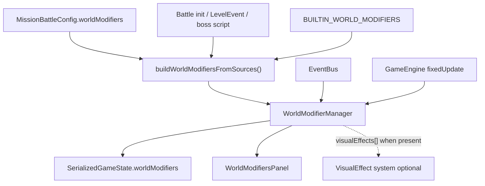

# World Modifiers — Implementation Plan

> **Completed 2026-06-19.** All v1 steps (1–8) are done and tests are green (two pre-existing failures in telegraphTracking and SimulationRunner unrelated to this system). Delivered: declarative `WorldModifierDef` type system, `WorldModifierManager` with EventBus integration, `spawnLightSource` / counter / mid-battle add-remove-disable effects, `setWorldModifiers` LevelEvent, Dark Swarm mission modifier on Last Holdout, `_builtin_default_death_vfx` migration from GameEngine, `WorldModifiersPanel` UI, checkpoint serialization, and `worldModifiers/AGENTS.md`. v2 handoffs (H1–H5) are documented in the plan and remain outstanding.

**Canonical file:** [`docs/plans/world-modifiers.plan.md`](docs/plans/world-modifiers.plan.md)

## Agent Instructions

Execute one step at a time via `/jp-implement-plan docs/plans/world-modifiers.plan.md`.

For each step:

1. Read the step description, files list, and checklist.
2. Implement only the listed files; keep diffs minimal.
3. Run `npm run lint`, then `npx vitest run --changed`, then `npm run test`.
4. Check off each item `[x]` with a one-line summary.
5. Do not start the next step until the current step is fully checked.

**Completion definition:** v1 steps (1–8) must pass tests. The **World Modifiers initiative is not complete** until v2 handoffs (Section at end) are also done.

---

## Architecture Summary

World modifiers are battle-wide rules with static **defs** (mission, story, built-ins) and per-battle **runtime instances** (counters, disabled flag, dynamic adds). A single `WorldModifierManager` owns instances, subscribes to `EventBus`, runs ambient hooks, and serializes state into checkpoints.



### Def shape (v1)

```typescript
interface WorldModifierDef {
  id: string;
  name: string;
  description: string;
  icon: string; // inline SVG or bundled asset key — same pattern as ability cards

  /** Sort key when multiple modifiers react to the same event. Higher runs first. */
  priority?: number;

  /** Conditional activation (v1) */
  activeFromRound?: number;
  activeUntilRound?: number;
  requiresObjectiveCompletedId?: string;

  /** Instance starts disabled when true; can be toggled mid-battle */
  startsDisabled?: boolean;

  ambient?: WorldAmbientEffect[];       // always-on while active (stub in v1; full in Rainy follow-up)
  rules?: Partial<Record<WorldEventType, WorldEventRule[]>>;
}

interface WorldEventRule {
  id?: string;
  priority?: number;
  once?: boolean;
  maxTriggers?: number;
  /** When true, no further on_unit_died rules run after this rule matches (alpha wolf pattern) */
  exclusive?: boolean;
  conditions: WorldCondition[];
  effects: WorldEffect[];
}
```

### WorldEventType (v1)

| Event            | Source                                                       |
| ---------------- | ------------------------------------------------------------ |
| `on_unit_died`   | `EventBus` `unit_died`                                       |
| `on_round_start` | `EventBus` `round_start` (add emit in GameEngine if missing) |
| `on_round_end`   | `EventBus` `round_end`                                       |

Defer `on_tick`, `on_damage_taken`, `on_ability_used` until a modifier needs them.

### WorldEffect (v1 minimal union)

Every variant in the union may include an optional **`visualEffects`** array (see [VisualEffect integration](#visualeffect-integration-optional) below).

- `{ type: 'spawnLightSource'; lightAmount; radius; durationRounds; position: 'victim' | 'killer'; color?; visualEffects? }`
- `{ type: 'incrementCounter'; counterId: string; amount?: number; visualEffects? }`
- `{ type: 'addWorldModifier'; modifierDef: WorldModifierDef; visualEffects? }` — mid-battle add
- `{ type: 'removeWorldModifier'; modifierId: string; visualEffects? }`
- `{ type: 'setWorldModifierDisabled'; modifierId: string; disabled: boolean; visualEffects? }`
- `{ type: 'custom'; effectId: string; comment: string; params?; visualEffects? }` — built-in migration escape hatch

### VisualEffect integration (optional)

A separate session is building a **VisualEffect** definition system (screen-space / world VFX authored as JSON-safe defs with helpers). World modifiers should **reserve a hook** for it without blocking v1 if that system is not merged yet.

**On every `WorldEffect` variant**, include an optional field:

```typescript
/**
 * VisualEffect — optional companion VFX to play when this gameplay effect applies.
 * References the VisualEffect def system (parallel workstream). JSON-safe stub until
 * that runtime exists; omit or leave empty in v1 mission defs.
 *
 * When the VisualEffect runtime is available, WorldModifierRuntime applies these
 * after (or in parallel with) the gameplay effect, using event context for position
 * (e.g. victim x/y for on_unit_died).
 */
visualEffects?: VisualEffectDef[];
```

**v1 implementation policy:**

- Define `VisualEffectDef` in `WorldEffect.ts` as a **minimal forward-compatible stub** (e.g. `{ id: string; params?: Record<string, unknown> }`) or `import type` from the VisualEffect module **only if it already exists** in the repo — do not block Step 1 on the other session.
- In `WorldModifierRuntime.applyEffect`, if `visualEffects` is present and non-empty, call a no-op `applyVisualEffects(visualEffects, context)` helper with a comment: `// VisualEffect: wire to VisualEffect runtime when available`.
- Dark Swarm v1 does **not** require `visualEffects`; gameplay is the dark `LightSource` only.

**When VisualEffect lands:** replace the stub type with the real def, implement `applyVisualEffects` to spawn defs at the resolved world position, and optionally add `visualEffects` to Dark Swarm (e.g. purple wisps at death site).

### WorldCondition (v1)

- `{ type: 'always' }`
- `{ type: 'victimCharacterIdIs'; characterId: string }`
- `{ type: 'roundAtLeast'; round: number }`
- `{ type: 'roundAtMost'; round: number }`
- `{ type: 'counterAtLeast'; counterId: string; count: number }`
- `{ type: 'objectiveCompleted'; objectiveId: string }`
- `{ type: 'custom'; conditionId: string; comment: string; params? }`

### Runtime instance + checkpoint

```typescript
interface SerializedWorldModifierInstance {
  id: string;
  disabled: boolean;
  counters: Record<string, number>;
  /** Full def JSON for modifiers added mid-battle (not in mission) */
  dynamicDef?: WorldModifierDef;
  /** Rule ids that fired with once:true */
  firedOnceRuleIds?: string[];
}
```

Add `worldModifiers?: SerializedWorldModifierInstance[]` to [`SerializedGameState`](app/js/games/minion_battles/game/types.ts).

### Build + install

[`buildWorldModifiersFromSources()`](app/js/games/minion_battles/worldModifiers/buildWorldModifiers.ts):

```
builtins (always)
  + mission.worldModifiers
  + battleInit.storyWorldModifiers (optional lobby payload field)
```

Dedupe by `id`; later sources override earlier. Called from [`BattleSession.load()`](app/js/games/minion_battles/game/BattleSession.ts) and after `loadFromSnapshot()` (defs from mission, state from checkpoint — same pattern as [`ObjectiveManager`](app/js/games/minion_battles/game/managers/ObjectiveManager.ts)).

### Death dispatch ordering (Decision A)

All `on_unit_died` handling moves toward `WorldModifierManager` in phases:

1. **v1:** WMM runs **after** existing GameEngine death listener for mission modifiers only (Dark Swarm). Built-ins stay in GameEngine temporarily.
2. **Step 8:** Migrate **default death VFX** into a built-in modifier as proof-of-pattern.
3. **Follow-up (post-v1, same architecture):** Migrate lanternite death, alpha wolf story death, stack ghost particles into `BUILTIN_WORLD_MODIFIERS` with `custom` handlers; delete the corresponding blocks in [`GameEngine.registerCoreEventListeners()`](app/js/games/minion_battles/game/GameEngine.ts).

**Global dispatch order** once fully migrated:

```
sort all (modifier.priority, rule.priority, declarationIndex)
for each rule on on_unit_died:
  skip if modifier inactive / disabled / activation conditions fail
  evaluate rule conditions
  apply effects
  if rule.exclusive → stop
```

Built-in modifiers use reserved ids prefixed `_builtin_` and high/low priority slots:

- `_builtin_lanternite_death` — priority 900
- `_builtin_alpha_wolf_death` — priority 800, `exclusive: true`
- `_builtin_default_death_vfx` — priority -100 (runs last)

Custom handlers live in [`worldModifiers/builtinHandlers.ts`](app/js/games/minion_battles/worldModifiers/builtinHandlers.ts), registered on the manager at init.

### Mid-battle changes (Decision D)

`WorldModifierManager` public API (v1):

- `addModifier(def: WorldModifierDef)` — stores `dynamicDef` on instance
- `removeModifier(id: string)`
- `setDisabled(id: string, disabled: boolean)`

Triggers:

- **WorldEffect** `addWorldModifier` / `removeWorldModifier` / `setWorldModifierDisabled` (boss phase scripts)
- **New LevelEvent** `setWorldModifiers` in [`storylines/types.ts`](app/js/games/minion_battles/storylines/types.ts):

```typescript
interface LevelEventSetWorldModifiers extends LevelEventBase {
  type: 'setWorldModifiers';
  trigger: { atRound: number } | { afterSeconds: number };
  actions: Array<
    | { action: 'add'; modifier: WorldModifierDef }
    | { action: 'remove'; modifierId: string }
    | { action: 'enable' | 'disable'; modifierId: string }
  >;
}
```

Wire in [`LevelEventManager.processLevelEvents()`](app/js/games/minion_battles/game/managers/LevelEventManager.ts) calling into `ctx.worldModifierManager`.

### UI (Decision E)

New [`WorldModifiersPanel.tsx`](app/js/games/minion_battles/ui/components/WorldModifiersPanel.tsx): read-only strip showing active modifiers (`name`, `description`, `icon`). Mount in [`BattlePhase.tsx`](app/js/games/minion_battles/ui/pages/BattlePhase.tsx) near [`ObjectivePanel`](app/js/games/minion_battles/ui/components/ObjectivePanel.tsx). Hide modifiers that are inactive (activation window) or removed.

### Dark Swarm (first mission modifier)

Add to [`last_holdout.ts`](app/js/games/minion_battles/storylines/BunkerAtTheEnd/missions/last_holdout.ts):

- `id: 'dark_swarm'`, name/description/icon for UI
- Rule on `on_unit_died`: `victimCharacterIdIs: 'swarmling'`
- Effect: `spawnLightSource` with **negative** `lightAmount` (darklight — supported by [`LightGrid`](app/js/games/minion_battles/game/LightGrid.ts)), `durationRounds: 5`, `position: 'victim'`
- Suggested tuning (adjust in playtest): `lightAmount: -4`, `radius: 2` — mirrors small torch magnitude, inverted
- Swarmling keeps existing [`deathEffect`](app/js/games/minion_battles/game/units/unit_defs/unitDef.ts) VFX; dark light stacks independently (LightGrid max-abs wins per tile)
- `visualEffects` omitted in v1 (optional hook only)

### Shared dispatcher

Generalize [`dispatchAbilityEventRules`](app/js/games/minion_battles/abilities/events/AbilityEventDispatcher.ts) into a generic `dispatchEventRules<TCondition, TEffect, TContext>()` in `worldModifiers/EventRuleDispatcher.ts`. Ability and world systems both use it — no ability-def reuse in v1.

---

## Step 1 — Types and build helper

**Goal:** JSON-safe def/instance types and merge helper. No runtime behavior yet.

**Files:**

- `app/js/games/minion_battles/worldModifiers/types.ts` *(new)*
- `app/js/games/minion_battles/worldModifiers/WorldCondition.ts` *(new)*
- `app/js/games/minion_battles/worldModifiers/WorldEffect.ts` *(new)*
- `app/js/games/minion_battles/worldModifiers/buildWorldModifiers.ts` *(new)*
- `app/js/games/minion_battles/storylines/types.ts` *(modify — add `worldModifiers?` to `MissionBattleConfig`)*

### Checklist

- [x] Define `WorldModifierDef`, `WorldEventRule`, `WorldEventType`, `WorldAmbientEffect` stub, `SerializedWorldModifierInstance`
  - Created `worldModifiers/types.ts` with all five types; WorldAmbientEffect is a `{ type; params? }` stub for post-v1.
- [x] Define `WorldCondition` and `WorldEffect` strict unions (v1 variants above)
  - `WorldCondition.ts`: 6 variants + `WorldCustomCondition` escape hatch.
  - `WorldEffect.ts`: 6 variants (SpawnLightSource, IncrementCounter, AddWorldModifier, RemoveWorldModifier, SetWorldModifierDisabled, Custom) each extending with `visualEffects?`.
- [x] Add optional `visualEffects?: VisualEffectDef[]` on every `WorldEffect` variant; define `VisualEffectDef` stub (or import from VisualEffect module if present) with JSDoc keyword **VisualEffect**
  - VisualEffectDef stub (`{ id; params? }`) defined in `WorldEffect.ts`; VisualEffect module not yet in repo so stub used per plan.
- [x] Implement `buildWorldModifiersFromSources({ builtins, mission, story })` with id dedupe
  - `buildWorldModifiers.ts`: Map-based merge, precedence story > mission > builtins.
- [x] Add `worldModifiers?: WorldModifierDef[]` to `MissionBattleConfig`
  - Added import + field to `storylines/types.ts`; lint clean, pre-existing test failures unaffected.

---

## Step 2 — EventRuleDispatcher + WorldModifierManager core

**Goal:** Manager installs defs, listens to `unit_died` / round events, dispatches rules, applies v1 effects.

**Files:**

- `app/js/games/minion_battles/worldModifiers/EventRuleDispatcher.ts` *(new — extracted from ability dispatcher)*
- `app/js/games/minion_battles/worldModifiers/WorldModifierRuntime.ts` *(new — evaluateCondition / applyEffect)*
- `app/js/games/minion_battles/worldModifiers/WorldModifierManager.ts` *(new)*
- `app/js/games/minion_battles/game/GameState.ts` *(modify — add manager)*
- `app/js/games/minion_battles/game/EngineContext.ts` *(modify — expose manager accessor if needed)*

### Checklist

- [x] Extract generic rule dispatcher; keep ability dispatcher as thin wrapper (no behavior change)
  - `worldModifiers/EventRuleDispatcher.ts`: `dispatchEventRules<C,E,Ctx>` with priority sort, trigger counts, exclusive flag, `onRuleProcessed` hook.
  - `abilities/events/AbilityEventDispatcher.ts`: thin wrapper; `processedRuleKeys` ordering guard preserved via `onRuleProcessed` callback.
- [x] Implement `WorldModifierManager.install(defs)`, `isModifierActive(def, round, objectives)`, `registerListeners(eventBus)`
  - `WorldModifierManager.ts`: install merges snapshot; isModifierActive checks round window + objective gate; registerListeners subscribes unit_died and round_start; handleRoundEnd dispatches on_round_end.
- [x] Implement `spawnLightSource` effect via [`LightSourceManager`](app/js/games/minion_battles/game/lightSources/LightSourceManager.ts) (`roundCreated: ctx.roundNumber`, `roundsTotal: durationRounds`, no interval decay)
  - `WorldModifierRuntime.applyEffect`: creates LightSource with decay { roundCreated, roundsTotal }; victim/killer position lookup via engine.getUnit.
- [x] Implement counter increment + mid-battle add/remove/disable effects
  - All five non-custom WorldEffect variants implemented in WorldModifierRuntime.applyEffect.
- [x] After each gameplay effect, call `applyVisualEffects(effect.visualEffects, context)` — no-op stub with `// VisualEffect:` comment until VisualEffect runtime exists
  - `applyVisualEffects` no-op stub in WorldModifierRuntime.ts with `// VisualEffect:` comment.
- [x] Implement `disabled` flag on instances; respect `startsDisabled`
  - Instance starts with `disabled = def.startsDisabled ?? false`; dispatchForEvent skips disabled instances; setDisabled toggles.
- [x] Implement conditional activation: `activeFromRound`, `activeUntilRound`, `requiresObjectiveCompletedId`
  - `isModifierActive` checks all three; `requiresObjectiveCompletedId` uses `ctx.isObjectiveCompleted` (added to EngineContext + GameEngine; delegates to ObjectiveManager.isCompleted).
  - Extra touches: `ObjectiveManager.isCompleted`, `EngineContext.isObjectiveCompleted`, `GameEngine.isObjectiveCompleted`.
- [x] Wire manager into `GameState` constructor
  - `GameState.ts`: import + `readonly worldModifierManager: WorldModifierManager`; constructed last in constructor with `new WorldModifierManager(ctx)`.

---

## Step 3 — Engine integration and serialization

**Goal:** Tick hooks, checkpoint round-trip, listener registration.

**Files:**

- `app/js/games/minion_battles/game/GameEngine.ts` *(modify)*
- `app/js/games/minion_battles/game/types.ts` *(modify — `worldModifiers` on snapshot)*

### Checklist

- [x] Register WMM listeners inside `registerCoreEventListeners()` **after** `interruptSystem`, before/alongside existing death handler (mission modifiers only in v1)
  - `GameEngine.registerCoreEventListeners()`: added `this.state.worldModifierManager.registerListeners(this.eventBus)` after interruptSystem line.
- [x] Emit `round_start` on EventBus if not already emitted (needed for activation checks)
  - Already emitted at `processRoundProgressMilestones` (line ~1455); no change needed.
- [x] Call `worldModifierManager.handleRoundEnd(roundNumber)` from existing round-end path
  - Added `this.state.worldModifierManager.handleRoundEnd(roundNumber)` inside `GameEngine.handleRoundEnd`.
- [x] Add `worldModifierManager.toJSON()` / `importSnapshot()` / `restoreInstances()` to `GameEngine.toJSON()` / `fromJSON()`
  - `toJSON()`: added `worldModifiers: this.state.worldModifierManager.toJSON()`.
  - `fromJSON()`: added `engine.state.worldModifierManager.importSnapshot(data.worldModifiers ?? null)` alongside objectiveManager pattern.
  - `SerializedGameState.worldModifiers?` added to `game/types.ts`.
- [x] Add `getActiveWorldModifiersForUI()` facade on GameEngine
  - `GameEngine.getActiveWorldModifiersForUI()` returns `state.worldModifierManager.getActiveModifiersForUI(roundNumber)`.

---

## Step 4 — BattleSession wiring + Dark Swarm mission

**Goal:** Modifiers load with battle; Last Holdout ships Dark Swarm.

**Files:**

- `app/js/games/minion_battles/worldModifiers/builtins/index.ts` *(new — empty array for now)*
- `app/js/games/minion_battles/game/BattleSession.ts` *(modify)*
- `app/js/games/minion_battles/storylines/BunkerAtTheEnd/missions/last_holdout.ts` *(modify)*
- `app/js/games/minion_battles/storylines/BaseMissionDef.ts` *(modify — pass through `worldModifiers`)*

### Checklist

- [x] Call `buildWorldModifiersFromSources` + `engine.worldModifierManager.install()` in `BattleSession.load()` and re-install defs after `loadFromSnapshot()`
  - Added `buildWorldModifiersFromSources` + `BUILTIN_WORLD_MODIFIERS` imports to `BattleSession.ts`; wired install call in `finalizeEngine()` (covers both load and loadFromSnapshot paths). Added `worldModifiers?: WorldModifierDef[]` to `BaseMissionDef` class body.
- [x] Define Dark Swarm modifier on Last Holdout with icon/description copy
  - Exported `DARK_SWARM_MODIFIER` const from `last_holdout.ts` (lightAmount: -4, radius: 2, durationRounds: 5, position: victim); `LastHoldoutMission.worldModifiers = [DARK_SWARM_MODIFIER]`.
- [x] Unit test: kill swarmling → one active dark `LightSource` at death position with 5-round lifetime
  - `worldModifiers/darkSwarm.test.ts`: two tests — swarmling death creates dark LightSource at victim position; non-swarmling death creates none. Both pass.

---

## Step 5 — Mid-battle LevelEvent + manager API hardening

**Goal:** Boss-fight-style modifier changes via level events and world effects.

**Files:**

- `app/js/games/minion_battles/storylines/types.ts` *(modify — `LevelEventSetWorldModifiers`)*
- `app/js/games/minion_battles/game/managers/LevelEventManager.ts` *(modify)*
- `app/js/games/minion_battles/worldModifiers/WorldModifierManager.ts` *(modify)*

### Checklist

- [x] Add `setWorldModifiers` level event type + processing in `LevelEventManager`
  - Added `LevelEventSetWorldModifiers` interface to `storylines/types.ts` and added to `LevelEvent` union; added `worldModifierManager` to `EngineContext` (implemented as getter on `GameEngine`); added `processSetWorldModifiersEvent` private method to `LevelEventManager` handling add/remove/enable/disable actions.
- [x] Ensure dynamically added modifiers serialize `dynamicDef` and restore on resync
  - Already implemented in Step 2 (`toJSON` includes `dynamicDef` for dynamic instances; `install` merges them back from snapshot). Verified via round-trip test.
- [x] Unit test: add modifier mid-battle via manager API → effect fires; survives `toJSON`/`fromJSON`
  - `worldModifiers/midBattle.test.ts`: 4 tests — addModifier fires effect; round-trip restores dynamic def; LevelEvent add; LevelEvent disable/enable. All pass.

---

## Step 6 — WorldModifiersPanel UI

**Goal:** Players see active world rules (Decision E).

**Files:**

- `app/js/games/minion_battles/ui/components/WorldModifiersPanel.tsx` *(new)*
- `app/js/games/minion_battles/ui/pages/BattlePhase.tsx` *(modify)*

### Checklist

- [x] Panel renders active modifiers (icon + name; description on hover/tooltip)
  - Created `WorldModifiersPanel.tsx`: compact vertical strip, each modifier shows inline SVG icon + purple name chip, `title` tooltip shows description, returns null when empty.
- [x] Subscribes to engine state changes / round updates so activation windows update live
  - Added `activeWorldModifiers` state + 500ms polling interval in `BattlePhase.tsx` calling `engine.getActiveWorldModifiersForUI(roundNumber)`.
- [x] Dark Swarm visible on Last Holdout load
  - Panel mounted in canvas area (`absolute right-2 top-2 z-20`) alongside `BossFightHud`; Last Holdout's `DARK_SWARM_MODIFIER` surfaces through the existing `getActiveWorldModifiersForUI` path.

---

## Step 7 — Built-in death VFX migration (Decision A proof)

**Goal:** Move default `getDeathEffectDef` handling from GameEngine into WMM built-ins; validate ordering.

**Files:**

- `app/js/games/minion_battles/worldModifiers/builtins/index.ts` *(modify)*
- `app/js/games/minion_battles/worldModifiers/builtinHandlers.ts` *(new)*
- `app/js/games/minion_battles/game/GameEngine.ts` *(modify — remove default death VFX block)*

### Checklist

- [x] Add `_builtin_default_death_vfx` with `custom` handler replicating current particle/icon death logic
  - `worldModifiers/builtins/index.ts`: added `BUILTIN_DEFAULT_DEATH_VFX` (priority -100, `on_unit_died` → `custom effectId: 'defaultDeathVfx'`); wired into `BUILTIN_WORLD_MODIFIERS`.
  - `worldModifiers/builtinHandlers.ts` (new): `registerBuiltinHandlers` registers `defaultDeathVfx` handler that inlines particle-burst / darkCreatureIcon logic from `EngineContext`; skips `alpha_wolf` (story sequence owns VFX until `_builtin_alpha_wolf_death`).
  - Extra touches: `WorldModifierRuntime.WorldEffectCallbacks` — added optional `onCustomEffect`; `applyEffect` dispatches to it. `WorldModifierManager` — added `customEffectHandlers` map + `registerCustomEffectHandler`; passes `onCustomEffect` in `dispatchForEvent`.
- [x] Register builtin handlers on manager init
  - `WorldModifierManager.constructor` calls `registerBuiltinHandlers(this)` (imported from `builtinHandlers.ts`).
- [x] Remove default death VFX branch from `GameEngine` `unit_died` listener (keep lanternite + alpha wolf until follow-up)
  - Removed `getDeathEffectDef` block (old lines 529-538); removed unused `DarkCreatureIconDeathEffect` and `getDeathEffectDef` imports. Left lanternite + alpha_wolf blocks intact.
- [x] Verify existing death VFX tests / swarmling behavior unchanged
  - `npx vitest run --changed` — darkSwarm.test.ts and midBattle.test.ts both pass; only pre-existing SimulationRunner failure present.

---

## Step 8 — Documentation + AGENTS note

**Files:**

- `app/js/games/minion_battles/worldModifiers/AGENTS.md` *(new)*
- `app/js/games/minion_battles/AGENTS.md` *(modify — one row in manager table)*

### Checklist

- [x] Document def authoring, mid-battle API, built-in migration pattern, serialization contract
  - Created `worldModifiers/AGENTS.md` covering: def authoring fields, conditions/effects tables, mission wiring, buildWorldModifiersFromSources, mid-battle API (manager, WorldEffect, LevelEvent), built-in migration pattern, serialization contract.
- [x] Document reserved `_builtin_` id prefix and priority conventions
  - `worldModifiers/AGENTS.md` "Reserved `_builtin_` id prefix" and "Priority conventions" sections with priority table (-100 to 900).
- [x] Document optional `visualEffects` on `WorldEffect` and **VisualEffect** integration point (stub vs wired)
  - `worldModifiers/AGENTS.md` "VisualEffect hook (stub in v1)" section: stub type, `applyVisualEffects` no-op, search comment, wiring instructions for when VisualEffect lands.

---

## v2 Handoffs (required for initiative completion)

These are **not** in v1 scope. Do not mark the World Modifiers initiative complete until all four are done.

### H1 — Preset / helper builders

**Deliverable:** `worldModifiers/presets/` with typed builders, e.g. `darkSwarmModifier(opts)`, `rainyStormModifier(opts)`, each returning `WorldModifierDef` ready for mission arrays or `toJSON()`.

**Acceptance:** Last Holdout uses `darkSwarmModifier()` instead of inline def; at least two presets documented in AGENTS.md.

### H2 — Modifier stacking policy (`overrideEffect`)

**Deliverable:** Per-modifier config describing how duplicate effects combine:

```typescript
interface WorldModifierDef {
  // ...
  overrideEffect?: Partial<Record<WorldEffect['type'], 'replace' | 'stack' | 'sum' | 'max'>>;
}
```

**Examples:** spawn effects → `replace` duration; damage effects → `sum`; light sources → `stack` (default).

**Acceptance:** Two modifiers with conflicting `spawnLightSource` on same tile behave per config; unit test covers `sum` vs `replace`.

### H3 — Ability test scenarios

**Deliverable:** Headless AbilityTest scenario(s) per [`ability-tests` skill](.claude/skills/ability-tests/SKILL.md):

- "Dark Swarm — swarmling death leaves darklight for 5 rounds"
- "Mid-battle modifier add — boss phase enables storm modifier"

**Acceptance:** Scenarios run in admin Ability Test UI and CI; deterministic, E2E-level (not numeric micro-assertions).

### H4 — Debug console tab

**Deliverable:** New Debug Console tab (see [`debug-console` skill](.claude/skills/debug-console/SKILL.md)) listing active modifiers, disabled state, counters, dynamic vs mission source; buttons to enable/disable/add test modifier (admin only).

**Acceptance:** Visible during battle for admin; reflects checkpoint state after resync.

### H5 — VisualEffect runtime wiring (cross-session)

**Deliverable:** Replace `VisualEffectDef` stub and no-op `applyVisualEffects` with the real VisualEffect definition system once merged. World modifier rules may attach `visualEffects` arrays to any `WorldEffect`.

**Acceptance:** Dark Swarm (or a test modifier) optionally plays a VisualEffect at victim position on swarmling death; deterministic in headless sim if VisualEffect system supports it.

---

## Built-in migration follow-up (post-v1, pre-initiative-complete optional track)

After Step 7, migrate remaining GameEngine death special cases:

| Built-in id                 | Replaces                       | Notes                    |
| --------------------------- | ------------------------------ | ------------------------ |
| `_builtin_lanternite_death` | lanternite block in GameEngine | custom handler           |
| `_builtin_alpha_wolf_death` | alpha wolf story sequence      | `exclusive: true`        |
| `_builtin_stack_ghost_vfx`  | `stack_members_died` listener  | optional; lower priority |

End state: `GameEngine.registerCoreEventListeners()` `unit_died` handler contains only fingerprint mixing (or that moves to a zero-priority builtin too).

---

## AbilityTests (v1)

v1 uses **Vitest unit tests** only (Step 4–5). AbilityTest scenarios deferred to **H3**.

---

## Key references

- Death event: [`EventBus`](app/js/games/minion_battles/game/EventBus.ts) `unit_died`
- Round-based light lifetime: [`LightSourceManager.handleRoundEnd`](app/js/games/minion_battles/game/lightSources/LightSourceManager.ts)
- Objective snapshot pattern: [`ObjectiveManager`](app/js/games/minion_battles/game/managers/ObjectiveManager.ts)
- Declarative rules pattern: [`AbilityEventRule`](app/js/games/minion_battles/abilities/events/AbilityEventRule.ts)
- **VisualEffect** — parallel visual effect definition system; optional `visualEffects[]` on each `WorldEffect`
