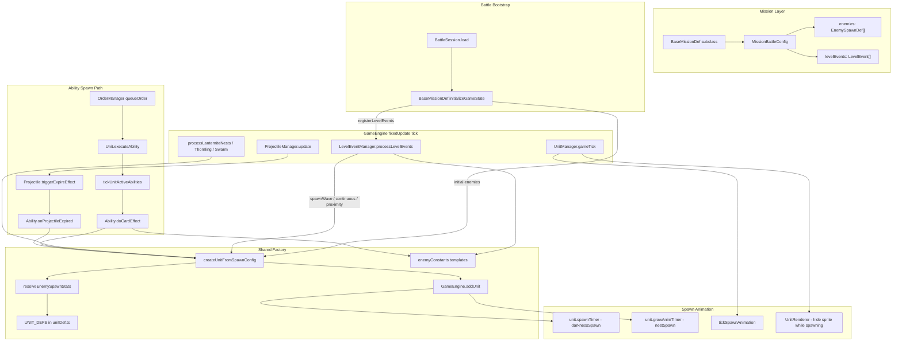
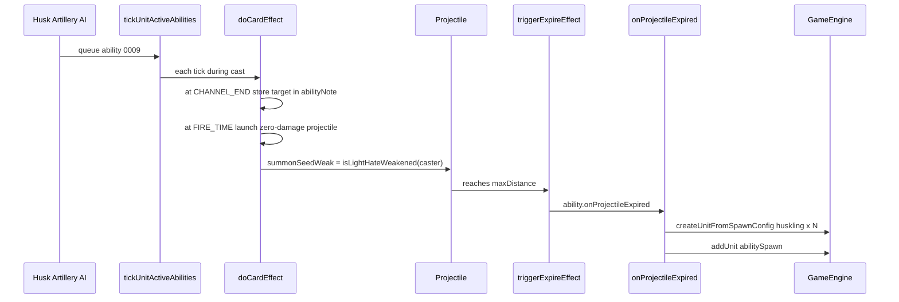
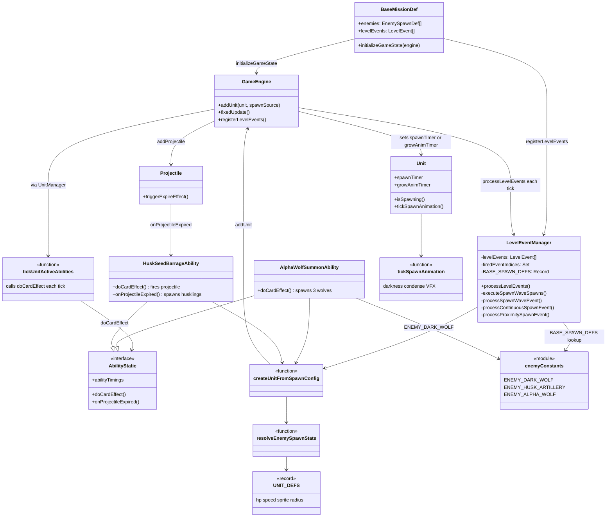

# Spawn Systems Implementation Report

**Produced:** 2026-06-19  
**Commit:** `0c63898` (`0c63898e59444f2fc6110e6a409e74de2a578b20`)

Minion Battles has **four distinct spawn pathways** that all converge on the same factory:

```
createUnitFromSpawnConfig(config) → GameEngine.addUnit(unit, spawnSource)
```

The `spawnSource` argument is what differentiates animation and combat-readiness behavior. Everything else (stats, sprites, AI) is resolved in the shared factory.

---

## 1. High-level architecture



---

## 2. Mission definition spawns

### 2a. Battle-start enemies (`enemies[]`)

**Entry point:** [`BaseMissionDef.initializeGameState`](app/js/games/minion_battles/storylines/BaseMissionDef.ts) called from [`BattleSession.load`](app/js/games/minion_battles/game/BattleSession.ts).

**Event/callback system:** Synchronous bootstrap — no tick polling. Runs once when the battle loads, before the tick loop starts.

**Spawn location:** Fixed world coordinates from each `EnemySpawnDef.position` in the mission file. No algorithmic placement.

**Unit definitions:**

- Mission `enemies[]` entries are full `EnemySpawnDef` objects (often spread from templates in [`enemyConstants.ts`](app/js/games/minion_battles/constants/enemyConstants.ts), e.g. `ENEMY_ALPHA_WOLF`).
- `characterId` keys into [`UNIT_DEFS`](app/js/games/minion_battles/game/units/unit_defs/unitDef.ts) for baseline hp, speed, sprite, radius, stamina.

**Stats resolution:**

1. `resolveEnemySpawnStats(spawn)` merges mission overrides (`hp`, `speed`, `stackSize`) with `UNIT_DEFS` defaults.
2. Enemy HP is scaled by player count: `hp × getEnemyHealthMultiplier(playerCount)` when `teamId === 'enemy'`.
3. `createUnitFromSpawnConfig` constructs the `Unit` with resolved values.
4. `initializeAbilityRuntimeForUnit(unit)` wires ability runtime state (wave spawns skip this).

**Spawn animation:** `engine.addUnit(unit, 'initialGameSpawn')` — **no animation**. Unit is visible and combat-ready immediately.

---

### 2b. Mid-battle level events (`levelEvents[]`)

**Entry point:** [`LevelEventManager.processLevelEvents`](app/js/games/minion_battles/game/managers/LevelEventManager.ts), called every `GameEngine.fixedUpdate` tick (when not story-paused).

**Event/callback system:** Polling-based state machine, not EventBus-driven:

- `firedEventIndices` tracks one-shot events.
- `continuousSpawnLastSpawnedAt` tracks interval spawns.
- Optional `onEmitMessage` / `onVictory` / `onDefeat` callbacks wired by `BattleSession` for chat and mission end.

**Event types that spawn units:**

| Type | Trigger | Spawn path |
|------|---------|------------|
| `spawnWave` | `atRound` or `afterSeconds` | `executeSpawnWaveSpawns` |
| `continuousSpawn` | Every N rounds within a round window | Inline darkness/anywhere logic (defaults `spawnBehaviour` to `'darkness'`) |
| `proximitySpawn` | Player enters world circle | `executeSpawnWaveSpawns` + optional `extraEnemySpawns` at fixed positions |

Example mission data: [`001_dark_awakening.ts`](app/js/games/minion_battles/storylines/WorldOfDarkness/missions/001_dark_awakening.ts), [`last_holdout.ts`](app/js/games/minion_battles/storylines/BunkerAtTheEnd/missions/last_holdout.ts).

**Spawn location** (in `executeSpawnWaveSpawns`):

| `spawnBehaviour` | Algorithm |
|------------------|-----------|
| `edgeOfMap` (default) | [`getEdgePositions`](app/js/games/minion_battles/storylines/edgeSpawns.ts) — evenly spaced perimeter points |
| `anywhere` | Random passable tiles; optional `spawnTarget` circle (radius in **tiles** × cell size) |
| `darkness` | Same as anywhere, but tile light ≤ `FULL_DARKNESS` |
| `closest` | Chebyshev rings outward from average living player position; optional `closestConfig.inDarkness` |
| `closestEnemySpawnPoint` | Closest `enemySpawn` POI from `engine.mapPOIs` to any player; spawn on POI or within `enemySpawnPointConfig.radius` |

Tile picks use `engine.generateRandomInteger` for determinism. Unknown `characterId` values are **silently skipped** — the ID must exist in `LevelEventManager.BASE_SPAWN_DEFS`.

**Unit definitions:**

- Wave entries use `SpawnWaveEntry` (minimal: `characterId` + overrides).
- `BASE_SPAWN_DEFS` maps `characterId` → full `EnemySpawnDef` template from `enemyConstants.ts`.
- Config merge: `{ ...base, ...entry, position, x, y, ownerId: 'ai' }`.

**Stats resolution:** Same as battle-start: `resolveEnemySpawnStats({ ...base, ...entry })` + player-count HP multiplier for enemy team.

**Spawn animation:** `ctx.addUnit(unit)` → defaults to `'darknessSpawn'`:

- `GameEngine.addUnit` sets `unit.spawnTimer = 0.5`.
- [`tickSpawnAnimation`](app/js/games/minion_battles/game/units/spawnAnimation.ts) emits spiral condensing particles (0–0.2s) then dust burst (0.2–0.5s).
- [`UnitRenderer`](app/js/games/minion_battles/game/GameRenderer/renderers/UnitRenderer.ts) hides sprite while `unit.isSpawning()`.
- Unit cannot move, take damage, or be targeted during spawn.

---

## 3. Ability-triggered spawns

Ability spawns bypass `LevelEventManager` entirely. They use the ability cast pipeline:

```
AI/player order → OrderManager → Unit.executeAbility → tickUnitActiveAbilities (each tick)
  → ability.doCardEffect(engine, caster, targets, prevTime, currentTime)
  → createUnitFromSpawnConfig → addUnit(..., 'abilitySpawn')
```

`doCardEffect` is called **every tick** during the cast; abilities use threshold checks (`prevTime < T && currentTime >= T`) to fire once.

### 3a. Alpha Wolf Summon (`0005`)

**File:** [`0005Ability.ts`](app/js/games/minion_battles/card_defs/dark_animals/0005_AlphaWolfSummon/0005Ability.ts)

**Trigger chain:**

1. Alpha Wolf boss AI ([`alphaWolfBoss_attack.ts`](app/js/games/minion_battles/game/units/unitAI/alphaWolfBoss/alphaWolfBoss_attack.ts)) queues Summon via `tryQueueAbilityOrder` (priority 20, `maxUsesPerRound: 1`).
2. At `PREFIRE_TIME`, `doCardEffect` fires.

**Spawn location:** Three fixed pixel offsets around the caster (+35px right, two diagonal rear positions). No terrain/passability check.

**Unit definitions:** Spreads `ENEMY_DARK_WOLF` from `enemyConstants.ts`; inherits `caster.teamId`, `caster.ownerId`, `caster.unitAITreeId`.

**Stats:** Baseline dark wolf (hp 12, speed 120 from `UNIT_DEFS`). **No player-count HP scaling** applied in the ability code.

**Spawn animation:** `'abilitySpawn'` — immediate visibility. Custom VFX: `darkBlobBurst` sprite effects at each spawn point, plus windup `HowlShockwave` emitters and landing `Pulse` effect on the caster.

**Post-spawn:** Immediately queues Dark Wolf Bite (`0003`) on `gameTick + 1` for each wolf, targeting closest enemy.

### 3b. Huskling spawning (Husk Seed Barrage `0009`)

**File:** [`0009Ability.ts`](app/js/games/minion_battles/card_defs/0009_HuskSeedBarrage/0009Ability.ts)

**Status:** Code-complete but **not placed in any storyline mission yet**. `husk_artillery` exists in `enemyConstants.ts` and `BASE_SPAWN_DEFS` (waves can spawn the summoner), but husklings only hatch from the ability.

**Two-phase trigger chain:**



**Spawn location:** Projectile landing coordinates (`projectile.x/y`) + small offsets (0/0, +16/+12, -16/+12).

**Unit definitions:** Inline config with `characterId: 'huskling'` — **not** from an `enemyConstants` template. `huskling` def exists only in `UNIT_DEFS` (hp 6, speed 88, placeholder `enemy_melee` sprite).

**Stats:**

- Baseline from `UNIT_DEFS`.
- Inline overrides: `combatSettings: { damageModifier: { flatAmt: -3 } }`, `abilities: ['0002']`, `aiSettings: { minRange: 0, maxRange: 70 }`.
- `ephemeralDespawnAtGameTime = gameTime + 22s` — unit self-destructs in `Unit.tickMovement`.
- Light Hate: `isLightHateWeakened` → spawns 1 husk instead of 2.

**Spawn animation:** `'abilitySpawn'` — no hatch VFX yet. Appears instantly.

**Projectile expiry wiring:** [`Projectile.triggerExpireEffect`](app/js/games/minion_battles/game/projectiles/Projectile.ts) calls both `triggerAbilityEventFromProjectileExpiry` (abilityEvents system) and the optional `ability.onProjectileExpired` hook.

---

## 4. Related: nest ecology spawns (bonus context)

Not requested explicitly, but mission `enemies[]` can place nest units (`lanternite_nest`, `thornling_nest`) whose **child spawns** are a fourth pathway:

- [`processLanterniteNests`](app/js/games/minion_battles/game/lanternite/lanterniteNestTick.ts), [`processThornlingNests`](app/js/games/minion_battles/game/lanternite/thornlingNestTick.ts), [`processSwarmNests`](app/js/games/minion_battles/game/lanternite/swarmNestTick.ts) run each tick from `GameEngine.fixedUpdate`.
- Children spawned via `addUnit(unit, 'nestSpawn')` → `growAnimTimer = 0.3` (scale 0→1 in `UnitRenderer`).

---

## 5. SpawnSource comparison table

| Pathway | `SpawnSource` | Visible immediately? | VFX |
|---------|---------------|----------------------|-----|
| Mission `enemies[]` | `initialGameSpawn` | Yes | None |
| Level event waves | `darknessSpawn` (default) | No (0.5s) | `tickSpawnAnimation` particles |
| Nest children | `nestSpawn` | Yes (scale grow-in) | `growAnimTimer` scale + optional arc |
| Alpha Wolf Summon | `abilitySpawn` | Yes | Custom `darkBlobBurst` + howl effects |
| Huskling hatch | `abilitySpawn` | Yes | None (gap) |
| Stack-split (BaseAttackBehaviour) | `abilitySpawn` | Yes | None |

---

## 6. Class relationship diagram



---

## 7. Key takeaways and gaps

**Shared pattern:** All spawn paths funnel through `createUnitFromSpawnConfig` + `resolveEnemySpawnStats` + `UNIT_DEFS`. Mission/wave paths additionally use `enemyConstants` templates; ability paths may spread a template (Alpha Wolf) or inline a minimal config (Huskling).

**Location is path-specific:** Mission start = fixed coords; waves = algorithmic (`spawnBehaviour`); abilities = caster-relative offsets or projectile landing point.

**Animation is path-specific:** Controlled entirely by the `SpawnSource` passed to `addUnit`, except ability spawns that add their own VFX on top.

**Notable gaps:**

- Wave spawns do not call `initializeAbilityRuntimeForUnit` (battle-start enemies do).
- `huskling` has no mission placement or ability tests yet.
- Huskling hatch has no dedicated landing VFX (unlike Alpha Wolf's burst).
- `BASE_SPAWN_DEFS` is a manual allowlist — new wave enemies must be added there explicitly.
